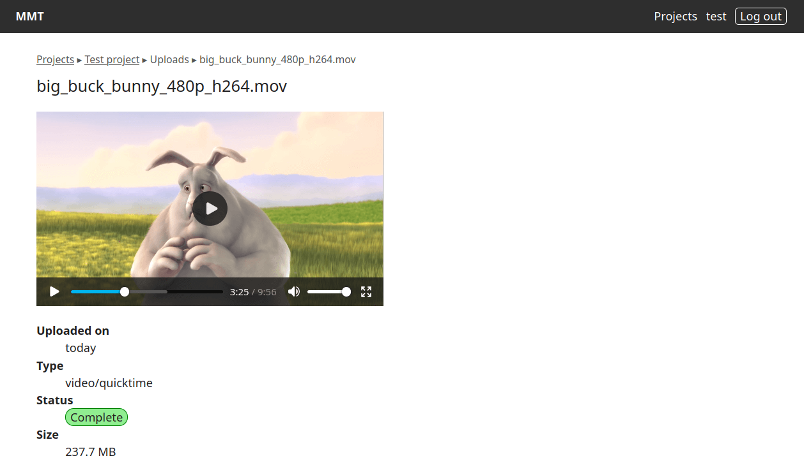

[](https://github.com/asr4memory/mmt-py/actions/workflows/app-tests.yml)
[](https://github.com/asr4memory/mmt-py/actions/workflows/app-docker.yml)

[](https://github.com/asr4memory/mmt-py/actions/workflows/ner-tests.yml)
[](https://github.com/asr4memory/mmt-py/actions/workflows/ner-docker.yml)

[](https://github.com/asr4memory/mmt-py/actions/workflows/asr-tests.yml)
[](https://github.com/asr4memory/mmt-py/actions/workflows/asr-docker.yml)

# mmt-py

Django version of the Media Management Tool

You can create projects and upload video or audio files for further processing.
In the future, you can create and edit automatic transcriptions based on the
uploaded files.

<p>
  
</p>


## Requirements

- Python 3.14
- Node.js 24
- Docker

- Libraries e.g. for Debian:
  - default-libmysqlclient-dev
  - ffmpeg
  - gettext
  - libharfbuzz-subset0
  - libpango-1.0-0
  - libpangoft2-1.0-0
  - pkg-config

## Development

The development environment can be started with uv:

```bash
uv run manage.py runserver
```

In another terminal, start the Vite development server:

```bash
npm run dev
```

Optionally, run the Celery worker with:

```bash
uv run celery -A mmt worker --loglevel=INFO
```

Tests can be run with:

```bash
uv run manage.py test
```
