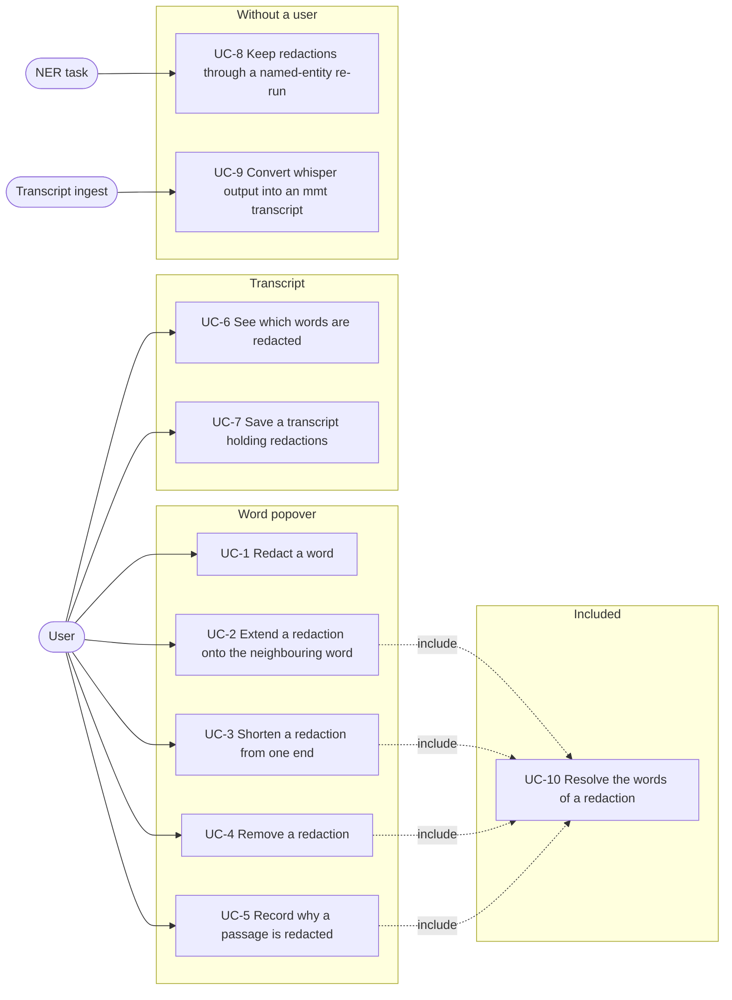
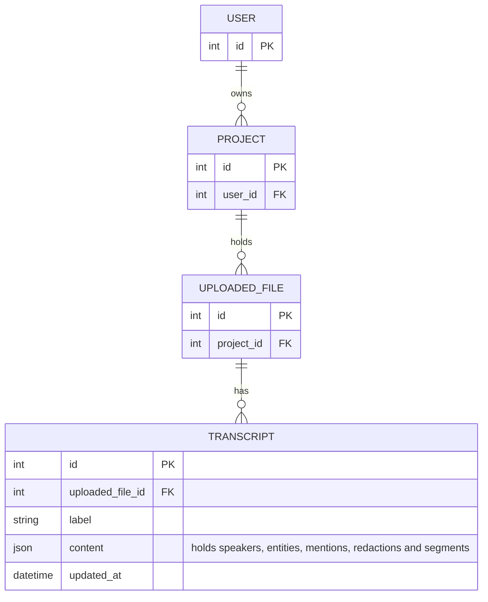
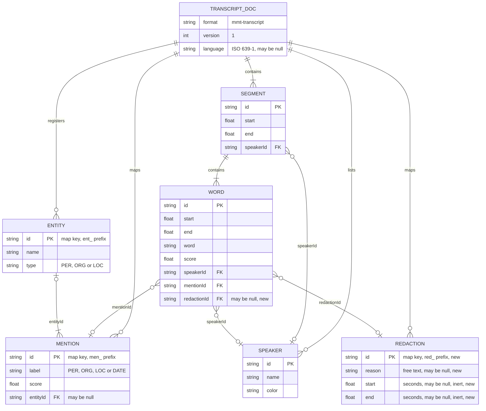

# Spec: redacted sections in the mmt-transcript format

Status: draft, not started.

This document is an **executable spec** (spec-driven development): it is the
prompt an implementing session works from and the authoritative record of every
decision, not a background sketch. Resolve ambiguity by reading this document,
not by inventing; if a genuinely new decision comes up, write it into this
document as part of the task. Check off tasks (`[x]`, with date) as they land.
Do not duplicate CLAUDE.md conventions here (test-first, pytest style, vitest
for the frontend, both locale files for every new string).

The architectural overview that accompanies this spec is
[`docs/redactions-architecture.md`](../docs/redactions-architecture.md). It
records where the redaction tier sits and why; this spec records what is built.

## Motivation

Interviews contain names, places and whole passages that must not be published.
A person names their employer, a third party who never consented is described in
detail, an address is read out. That decision is editorial: a person makes it
once while working in the transcript editor, and it has to persist with the
transcript so that every later export can apply it.

Today the editor can mark a word as a named-entity mention, and it can link that
mention to an entity in the transcript's register, but there is nothing that
records "this passage must not be published". The decision therefore lives
outside the application entirely, in a note beside the transcript or in the head
of the person who made it, and it has to be applied by hand in every file
produced from the transcript.

The mentions map already solves the structural half of this problem: an
occurrence-level record lives in one transcript-level map, and the words that
belong to it point at it by identifier. Redactions reuse that shape. The
differences from mentions are that a redaction carries an editorial instruction
rather than a classification, that it concerns the media as well as the text,
and that a word can belong to a mention and to a redaction at the same time —
the common case is redacting a name that the named-entity pass already marked as
a `PER` mention.

## Non-goals

Do not add these, even where they would be easy:

- **No application of the redaction.** This spec records the marks only, and
  pins what applying one means so that later work has a rule to implement rather
  than a decision to invent. Producing a silenced media file, a redacted text
  export or a redacted copy of the transcript is separate work, and the format
  is deliberately designed so that work can happen later without another schema
  change. In particular, none of the export formats in
  [`2026-07-30-transcript-export.md`](2026-07-30-transcript-export.md) changes
  here.
- **No access control.** A redaction does not change who may read the
  transcript. The unredacted words stay in `Transcript.content`, every user who
  can open the editor sees them, and the existing JSON download keeps serving
  them.
- **No replacement text.** There is no `replace` mode and no per-redaction
  pseudonym. A pseudonym is a property of an identity, not of one occurrence of
  a name, so it belongs on `Entity` next to the canonical name and the aliases;
  see [`2026-07-31-canonical-entities.md`](2026-07-31-canonical-entities.md).
  A redaction says only that the passage must not be published.
- **No time-anchored redactions.** `start` and `end` are part of the schema and
  are validated and carried through, but nothing in this version writes them.
  A redaction is anchored to words, so a region that contains no words cannot be
  redacted; see the open questions.
- **No automatic redaction.** A batch action such as "redact every `PER`
  mention" or "redact every mention of this entity" is deferred; see the open
  questions.
- **No redaction overview UI.** There is no drawer, panel or list of all
  redactions of a transcript. Every operation happens in the word popover.
- **No schema version bump and no compatibility with content stored earlier.**
  This extends `version: 1` in place. `redactions` is a required field, so a
  document written before it existed is rejected by the validator, and there is
  no upgrade path that adds it. See the format extension below.

## Actors

- **User** — a logged-in account holder with the
  `transcripts.change_transcript` permission, editing one transcript in the
  transcript editor. The actor in UC-1 to UC-7.
- **NER task** — the Celery task `enrich_transcript` in
  [`app/mmt/transcripts/tasks.py`](../app/mmt/transcripts/tasks.py). A system
  actor, triggered by a user asking for named-entity recognition on a
  transcript, but running without a user present. The actor in UC-8.
- **Transcript ingest** — `_whisper_to_mmt` in
  [`app/mmt/transcripts/normalize.py`](../app/mmt/transcripts/normalize.py),
  converting whisperX output into an mmt-transcript document, whether from the
  ASR service or from a manual upload. A system actor. The actor in UC-9.

## System use cases

The overview shows which actor triggers which use case. `<<include>>` marks a
use case that every dependent case performs as part of its own flow.



Each use case below is the authoritative description of one system behaviour.
The feature reference further down repeats the rules in a compact form; where
the two disagree, the feature reference is wrong and both are fixed together.

UC-1 to UC-6 change the editor's in-memory state only. Nothing reaches the
database until the user saves (UC-7).

Every one of UC-1 to UC-5 marks the segment holding the redaction's words as
dirty, which is what makes the change saveable at all: the editor's unsaved
state lives on segments and words, and every redaction operation touches at
least one word of one segment. No separate indicator in the document bar is
needed, unlike the entity register, which can change without any segment
changing.

### UC-1 Redact a word

- **Actor:** User.
- **Precondition:** The transcript is open in the editor and a word is selected.
  The word carries no `redactionId`.
- **Trigger:** The user opens the word popover and activates the create action
  in its redaction section.
- **Main flow:**
  1. The redaction section shows its empty state: a heading, a line saying the
     word is not redacted, and one button that redacts it.
  2. The system mints a redaction identifier with the prefix `red`, stores an
     entry with no reason and neither `start` nor `end`, and sets the word's
     `redactionId` to it.
  3. The system marks the segment dirty.
  4. The popover switches the redaction section to its marked state, showing the
     redaction's surface text (UC-10), the four edge actions, the remove action
     and the reason input.
  5. The word is rendered as redacted in the transcript (UC-6).
- **Alternative flow A — the word already carries a mention:** The redaction is
  created regardless. The word's `mentionId` and the mention it points at are
  untouched, and the popover keeps showing the mention section above the
  redaction section.
- **Postcondition:** The transcript holds one more redaction, referenced by
  exactly one word.

### UC-2 Extend a redaction onto the neighbouring word

- **Actor:** User.
- **Precondition:** The selected word carries a `redactionId`.
- **Trigger:** The user activates the extend action on the left or on the right
  in the popover's redaction section.
- **Main flow:**
  1. The system resolves the words of the redaction within the segment (UC-10)
     and takes the word immediately outside that run on the chosen side.
  2. The system sets that word's `redactionId` to the same identifier.
  3. The system marks the segment dirty and the popover shows the grown surface
     text.
- **Alternative flow A — the run already reaches the segment boundary on that
  side:** Nothing happens. Every redaction operation is scoped to one segment,
  exactly as the mention operations are, so a redaction the editor produces
  never crosses a segment boundary.
- **Alternative flow B — the neighbouring word already carries a different
  `redactionId`:** Nothing happens. A redaction never takes a word away from
  another redaction, exactly as `extendMention` never takes a word away from
  another mention. The user removes one of the two first.
- **Alternative flow C — the neighbouring word carries a `mentionId`:** The
  extension is made regardless. The mention tier is not consulted.
- **Postcondition:** The redaction covers one more word, or the document is
  unchanged.

### UC-3 Shorten a redaction from one end

- **Actor:** User.
- **Precondition:** The selected word carries a `redactionId` whose run within
  the segment holds at least two words.
- **Trigger:** The user activates the shorten action on the left or on the right
  in the popover's redaction section.
- **Main flow:**
  1. The system resolves the words of the redaction within the segment (UC-10)
     and takes the outermost word of the run on the chosen side.
  2. The system sets that word's `redactionId` to `null`.
  3. The system marks the segment dirty and the popover shows the shortened
     surface text.
- **Alternative flow A — the run holds exactly one word:** Nothing happens.
  Shortening never deletes the redaction, because a redaction with no words
  would fail validation; UC-4 is the operation that removes it.
- **Alternative flow B — the shortened-away word is the selected one:** The
  operation is performed anyway and the popover switches to its empty state,
  since the selected word now carries no redaction.
- **Postcondition:** The redaction covers one word fewer and is still referenced
  by at least one word, or the document is unchanged.

### UC-4 Remove a redaction

- **Actor:** User.
- **Precondition:** The selected word carries a `redactionId`.
- **Trigger:** The user activates the remove action in the popover's redaction
  section.
- **Main flow:**
  1. The system resolves every word in the segment carrying that identifier
     (UC-10) and sets each of their `redactionId` to `null`.
  2. The system deletes the entry from the `redactions` map, discarding the
     reason with it.
  3. The system marks the segment dirty and the popover switches to its empty
     state.
  4. The words are rendered normally again.
- **Alternative flow A — the redaction carries a reason:** The reason is
  discarded without a confirmation. The action is one click to undo by
  redacting the word again, and the reason is one short line of text, so it is
  not worth a confirmation of its own.
- **Postcondition:** No word carries the identifier and the `redactions` map
  does not hold it. The words themselves, their timestamps, their speakers and
  their mentions are unchanged.

### UC-5 Record why a passage is redacted

- **Actor:** User.
- **Precondition:** The selected word carries a `redactionId`.
- **Trigger:** The user types into the reason input in the popover's redaction
  section.
- **Main flow:**
  1. The system writes the text to the redaction's `reason`.
  2. The system resolves the words of the redaction (UC-10) to find the segment
     holding them and marks it dirty.
- **Alternative flow A — the user clears the input:** The reason is stored as
  an empty string. An empty reason is legal; the field exists for the user, not
  for the format.
- **Postcondition:** The redaction carries the reason. Nothing else changed; in
  particular `start` and `end` stay `null`.

### UC-6 See which words are redacted

- **Actor:** User.
- **Precondition:** The transcript is open in the editor.
- **Trigger:** The user reads the transcript.
- **Main flow:**
  1. Every word carrying a `redactionId` is rendered with a line-through in the
     redaction colour.
  2. The marking composes with whatever else the word carries: an entity
     background fill and the dirty-word underline both stay visible.
- **Alternative flow A — entity highlighting is switched off:** The redaction
  marking is still rendered. There is no display toggle for redactions, because
  an editorial decision must not be invisible.
- **Postcondition:** None. Rendering changes nothing.

### UC-7 Save a transcript holding redactions

- **Actor:** User.
- **Precondition:** The editor holds unsaved changes and at least one segment is
  marked dirty.
- **Trigger:** The user activates the save action in the document bar.
- **Main flow:**
  1. The editor posts the content including the `redactions` map and each word's
     `redactionId` to the existing update route.
  2. The backend validates it with `validate_mmt_content`, which now also checks
     that every `redactionId` resolves and that every redaction is referenced by
     at least one word.
  3. The backend stores the content and the editor clears its unsaved state.
- **Alternative flow A — the content fails validation:** The existing behaviour
  applies: the route answers `400` with the messages and the editor keeps its
  unsaved state. A dangling `redactionId` or an unreferenced redaction reaching
  this point is a bug in the editor, not user input.
- **Postcondition:** `Transcript.content` holds the redactions and the links,
  and a later load of the transcript reproduces them exactly.

### UC-8 Keep redactions through a named-entity re-run

- **Actor:** NER task.
- **Precondition:** A stored transcript carries redactions, and named-entity
  recognition is run on it again.
- **Trigger:** A user asks for named-entity recognition on the transcript.
- **Main flow:**
  1. `apply_mention_spans` clears and rebuilds the `mentions` map and every
     word's `mentionId` from the service's response.
  2. Every word's `redactionId` and the whole `redactions` map are left
     untouched.
  3. The task validates and stores the content as it already does.
- **Postcondition:** The mention tier is the one the model just produced; the
  redaction tier is the one the user built. Editorial work survives a re-run of
  the model.

### UC-9 Convert whisper output into an mmt transcript

- **Actor:** Transcript ingest.
- **Precondition:** whisperX-shaped output is being converted into an
  mmt-transcript document.
- **Trigger:** The ASR service delivers a result, or a user uploads whisperX
  JSON.
- **Main flow:**
  1. `_whisper_to_mmt` sets `'redactionId': None` on each word it builds.
  2. It sets `'redactions': {}` on the result.
- **Alternative flow A — the input carries redaction-shaped keys:** They are
  ignored. Whisper input never carries redactions and there is no lenient input
  path for them.
- **Postcondition:** A freshly converted transcript is valid and holds no
  redactions.

### UC-10 Resolve the words of a redaction

- **Actor:** Included by UC-2, UC-3, UC-4 and UC-5; never triggered on its own.
- **Precondition:** A redaction identifier and a segment.
- **Trigger:** Any of the including use cases, and the popover when it renders a
  redaction's surface text.
- **Main flow:**
  1. The system collects the indices of the words of the segment whose
     `redactionId` equals the identifier, in document order.
  2. The surface text is those words' `word` values joined with a single space.
  3. The ends of the run are the first and the last of those indices.
- **Alternative flow A — no word in the segment carries the identifier:** The
  result is empty, the surface text is the empty string, and the including use
  case does nothing.
- **Postcondition:** None. Resolving writes nothing.

## Entity relationship model

Two diagrams. The first is the persisted graph, which this feature does not
change: redactions are not a table. The second is the structure inside the
`content` column, which is where the whole feature lives.

### Persisted entities



Ownership is checked on the path the editor's routes already use:
`Transcript.objects.filter(pk=..., uploaded_file__project__user=user)`. This
feature adds no model, no migration and no query.

### Structure of `Transcript.content`

The mmt-transcript document as defined in
[`app/mmt/transcripts/mmt_schema.py`](../app/mmt/transcripts/mmt_schema.py) and
described in [`docs/mmt-transcript-format.md`](../docs/mmt-transcript-format.md),
with `REDACTION` and the `redactionId` reference added by this feature.
Relations are containment and reference within one JSON document, not foreign
keys.



The cardinality of the new relation is the same one the mention relation has: a
word points at zero or one redaction, and a redaction is pointed at by one or
more words. The zero side is the permanent legal state of a word nobody
redacted; the one-or-more side is the invariant that keeps the map free of
entries nothing uses.

The relation between the two occurrence tiers is deliberately absent from the
diagram, because there is none. `mentionId` and `redactionId` are independent
references on the same word.

### Invariants

The strict validator enforces these, in addition to the ones it enforces today:

1. The document carries a `redactions` map. It may be empty, but it may not be
   absent.
2. Redaction identifiers are unique across every identifier in the document, in
   the same namespace as speaker, entity, mention, segment and word identifiers.
3. Every `word.redactionId` that is not `null` resolves to a key of
   `redactions`.
4. Every key of `redactions` is the `redactionId` of at least one word.
5. A redaction carries both `start` and `end` or neither, and `start` is not
   greater than `end`.

The validator deliberately does **not** enforce these:

- **Contiguity of a redaction's words.** The editor only produces contiguous
  runs, because every operation works from the ends of the existing run, but a
  document whose run has been split is not rejected. This matches how mentions
  are handled.
- **Any relationship between `mentionId` and `redactionId`.** A word may carry
  both, one or neither, and a redaction may cover part of a mention, all of it,
  or several mentions at once.
- **A redaction staying inside one segment.** The schema permits a redaction
  whose words lie in different segments. No editor operation produces one; see
  the open questions.

## Feature reference

### Concept

A **redaction** is one contiguous run of words that must not be published, plus
an optional reason recording why. The words fix **which text** it affects, and
the range derived from them fixes **which audio**.

### Format extension

The format extends version 1 **in place**. There is no version bump and no
migration, on the same grounds as the entity register: a bump exists to trigger
a migration for stored content, and this change deliberately provides none.

The extension does not keep documents stored before it valid. `redactions` is
required, like `speakers`, `entities` and `segments`, so a document written
before the field existed is rejected by the validator. There is no upgrade path
either: `normalize_content` re-validates content that already carries
`format: "mmt-transcript"` rather than upgrading it, so `normalize_transcripts`
reports such a row as invalid and skips it. The format is in its development
phase, and deleting those rows is cheaper than carrying a default whose only
purpose is to accept the old shape.

`redactionId` on a word is defaulted rather than required, in the same way as
`mentionId` on a word and `entityId` on a mention: an absent key means `null`,
which is the state of a word nobody redacted. The same holds for `reason`,
`start` and `end` on a redaction. This is a property of those fields, not a
concession to content stored earlier.

### Schema

In [`mmt_schema.py`](../app/mmt/transcripts/mmt_schema.py):

```python
RedactionId = Annotated[str, StringConstraints(min_length=1)]


class Redaction(BaseModel):
    model_config = ConfigDict(extra='forbid')

    reason: str | None = None
    start: float | None = Field(default=None, ge=0)
    end: float | None = Field(default=None, ge=0)

    @model_validator(mode='after')
    def _consistent(self):
        if (self.start is None) != (self.end is None):
            raise ValueError('redaction needs both start and end or neither')
        if self.start is not None and self.start > self.end:
            raise ValueError('redaction: start after end')
        return self
```

`Word` gains `redactionId: str | None = None`, next to and independent of
`mentionId`. `Transcript` gains `redactions: dict[RedactionId, Redaction]`,
required and without a default.

The relational invariants in `Transcript._relations` mirror the mention ones:
redaction identifiers are claimed into the same `seen_ids` set, so they are
unique against every speaker, entity, mention, segment and word identifier;
every `redactionId` on a word resolves to a `redactions` entry; and every
redaction is referenced by at least one word, so editors garbage-collect a
redaction when its last word is unlinked. The error messages follow the existing
wording: `word {id}: unknown redactionId {value!r}` and `orphaned redaction
{id!r}: no word references it`.

### Applying a redaction

Nothing in this feature applies a redaction. The rule is nevertheless pinned
here, because it is the retroactive meaning of every redaction stored under this
version of the format, and later work implements it rather than deciding it:

> Applying a redaction masks both the text and the media. In the text, each
> word linked to the redaction has its `word` value replaced by the marker
> `XXX`, keeping its `id`, `start`, `end` and `speakerId`, and clearing its
> `mentionId` and `redactionId`. In the media, the effective range of the
> redaction is silenced.

One marker per word rather than one marker for the whole run, so that the
mapping from the stored document to the applied document is one to one: every
word keeps its identifier and its timestamps, and no segment can lose all of its
words, which the schema forbids. The marker is a constant of the applying
export, not a stored value, so changing it later changes no stored content.

### The time range

The effective range of a redaction is the `start` of its first word and the
`end` of its last word. Padding around that range is a decision of the applying
export and is not stored.

`start` and `end` on the redaction itself are inert in this version: they are
validated and carried through the backend and the frontend, but nothing writes
them. When they are set, they override the range derived from the words. They
exist in the schema now because the case they serve is known — word timestamps
from ASR are approximate, and the audio between two words, a pause, a breath or
a half-spoken name, is covered by no word's range — and adding them now costs
one validator and no migration.

Because every redaction must be referenced by at least one word, a region that
contains no words at all cannot be redacted. That is accepted for this version;
see the open questions.

### IDs

Redaction identifiers use the existing scheme with the prefix `red`:
`_new_id('red')` on the backend, `newId("red")` in the store.

### Backend

- [`normalize.py`](../app/mmt/transcripts/normalize.py): `_whisper_to_mmt` sets
  `'redactionId': None` on each word it builds and `'redactions': {}` on the
  result. Whisper input never carries redactions, and there is no lenient input
  path for them.
- `normalize_content` gains nothing. Content that already carries
  `format: "mmt-transcript"` goes through `validate_mmt_content` unchanged, so a
  document stored before `redactions` existed is reported as invalid rather than
  repaired. That is intended; such rows are deleted.
- `apply_mention_spans` clears and rebuilds `mentionId` and `mentions`. It must
  leave `redactionId` and `redactions` untouched, so a named-entity re-run does
  not discard editorial marks. This is a test, not new code — the function only
  touches the mention keys today.
- `validate_mmt_content`, `detail_json` and `update_json` need no change; the
  new fields ride along in the content.

### Frontend

[`types.ts`](../app/assets/js/transcript/types.ts):

```ts
export interface Redaction {
    reason?: string | null;
    start?: number | null;
    end?: number | null;
}
```

with `redactionId?: string | null` on `TranscriptWord` and
`redactions: Record<string, Redaction>` on `TranscriptContent`.

[`transcript_store.ts`](../app/assets/js/transcript/transcript_store.ts) gains a
`redactions` ref and functions that mirror the mention ones one for one, all
scoped to a single segment as the mention functions are:

```ts
function redaction(redactionId?: string | null): Redaction | null
function redactionText(segmentIndex: number, redactionId?: string | null): string
function createRedaction(segmentIndex: number, wordIndex: number): string
function extendRedaction(segmentIndex: number, redactionId: string, side: "left" | "right"): void
function reduceRedaction(segmentIndex: number, redactionId: string, side: "left" | "right"): void
function removeRedaction(segmentIndex: number, redactionId: string): void
function setRedactionReason(redactionId: string, reason: string): void
```

Behaviour pinned:

- `createRedaction` mints a `red_` identifier, stores `{ reason: null, start:
  null, end: null }` and links the one word, then returns the identifier.
- `extendRedaction` refuses to take a word that already carries a different
  `redactionId`, exactly as `extendMention` refuses to take a word from another
  mention. It does not cross the segment boundary.
- `reduceRedaction` does nothing for a single-word redaction; `removeRedaction`
  covers that case, unlinks every word in the segment carrying the identifier
  and deletes the entry.
- `setRedactionReason` takes no segment index, because the reason belongs to the
  transcript-level entry. It finds the segments whose words carry the identifier
  and marks them dirty, so that a change of reason alone is saveable.
- Every one of these functions marks the segment it changed as dirty, the way
  the mention functions do.
- Nothing writes `start` or `end`. They are loaded, held and posted back
  unchanged.

[`word_popover.vue`](../app/assets/js/transcript/word_popover.vue) gains a
redaction section below the mention section, built like it: when the word
carries no redaction, a heading with a single button that redacts it and an
empty-state line; when it does, the same four edge buttons (extend and reduce on
each side), a remove button, the redaction's surface text as the title, and a
row with the reason input.

[`transcript_word.vue`](../app/assets/js/transcript/transcript_word.vue) marks a
redacted word with the class `transcript-word--redacted`. The styling is a
line-through in a dedicated colour, because it has to compose with the entity
background fill and with the dirty-word underline that the same word may carry
at the same time:

```css
.transcript-word--redacted {
    text-decoration: 0.125rlh line-through var(--color-redaction);
}
```

`--color-redaction: var(--pill-danger-base);` is added to
[`semantic.css`](../app/assets/css/variables/semantic.css). Unlike the entity
highlighting, redaction marking has **no display toggle**: it takes no
`showRedactions` prop and is always rendered, because an editorial decision must
not be invisible.

### Translations

New vue-i18n keys in both `en.js` and `de.js`:

| key | English | German |
| --- | --- | --- |
| `redaction_section` | Redaction | Anonymisierung |
| `no_redaction` | Not redacted | Nicht anonymisiert |
| `set_as_redaction` | Redact this word | Dieses Wort anonymisieren |
| `remove_redaction` | Remove redaction | Anonymisierung entfernen |
| `extend_redaction_left` | Extend to the left | Nach links erweitern |
| `extend_redaction_right` | Extend to the right | Nach rechts erweitern |
| `reduce_redaction_left` | Shorten from the left | Von links verkürzen |
| `reduce_redaction_right` | Shorten from the right | Von rechts verkürzen |
| `redaction_reason` | Reason | Grund |

No Django-side strings are introduced.

## File layout

No new module on either side. The feature is an extension of files that exist:

```
app/mmt/transcripts/
    mmt_schema.py               Redaction, RedactionId, Word.redactionId,
                                Transcript.redactions, _relations
    normalize.py                empty defaults in _whisper_to_mmt
    tests/
        test_mmt_schema.py      schema and invariant cases
        test_normalize.py       the defaults
        test_apply_mention_spans.py  redactions survive a re-run
        test_views.py           round trip through update_json/detail_json
        transcript_sample.json  gains "redactions": {}

docs/
    mmt-transcript-format.md    the redactions map and word.redactionId

app/assets/js/transcript/
    types.ts                    Redaction, TranscriptWord, TranscriptContent
    transcript_store.ts         redactions ref and the seven functions
    word_popover.vue            the redaction section
    transcript_word.vue         the redacted class
    transcript_store.test.ts    store behaviour
    word_popover.test.ts        both states of the section
    transcript_word.test.ts     new file, the class
app/assets/css/variables/
    semantic.css                --color-redaction
app/assets/js/locales/
    en.js, de.js                the nine keys
```

## Tests

- `test_mmt_schema.py` — content without a `redactions` key raises; an empty
  `redactions` map validates; a word whose `redactionId` names nothing raises; a
  redaction no word references raises; a redaction identifier colliding with a
  speaker, entity, mention, segment or word identifier raises; an unknown key on
  a redaction raises; `start` without `end` raises, `end` without `start`
  raises, and `start` greater than `end` raises; a word carrying both a
  `mentionId` and a `redactionId` validates; a redaction whose words lie in two
  segments validates.
- `test_normalize.py` — a converted whisper document carries
  `'redactions': {}` and `'redactionId': None` on every word; an
  mmt-transcript document without a `redactions` key is rejected by
  `normalize_content` rather than repaired.
- `test_apply_mention_spans.py` — a document carrying a redaction keeps the
  entry and every word link after the mention spans are applied, while the
  mentions themselves are rebuilt.
- `test_views.py` — content holding a redaction with a reason, and one holding a
  redaction with `start` and `end`, both round-trip through `update_json` and
  `detail_json` unchanged; content with a dangling `redactionId` answers `400`.
- `transcript_store.test.ts` — creating mints a `red_` identifier linked to the
  one word and marks the segment dirty; extending grows the run; extending stops
  at the segment boundary; extending stops at a word carrying another
  redaction; reducing shortens the run; reducing does nothing for a single-word
  redaction; removing unlinks every word and deletes the entry; setting a reason
  writes it, marks the segment dirty and leaves `start` and `end` `null`; a
  loaded document's `redactions` and word `redactionId` values are unchanged in
  the payload passed to `updateTranscript`.
- `word_popover.test.ts` — the empty state renders for an unredacted word, the
  marked state renders the surface text of the whole run, and the reason input
  shows the stored reason.
- `transcript_word.test.ts` — the `transcript-word--redacted` class follows the
  word's `redactionId`, and it is applied whether or not `showEntities` is set.

## Slices and tasks

Each slice leaves the system working and independently deployable. Slice 1 is
the format and the passthrough with no user-visible change; slice 2 is the whole
editor interaction.

- [ ] **1 Format extension, backend and passthrough.** Add `Redaction`,
  `RedactionId`, `Transcript.redactions` and `Word.redactionId`, extend
  `_relations`, emit the empty defaults from `_whisper_to_mmt`, and carry the
  fields through the frontend types and the store without any UI. Because
  `redactions` is required, this also means adding `"redactions": {}` to every
  mmt-transcript fixture and sample document the suites build, and describing
  the new map and the new word field in
  [`docs/mmt-transcript-format.md`](../docs/mmt-transcript-format.md) beside the
  entities section, including the sentence that a document stored before the
  field existed is rejected. This covers UC-7, UC-8 and UC-9. Done when the
  `test_mmt_schema.py`, `test_normalize.py`, `test_apply_mention_spans.py` and
  `test_views.py` cases listed above pass, when the whole pytest suite passes
  with the required field in place, and when the `updateTranscript` payload case
  in `transcript_store.test.ts` passes.
- [ ] **2 Mark and unmark in the editor.** The store's `redactions` ref and its
  seven functions, the popover's redaction section in both states, the word
  styling, the colour variable and the locale keys. This covers UC-1 to UC-6 and
  UC-10. Done when the `transcript_store.test.ts`, `word_popover.test.ts` and
  `transcript_word.test.ts` cases listed above pass, and when a development run
  redacts a run of words, records a reason, saves, reloads the editor and shows
  the same marking.

## Open questions

Recorded, not blocking. Do not decide these while implementing; raise them.

- **Time-anchored redactions**, for music, background noise, or a bystander
  speaking off-microphone. They are impossible in this version because every
  redaction must be referenced by at least one word. Allowing a word-free
  redaction means one map and one identifier space still, with the invariant
  loosened to "referenced by a word **or** carrying both `start` and `end`",
  which is the backward-compatible direction, plus a way to draw a range on the
  waveform that links every word it overlaps. The missing piece is that
  range-selection interaction, which is also what would create a redaction
  crossing segment boundaries.
- **Redactions crossing segment boundaries.** The schema permits them, but every
  editor operation is scoped to one segment, as the mention operations are, so
  the editor cannot produce one. A passage-length redaction spanning many
  segments is a plausible need and would require the same range-selection
  interaction rather than the per-word popover.
- **Per-channel masking.** Applying a redaction currently masks the text and the
  media together. Separating them would be two booleans rather than an enum,
  defaulting to the values that agree with the rule pinned above, so that stored
  content keeps its meaning. Blurring a region of the video frame is a different
  feature again, needing a spatial box over time rather than a range.
- **Batch redaction from mentions**, for example "redact every `PER` mention" or
  "redact every mention of this entity". It is cheap once the format exists, but
  it needs a review step, and it is better expressed over the entity tier than
  over the mention tier.
- **A redaction overview.** Once a transcript carries many redactions, finding
  and reviewing them word by word is impractical. The entity drawer is the
  obvious place for a second list, with the reason as the column that makes the
  list worth reading.
- **What an export does with redactions.** The likely answer, recorded as an
  open question in
  [`2026-07-30-transcript-export.md`](2026-07-30-transcript-export.md) as well,
  is that every derived format applies them and the mmt-transcript download does
  not. That decision belongs to the work that implements the applying rule.
