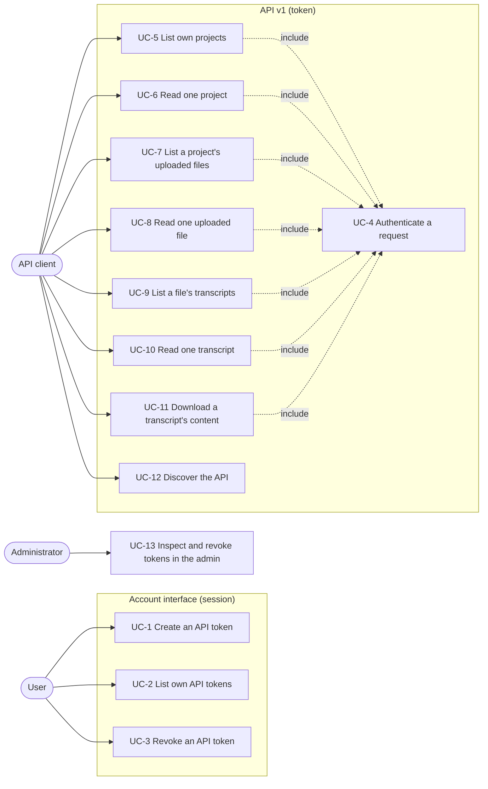
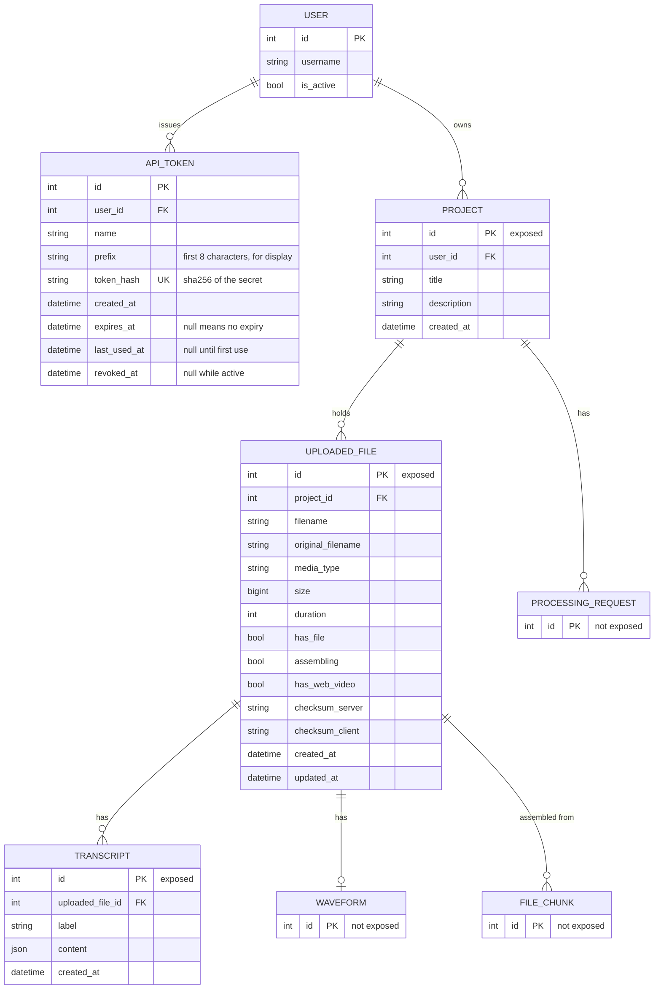

# Spec: read-only HTTP API with personal API tokens

Status: draft, not started.

This document is an **executable spec** (spec-driven development): it is the
prompt an implementing session works from and the authoritative record of every
decision, not a background sketch. Resolve ambiguity by reading this document,
not by inventing; if a genuinely new decision comes up, write it into this
document as part of the task. Check off tasks (`[x]`, with date) as they land.
Do not duplicate CLAUDE.md conventions here (test-first, pytest style).

The architectural overview that accompanies this spec is
[`docs/api-architecture.md`](../docs/api-architecture.md). It records where the
API layer sits in the project and why; this spec records what is built.

## Motivation

Everything a user can see about their projects, uploaded files and transcripts
is reachable only through the HTML interface and only with a session cookie.
Users who want to process their own data outside the application, for example to
count words in a transcript, to check which uploads have finished, or to archive
finished transcripts, currently have to click through the interface and download
files by hand.

This feature adds a read-only HTTP API for exactly the data a user already sees
in the interface, authenticated with a personal API token that the user creates
in their account. Nothing about the existing HTML views changes. The API is a
second way in to the same data with the same ownership rules and the same Django
permissions.

The scope is deliberately small: reading project data, uploaded file data and
transcript data, and downloading a transcript. Writing through the API is a
later, separate feature, and the shape chosen here does not obstruct it.

## Non-goals

Do not add these, even where they would be easy:

- **No write operations.** No `POST`, `PUT`, `PATCH` or `DELETE` on any
  resource in `/api/v1/`. Creating projects, uploading files and editing
  transcripts stay in the HTML interface.
- **No async endpoints.** Every operation is a synchronous `def`. Django Ninja
  supports `async def` operations, and the project already has async code paths
  in the models, but mixing both in one router is a source of accidental
  blocking calls. Async is revisited when an endpoint actually needs it.
- **No media download or streaming through the API.** The API returns metadata
  about an uploaded file, not its bytes. Serving large media files needs range
  requests, and the existing `uploaded_files.stream` and `uploaded_files.download`
  views already do that for session-authenticated users.
- **No access to other users' data.** A token grants exactly what its owner can
  see in the interface. There is no organisation-wide or administrative token.
- **No token scopes.** A token carries the full read access of its owner. A
  per-token scope list ("transcripts only") is a later decision and would be an
  additive field.
- **No rate limiting or quotas.** Not in this feature.
- **No CORS headers.** The API is for server-side and command-line clients. A
  browser application on another origin is not supported.
- **No API access to `ProcessingRequest`, `Waveform`, `FileChunk`, `Notice`,
  `Profile` or `Tag`.** They are visible in the entity relationship model below
  as context, but they are not exposed.
- **No client library.** The OpenAPI schema is published; no Python or
  JavaScript client is written or maintained here.
- **No webhooks or notifications.** Clients poll.

## Assumption on the framework

The request named "Jinja", which this spec reads as **Django Ninja**
(`django-ninja`), the schema-first API framework for Django. Jinja2, the
template engine, has no role in a JSON API, and Django Ninja is the library that
matches the rest of the description: declarative response schemas, pluggable
authentication, a generated OpenAPI document, and both sync and async
operations, of which only the sync form is used here. Django Ninja builds its
schemas on Pydantic, which is already a dependency (`pydantic~=2.13`, used by
`mmt/transcripts/mmt_schema.py`). If this assumption is wrong, correct it in
this section before starting slice 3; slices 1 and 2 do not depend on it.

## Actors

- **User** — an authenticated account holder. Owns projects and creates API
  tokens. Every use case below has the user as the primary actor, either through
  the HTML interface (UC-1 to UC-3) or through an API client acting with their
  token (UC-4 to UC-10).
- **API client** — a program the user runs, holding one of the user's tokens.
  Not a separate account. Where a use case says "the client", the responsible
  actor is still the user who issued the token.
- **Administrator** — a staff account. Appears only in UC-11, as the actor who
  inspects and revokes tokens in the Django admin.

## System use cases

The overview shows which actor triggers which use case. `<<include>>` marks a
use case that every dependent case performs as part of its own flow.



Each use case below is the authoritative description of one system behaviour.
The endpoint reference further down repeats the routes and response fields in a
compact form; where the two disagree, the use case is wrong and both are fixed
together.

### UC-1 Create an API token

- **Actor:** User.
- **Precondition:** The user is logged in.
- **Trigger:** The user opens the API tokens page in their account and submits
  the creation form.
- **Main flow:**
  1. The user opens `/account/api-tokens/` and sees the list of their tokens and
     a form with a name field and an expiry selection.
  2. The user enters a name (required, at most 100 characters) and picks an
     expiry from 30 days, 90 days, 365 days or "no expiry".
  3. The system generates a token secret, stores its hash together with the
     name, the display prefix and the expiry, and redirects back to the list.
  4. The list page shows the full token string once, in a block marked as the
     only time it is shown, together with a copy of the `Authorization` header
     to use.
- **Alternative flow A — name missing or too long:** The form is re-rendered
  with the field error, no token is created.
- **Alternative flow B — the user already has 10 active tokens:** The form is
  re-rendered with the error "You can have at most 10 active tokens. Revoke one
  first." and no token is created.
- **Postcondition:** One additional `ApiToken` row exists for the user, its
  plaintext secret exists only in the response the user just received.

### UC-2 List own API tokens

- **Actor:** User.
- **Precondition:** The user is logged in.
- **Trigger:** The user opens `/account/api-tokens/`.
- **Main flow:** The system lists the user's tokens, newest first, each with its
  name, its display prefix, the creation date, the expiry date or "no expiry",
  the last use ("never" when unused), and its state (active, expired, revoked).
- **Alternative flow A — no tokens:** The page shows an explanatory sentence and
  the creation form.
- **Postcondition:** None. The plaintext secret of an existing token is never
  shown again after UC-1.

### UC-3 Revoke an API token

- **Actor:** User.
- **Precondition:** The user is logged in and owns the token.
- **Trigger:** The user submits the revoke form for one token on the tokens
  page.
- **Main flow:**
  1. The system sets `revoked_at` on the token to the current time.
  2. The system redirects to the tokens page and shows a confirmation message.
  3. The token remains in the list, marked as revoked, and is no longer accepted
     by the API.
- **Alternative flow A — the token belongs to another user or does not exist:**
  The system responds `404`, nothing is changed.
- **Alternative flow B — the token is already revoked:** The request is accepted
  and changes nothing; `revoked_at` keeps its original value.
- **Postcondition:** Requests presenting this token are answered `401`.

### UC-4 Authenticate a request

- **Actor:** API client. Included by every other API use case.
- **Precondition:** The client holds a token string.
- **Trigger:** Any request to a route under `/api/v1/` other than the schema and
  documentation routes.
- **Main flow:**
  1. The client sends `Authorization: Bearer <token>`.
  2. The system hashes the presented string and looks up the token by that hash.
  3. The token is accepted when it exists, is not revoked and is not expired.
  4. The system sets the token's owner as the request's user and records the
     use (see the `last_used_at` decision below).
  5. The operation proceeds with that user.
- **Alternative flow A — header missing or not a `Bearer` header:** `401` with
  body `{"detail": "Unauthorized"}`.
- **Alternative flow B — unknown, revoked or expired token:** `401` with the
  same body. The three cases are not distinguished in the response, so that a
  client cannot use the API to test whether a token string exists.
- **Alternative flow C — the owning account is inactive (`is_active` false):**
  `401`, same body.
- **Postcondition:** On success, `request.auth` and `request.user` are the
  token's owner.

### UC-5 List own projects

- **Actor:** API client.
- **Precondition:** UC-4 succeeded.
- **Trigger:** `GET /api/v1/projects`.
- **Main flow:** The system returns the projects owned by the token's user,
  newest first, paginated, each with its identifier, title, description,
  creation time and the number of uploaded files it holds.
- **Alternative flow A — the user owns no projects:** `200` with an empty item
  list and a count of 0.
- **Postcondition:** None. Nothing is written except the token's `last_used_at`.

### UC-6 Read one project

- **Actor:** API client.
- **Precondition:** UC-4 succeeded.
- **Trigger:** `GET /api/v1/projects/{project_id}`.
- **Main flow:** The system returns the project with the same fields as in UC-5.
- **Alternative flow A — the project exists but belongs to another user:**
  `404`. A user cannot learn whether an identifier belongs to somebody else's
  project.
- **Alternative flow B — no project with that identifier:** `404`.
- **Postcondition:** None.

### UC-7 List a project's uploaded files

- **Actor:** API client.
- **Precondition:** UC-4 succeeded, the user has the
  `uploaded_files.view_uploadedfile` permission.
- **Trigger:** `GET /api/v1/projects/{project_id}/uploaded-files`.
- **Main flow:** The system returns the uploaded files of that project, ordered
  by creation time and then filename, paginated, with the fields listed in the
  endpoint reference.
- **Alternative flow A — the project belongs to another user or does not
  exist:** `404`.
- **Alternative flow B — the user lacks the permission:** `403` with body
  `{"detail": "Forbidden"}`.
- **Postcondition:** None.

### UC-8 Read one uploaded file

- **Actor:** API client.
- **Precondition:** UC-4 succeeded, the user has the
  `uploaded_files.view_uploadedfile` permission.
- **Trigger:** `GET /api/v1/uploaded-files/{uploaded_file_id}`.
- **Main flow:** The system returns the uploaded file, including its derived
  status, its checksum comparison and the number of transcripts attached to it.
- **Alternative flow A — the file belongs to a project of another user, or does
  not exist:** `404`.
- **Alternative flow B — the user lacks the permission:** `403`.
- **Postcondition:** None. In particular, the API never triggers a filesystem
  check; the reported `status` is derived from database fields only, exactly as
  the `UploadedFile.status` property does today.

### UC-9 List a file's transcripts

- **Actor:** API client.
- **Precondition:** UC-4 succeeded, the user has the
  `transcripts.view_transcript` permission.
- **Trigger:** `GET /api/v1/uploaded-files/{uploaded_file_id}/transcripts`.
- **Main flow:** The system returns the transcripts of that uploaded file,
  newest first, paginated, with metadata only. The transcript content is not
  part of a list response.
- **Alternative flow A — the file belongs to another user or does not exist:**
  `404`.
- **Alternative flow B — the user lacks the permission:** `403`.
- **Postcondition:** None.

### UC-10 Read one transcript

- **Actor:** API client.
- **Precondition:** UC-4 succeeded, the user has the
  `transcripts.view_transcript` permission.
- **Trigger:** `GET /api/v1/transcripts/{transcript_id}`.
- **Main flow:** The system returns the transcript's metadata: identifier, the
  uploaded file it belongs to, label, creation time, the format identity and
  version taken from the content, the language recorded in the content, and the
  number of segments. The content itself is not included.
- **Alternative flow A — the transcript belongs to another user or does not
  exist:** `404`.
- **Alternative flow B — the user lacks the permission:** `403`.
- **Alternative flow C — the content does not have the expected shape,** for
  example a transcript created before the mmt format or one holding an empty
  object: `format`, `version`, `language` and `segment_count` are `null`. The
  request still succeeds.
- **Postcondition:** None.

### UC-11 Download a transcript's content

- **Actor:** API client.
- **Precondition:** UC-4 succeeded, the user has the
  `transcripts.view_transcript` permission.
- **Trigger:** `GET /api/v1/transcripts/{transcript_id}/content`, optionally
  with `?download=true`.
- **Main flow:**
  1. The system reads `Transcript.content` and returns it unchanged as the
     response body, with content type `application/json`.
  2. When `download` is true, the system additionally sets
     `Content-Disposition: attachment; filename="<id>-<safe label>.json"`.
- **Alternative flow A — the transcript belongs to another user or does not
  exist:** `404`.
- **Alternative flow B — the user lacks the permission:** `403`.
- **Postcondition:** None. The bytes returned are byte-for-byte the stored
  content re-serialised by Django's JSON encoder; the API applies no
  redaction, no normalisation and no format conversion.

### UC-12 Discover the API

- **Actor:** API client.
- **Precondition:** None, these routes are unauthenticated.
- **Trigger:** `GET /api/v1/openapi.json` or `GET /api/v1/docs`.
- **Main flow:** The system returns the generated OpenAPI document, or the
  interactive documentation page rendered from it.
- **Postcondition:** None. The document describes routes and schemas only and
  contains no user data, so it needs no authentication.

### UC-13 Inspect and revoke tokens in the admin

- **Actor:** Administrator.
- **Precondition:** The administrator is logged in to the Django admin.
- **Trigger:** The administrator opens the API tokens list in the admin.
- **Main flow:** The administrator sees all tokens with owner, name, prefix,
  creation, expiry, last use and revocation, can filter by owner and state, and
  can revoke selected tokens with an admin action.
- **Alternative flow A — the administrator tries to see a secret:** Not
  possible. The admin shows the hash field as read-only and there is no add
  form; a token can only be created by its owner (UC-1).
- **Postcondition:** Revoked tokens are rejected by UC-4.

## Entity relationship model

The API reads from the existing model graph and adds one entity, `ApiToken`.
Entities marked *exposed* have a representation in the API; the others are shown
because they explain the ownership path that every authorisation check walks.



The ownership path is the same one the HTML views already use:

```
ApiToken.user == Project.user
ApiToken.user == UploadedFile.project.user
ApiToken.user == Transcript.uploaded_file.project.user
```

Every queryset in the API is filtered on that path before anything else. There
is no code path in the API that fetches an object by primary key alone.

## Feature reference

### Route prefix and versioning

The API is mounted at `/api/v1/` in `mmt/urls.py`. The version is part of the
path from the first release, so that a later incompatible change can be
published as `/api/v2/` while `/api/v1/` keeps working. There is no version
header and no content negotiation.

Routes carry no trailing slash (`/api/v1/projects`, not `/api/v1/projects/`),
which is the Django Ninja default and differs deliberately from the HTML routes.
`APPEND_SLASH` does not redirect these, since the un-slashed form is the one
that resolves.

### Authentication

The header is `Authorization: Bearer <token>`. The token string is
`mmt_` followed by 43 characters from `secrets.token_urlsafe(32)`, for example
`mmt_x7Qh...`. The prefix stored for display is the first 8 characters of the
part after `mmt_`.

The database stores `hashlib.sha256(token.encode()).hexdigest()` in a unique,
indexed column, never the token itself. A password hasher such as PBKDF2 is not
used: the secret is 32 bytes from a cryptographically secure generator, so it is
not guessable by dictionary attack, and a plain digest lets authentication be a
single indexed equality lookup instead of a scan over every token row.

`last_used_at` is written only when it is `null` or more than one hour old.
Without that condition every API request would issue a write, which turns a
read-only API into a write load on the database for polling clients.

### Authorisation

Two checks apply to every operation, in this order:

1. **Ownership**, enforced in the queryset as described in the entity
   relationship model. A failure is `404`, never `403`, so that identifiers of
   other users' objects stay indistinguishable from identifiers that do not
   exist.
2. **Django model permission**, checked with `request.user.has_perm(...)`. A
   failure is `403`.

The permissions used are the existing ones, so a user has the same reach through
the API as through the interface:

| Operation | Permission |
| --- | --- |
| Projects, list and detail | none beyond authentication, matching `project_index` and `project_detail`, which use `login_required` only |
| Uploaded files, list and detail | `uploaded_files.view_uploadedfile` |
| Transcripts, list, detail and content | `transcripts.view_transcript` |

### Pagination

List operations use Django Ninja's `LimitOffsetPagination` with `limit` default
50 and maximum 200, and `offset` default 0. A list response is:

```json
{ "items": [ ... ], "count": 137 }
```

`count` is the total number of matching objects, not the number in `items`.
Detail operations return the object itself, not wrapped.

### Errors

Every error response has the body `{"detail": "<message>"}`, the Django Ninja
default shape. The messages are fixed strings and are not translated: the API
serves programs, and its language is English regardless of the user's locale.

| Status | When | `detail` |
| --- | --- | --- |
| 400 | A query parameter fails validation, for example `limit=abc` | Django Ninja's validation message |
| 401 | Missing, malformed, unknown, revoked or expired token, or inactive owner | `Unauthorized` |
| 403 | Authenticated, but the user lacks the model permission | `Forbidden` |
| 404 | Object does not exist or is not owned by the token's user | `Not Found` |

### Endpoint reference

All operations are `GET` and synchronous.

#### `GET /api/v1/projects` — UC-5

Ordered by `-created_at` (the model's `Meta.ordering`). Paginated. Item schema
`ProjectOut`:

| Field | Type | Source |
| --- | --- | --- |
| `id` | int | `pk` |
| `title` | str | |
| `description` | str | |
| `created_at` | datetime | |
| `uploaded_files_count` | int | `Count('uploaded_files')` annotation |

#### `GET /api/v1/projects/{project_id}` — UC-6

`ProjectOut`.

#### `GET /api/v1/projects/{project_id}/uploaded-files` — UC-7

Ordered by `created_at`, then `filename`. Paginated. Item schema
`UploadedFileOut`:

| Field | Type | Source |
| --- | --- | --- |
| `id` | int | `pk` |
| `project_id` | int | |
| `filename` | str | |
| `original_filename` | str | |
| `media_type` | str | |
| `file_category` | str | `file_category()`, one of `audio`, `video`, `other` |
| `size` | int | bytes |
| `duration` | int | seconds |
| `status` | str | `status` property: `complete`, `processing`, `incomplete`, `missing` |
| `has_web_video` | bool | |
| `checksum_server` | str | empty string when unknown |
| `checksum_client` | str | empty string when unknown |
| `is_corrupt` | bool or null | `is_corrupt` property, `null` while a checksum is missing |
| `transcripts_count` | int | `Count('transcripts')` annotation |
| `created_at` | datetime | |
| `updated_at` | datetime | |

`file_category` is included because `media_type` alone forces every client to
reimplement the mapping that `mmt/core/utils.py` already owns.

#### `GET /api/v1/uploaded-files/{uploaded_file_id}` — UC-8

`UploadedFileOut`.

#### `GET /api/v1/uploaded-files/{uploaded_file_id}/transcripts` — UC-9

Ordered by `-created_at`. Paginated. Item schema `TranscriptOut`:

| Field | Type | Source |
| --- | --- | --- |
| `id` | int | `pk` |
| `uploaded_file_id` | int | |
| `label` | str | |
| `format` | str or null | `content['format']` |
| `version` | int or null | `content['version']` |
| `language` | str or null | `content['language']` |
| `segment_count` | int or null | `len(content['segments'])` |
| `created_at` | datetime | |

The four content-derived fields are read with `.get()` and are `null` when the
key is absent or the content is not a mapping, per UC-10 alternative flow C.

The list operation defers nothing: reading `format`, `version`, `language` and
`segment_count` requires the content column. This is accepted for now; if it
becomes a problem, the fix is denormalised columns on `Transcript`, which is a
separate change and not part of this feature.

#### `GET /api/v1/transcripts/{transcript_id}` — UC-10

`TranscriptOut`.

#### `GET /api/v1/transcripts/{transcript_id}/content` — UC-11

Query parameter `download`, boolean, default `false`.

Returns `Transcript.content` as the whole response body, not wrapped in an
envelope, so that a client can pipe the response straight into a file that the
transcript editor and every other consumer of the mmt-transcript format accepts.
The operation is declared with `response=dict` and returns a `JsonResponse`.

With `download=true`, the response additionally carries
`Content-Disposition: attachment; filename="{pk}-{filename_safe(label)}.json"`,
using `filename_safe` from `mmt/core/utils.py`. One endpoint with a parameter is
used rather than a separate `/download` route, because the two would return
identical bodies and differ only in one header.

### OpenAPI document

`NinjaAPI(title='MMT API', version='1.0.0', urls_namespace='api-v1')`. The
schema is at `/api/v1/openapi.json` and the documentation page at `/api/v1/docs`,
both unauthenticated (UC-12). Every operation has an `operation_id` and a
one-sentence `summary`, since those become the names in generated clients.

### Account interface for tokens

Three routes in `mmt/my_account/urls.py`, all `login_required`:

| Route | Name | Methods | Use case |
| --- | --- | --- | --- |
| `/account/api-tokens/` | `account:api-tokens` | GET, POST | UC-2, UC-1 |
| `/account/api-tokens/<int:pk>/revoke/` | `account:revoke-api-token` | POST | UC-3 |

The created token is passed to the redirected page through the session key
`new_api_token`, read once and deleted, so a page reload does not show it again
and the secret never appears in a URL or in the template context of a `GET` that
can be re-requested.

The page is linked from the profile page. All strings are translated into German
in `locale/de/LC_MESSAGES/django.po`.

## File layout

```
app/mmt/api/
    __init__.py
    apps.py                 ApiConfig, name = 'mmt.api'
    api.py                  NinjaAPI instance, router registration
    auth.py                 ApiTokenAuth
    permissions.py          require_permission helper
    schemas.py              ProjectOut, UploadedFileOut, TranscriptOut
    routers/
        __init__.py
        projects.py
        uploaded_files.py
        transcripts.py
    tests/
        __init__.py
        conftest.py         token fixtures
        test_auth.py
        test_projects.py
        test_uploaded_files.py
        test_transcripts.py
```

`mmt.api` is a Django app so that it can be listed in `INSTALLED_APPS` and its
tests are discovered like every other app's. It holds no models.

Key signatures:

```python
# mmt/my_account/models.py
class ApiToken(models.Model):
    PREFIX_LENGTH = 8
    MAX_ACTIVE_PER_USER = 10

    user: ForeignKey          # related_name='api_tokens'
    name: CharField           # max_length=100
    prefix: CharField         # max_length=8
    token_hash: CharField     # max_length=64, unique=True, db_index=True
    created_at: DateTimeField # auto_now_add
    expires_at: DateTimeField # null=True, blank=True
    last_used_at: DateTimeField  # null=True, blank=True
    revoked_at: DateTimeField    # null=True, blank=True

    class Meta:
        ordering = ['-created_at']

    @classmethod
    def generate(cls, user, name: str, expires_at: datetime | None) -> tuple[ApiToken, str]:
        """Create a token and return it together with its plaintext secret.

        The plaintext is returned once and is not recoverable afterwards.
        """

    @staticmethod
    def hash_token(token: str) -> str: ...

    @property
    def is_expired(self) -> bool: ...

    @property
    def is_active(self) -> bool: ...

    def revoke(self) -> None: ...

    def record_use(self) -> None:
        """Set last_used_at when it is null or older than one hour."""


# mmt/api/auth.py
class ApiTokenAuth(HttpBearer):
    def authenticate(self, request, token: str) -> User | None: ...


# mmt/api/permissions.py
def require_permission(request, permission: str) -> None:
    """Raise HttpError(403, 'Forbidden') when the user lacks the permission."""


# mmt/api/routers/transcripts.py
@router.get('/{int:transcript_id}/content', response=dict,
            operation_id='download_transcript_content')
def transcript_content(request, transcript_id: int, download: bool = False): ...
```

Queryset helpers live in the routers, one per resource, and are the only place
that builds a queryset:

```python
def owned_projects(user): return Project.objects.filter(user=user)
def owned_uploaded_files(user): return UploadedFile.objects.filter(project__user=user)
def owned_transcripts(user): return Transcript.objects.filter(uploaded_file__project__user=user)
```

## Tests

`app/mmt/api/tests/conftest.py` provides a fixture returning a user together
with the plaintext token, and a fixture returning a client callable that sets
the `Authorization` header.

- `test_auth.py` — missing header, malformed header, wrong scheme, unknown
  token, revoked token, expired token, inactive owner, valid token; that
  `last_used_at` is set on first use and not rewritten on an immediate second
  request; that `/api/v1/openapi.json` answers `200` without a token.
- `test_projects.py` — own projects only, another user's project answers `404`,
  the count annotation, pagination limit and offset, the empty case.
- `test_uploaded_files.py` — listing by project, `404` for another user's
  project, `403` without `view_uploadedfile`, the derived `status`,
  `is_corrupt` null when a checksum is missing, `file_category`.
- `test_transcripts.py` — listing by file, metadata fields, content-derived
  fields null for a malformed content, the content body equal to the stored
  content, the `Content-Disposition` header with `download=true` and its absence
  without, `403` without `view_transcript`, `404` across users.
- `app/mmt/my_account/tests/test_api_tokens.py` — the model: generation returns
  a plaintext that hashes to the stored value, the prefix matches the plaintext,
  `is_active` across the four states, `record_use` behaviour. The views:
  creation, the active-token limit, the plaintext shown once and not on reload,
  revocation, revoking another user's token answers `404`.

The API tests hit the routes over HTTP with the Django test client rather than
calling the operation functions, since authentication, permission handling and
pagination are only exercised through the full request path.

## Slices and tasks

Each slice leaves the system working and independently deployable. Each task is
one session.

- [ ] **1 `ApiToken` model.** The model, its migration, the generation and
  hashing helpers, `record_use`, and the read-only admin registration with the
  revoke action (UC-13). Done when `my_account/tests/test_api_tokens.py` passes
  for the model part and the admin list page loads.
- [ ] **2 Token management in the account.** The two routes, the form, the
  template, the link from the profile page, the once-only display of the
  plaintext, and the German translations (UC-1, UC-2, UC-3). Done when the view
  part of `my_account/tests/test_api_tokens.py` passes and a development run
  creates, displays and revokes a token.
- [ ] **3 API skeleton and projects.** The `django-ninja` dependency, the
  `mmt.api` app, `ApiTokenAuth`, the error shapes, pagination configuration, the
  mount in `mmt/urls.py`, and the two project operations (UC-4, UC-5, UC-6,
  UC-12). Done when `api/tests/test_auth.py` and `api/tests/test_projects.py`
  pass and `/api/v1/docs` lists the project operations.
- [ ] **4 Uploaded files.** Both uploaded-file operations and the permission
  helper (UC-7, UC-8). Done when `api/tests/test_uploaded_files.py` passes.
- [ ] **5 Transcripts.** The three transcript operations (UC-9, UC-10, UC-11).
  Done when `api/tests/test_transcripts.py` passes and a development run
  downloads a transcript with `curl` into a file that the transcript editor
  accepts on re-upload.
- [ ] **6 Documentation.** A user-facing section in the README or the account
  page describing how to create a token and call the API, with one `curl`
  example per resource, and the German translation of the interface strings it
  adds. Done when a person who has not seen this spec can retrieve a transcript
  by following it.

## Open questions

Recorded, not blocking. Do not decide these while implementing; raise them.

- Whether an expired token should be deleted automatically after some period, or
  kept forever as a record. Currently kept.
- Whether `ProcessingRequest` belongs in the API. It is the one remaining thing
  a user sees on the project page that the API does not report.
- Whether transcript list responses should keep reading the content column, or
  whether `format`, `version`, `language` and `segment_count` should become
  denormalised columns maintained on save.
