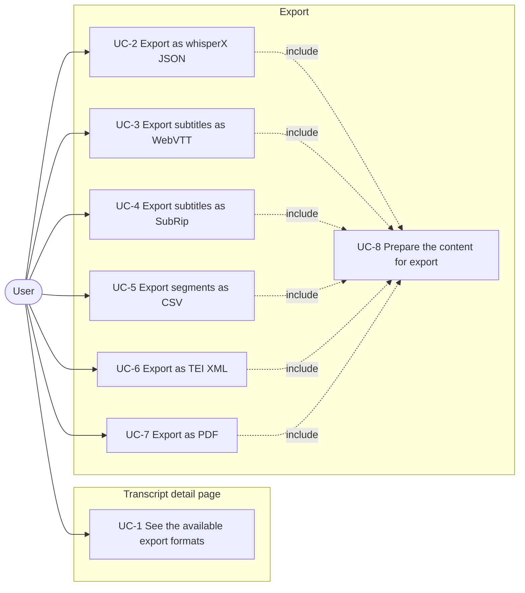
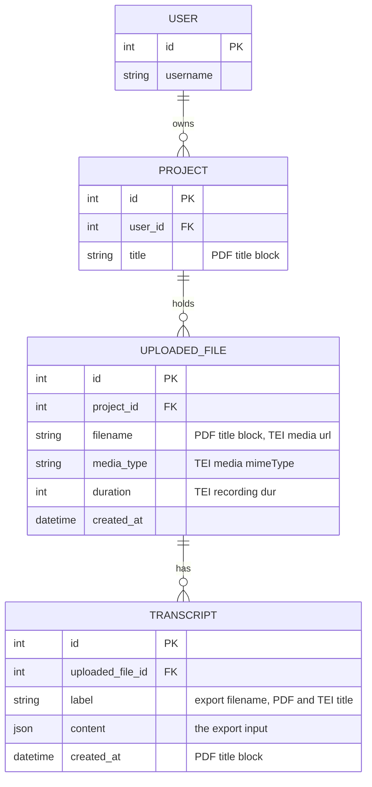
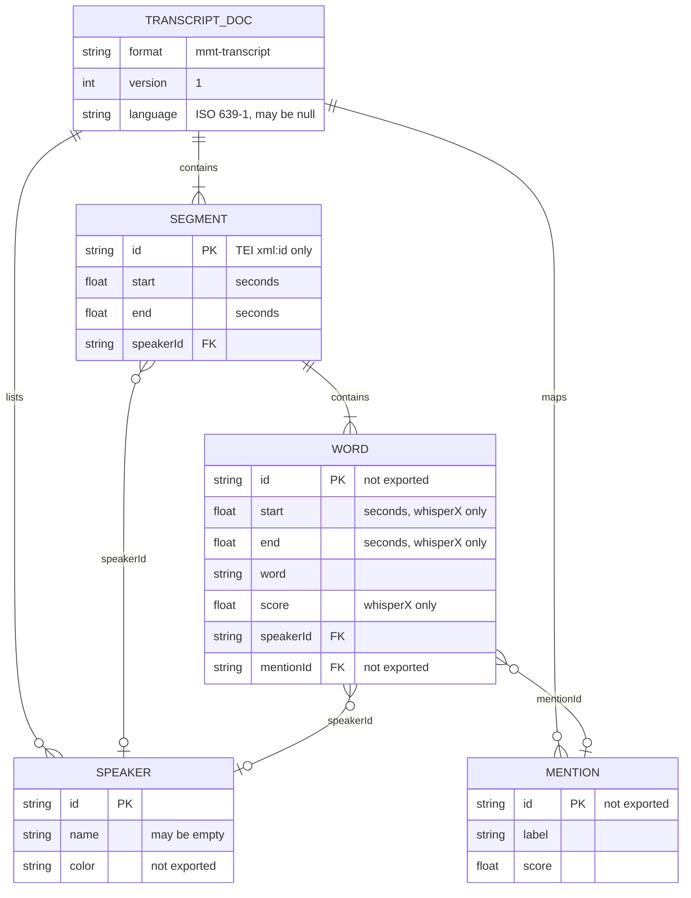

# Spec: transcript export in several formats

Status: in progress, slices 1 to 4 landed 2026-07-31.

This document is an **executable spec** (spec-driven development): it is the
prompt an implementing session works from and the authoritative record of every
decision, not a background sketch. Resolve ambiguity by reading this document,
not by inventing; if a genuinely new decision comes up, write it into this
document as part of the task. Check off tasks (`[x]`, with date) as they land.
Do not duplicate CLAUDE.md conventions here (test-first, pytest style).

The architectural overview that accompanies this spec is
[`docs/transcript-export-architecture.md`](../docs/transcript-export-architecture.md).
It records where the export layer sits and why; this spec records what is built.

## Motivation

A finished transcript is only useful outside the application. Subtitles go into
a video editor or a player, a table of segments goes into a spreadsheet or a
statistics tool, a TEI file goes into a corpus, a PDF goes to a person who reads
it. Today the transcript detail page offers exactly one download: the stored
mmt-transcript JSON, which no tool outside this project understands.

This feature adds an export section to the transcript detail page with one link
per format. The first set of formats is whisperX JSON with word timestamps,
WebVTT and SubRip for subtitles, CSV for segments, TEI XML, and PDF.

The stored content is unchanged by an export. Every format is a projection of
`Transcript.content`, computed on request, never persisted and never written
back.

## Non-goals

Do not add these, even where they would be easy:

- **No import.** No format listed here can be uploaded to create or update a
  transcript. The existing paths (ASR ingest, manual whisperX JSON upload) are
  untouched. In particular the whisperX export is not a round trip: exporting
  and re-importing loses the mmt identifiers.
- **No change to the stored content.** An export reads `Transcript.content` and
  writes nothing. Export results are not cached, not stored in the project's
  download directory and not attached to the transcript.
- **No background jobs.** Every export is produced inside the request. No Celery
  task, no polling, no progress display. See the size assumption below.
- **No export of several transcripts at once.** One transcript, one format, one
  file. No project-level "export everything" and no ZIP.
- **No export options.** No format carries settings: no choice of subtitle line
  length, no time offset, no speaker on or off, no font choice for the PDF. A
  format is one link with one deterministic result. Options are the obvious next
  request, and every one of them is easier to add once the registry exists.
- **No subtitle line wrapping or cue splitting.** One segment becomes one cue,
  however long it is, and its text is emitted on one line. Splitting a long
  segment into readable cues needs a rule about line length, reading speed and
  cue duration; that is its own feature.
- **No redaction handling.** [`2026-07-26-redactions.md`](2026-07-26-redactions.md)
  is not implemented; `Transcript.content` has no redaction fields today. When
  it does, applying them during export is separate work, as that spec's own
  non-goals already state. Until then no export removes or replaces anything.
- **No mention or entity output.** The `mentions` map is not represented in any
  format in this first set. TEI has a natural place for it (`<persName>`,
  `<placeName>`), which is recorded as an open question, not built.
- **No change to the existing "Download JSON" link.** It stays where it is and
  keeps serving the stored mmt-transcript content through
  `transcripts:detail-json`. It is not moved into the export section and not
  renamed.
- **No word-level timestamps in VTT, SRT, CSV or TEI.** Only the whisperX export
  carries word timings. This is the explicit request and it also keeps the four
  segment formats readable.

## Actors

- **User** — an authenticated account holder who owns the project the
  transcript belongs to and holds the `transcripts.view_transcript` permission.
  The only actor in this feature.

## System use cases

The overview shows the use cases and the one included case that all exports
perform.



Each use case below is the authoritative description of one system behaviour.
The format reference further down repeats the details in a compact form; where
the two disagree, the format reference is wrong and both are fixed together.

### UC-1 See the available export formats

- **Actor:** User.
- **Precondition:** The user is logged in, owns the project and has the
  `transcripts.view_transcript` permission, which is what the transcript detail
  page already requires.
- **Trigger:** The user opens the transcript detail page.
- **Main flow:**
  1. The page shows an "Export" section below the existing download and edit
     actions.
  2. The section lists one link per registered format, in the registry's order,
     each showing the format's name and a one-line description of what it
     contains.
  3. Every link is a plain `GET` to the export route for that format.
- **Alternative flow A — the user lacks `transcripts.view_transcript`:** The
  user does not reach the page at all; the existing view answers with the
  permission denial it already produces.
- **Postcondition:** None. Opening the page changes nothing.

### UC-2 Export as whisperX JSON

- **Actor:** User.
- **Precondition:** UC-1, and the user selected the whisperX format.
- **Trigger:** `GET /transcripts/<pk>/export/whisperx/`.
- **Main flow:**
  1. The system prepares the content (UC-8).
  2. The system builds a JSON document in whisperX output shape: a `segments`
     list with start, end, text, speaker and words; a flat `word_segments` list
     of every word in order; and the language when it is known.
  3. The system responds `200` with content type `application/json` and
     `Content-Disposition: attachment`.
- **Alternative flows:** See UC-8 for content and access failures.
- **Postcondition:** None. This is the only format carrying word-level
  timestamps.

### UC-3 Export subtitles as WebVTT

- **Actor:** User.
- **Precondition:** UC-1, and the user selected the WebVTT format.
- **Trigger:** `GET /transcripts/<pk>/export/vtt/`.
- **Main flow:**
  1. The system prepares the content (UC-8).
  2. The system writes a `WEBVTT` header, then one cue per segment with the
     segment's start and end as `HH:MM:SS.mmm` and the segment's text on one
     line, preceded by a voice tag when the segment has a speaker.
  3. The system responds `200` with content type `text/vtt; charset=utf-8` and
     `Content-Disposition: attachment`.
- **Alternative flow A — a segment has no speaker:** The cue carries no voice
  tag; the text is emitted alone.
- **Postcondition:** None.

### UC-4 Export subtitles as SubRip

- **Actor:** User.
- **Precondition:** UC-1, and the user selected the SubRip format.
- **Trigger:** `GET /transcripts/<pk>/export/srt/`.
- **Main flow:**
  1. The system prepares the content (UC-8).
  2. The system writes one numbered block per segment, counting from 1, with the
     time range as `HH:MM:SS,mmm --> HH:MM:SS,mmm` and the segment's text on one
     line, prefixed with the speaker's name and a colon when the segment has a
     speaker.
  3. The system responds `200` with content type
     `application/x-subrip; charset=utf-8` and `Content-Disposition: attachment`.
- **Alternative flow A — a segment has no speaker:** No prefix is written.
- **Postcondition:** None.

### UC-5 Export segments as CSV

- **Actor:** User.
- **Precondition:** UC-1, and the user selected the CSV format.
- **Trigger:** `GET /transcripts/<pk>/export/csv/`.
- **Main flow:**
  1. The system prepares the content (UC-8).
  2. The system writes a header row and one row per segment with the segment's
     position, start, end, speaker and text.
  3. The system responds `200` with content type `text/csv; charset=utf-8` and
     `Content-Disposition: attachment`.
- **Alternative flow A — a segment has no speaker:** The speaker cell is empty.
- **Alternative flow B — a segment's text contains a comma, a quotation mark or
  a line break:** The value is quoted according to RFC 4180 by the standard
  library's `csv` writer. No text is altered to avoid quoting.
- **Postcondition:** None.

### UC-6 Export as TEI XML

- **Actor:** User.
- **Precondition:** UC-1, and the user selected the TEI format.
- **Trigger:** `GET /transcripts/<pk>/export/tei/`.
- **Main flow:**
  1. The system prepares the content (UC-8).
  2. The system builds a TEI document: a header naming the transcript, the
     export date, the source recording and the language; a participant list with
     one `<person>` per speaker; a timeline with one `<when>` per distinct
     segment boundary; and one `<u>` element per segment referring to its
     speaker and to its two timeline points.
  3. The system responds `200` with content type
     `application/tei+xml; charset=utf-8` and `Content-Disposition: attachment`.
- **Alternative flow A — the content has no language:** The `<langUsage>`
  element and the document's `xml:lang` attribute are omitted.
- **Alternative flow B — a segment has no speaker:** Its `<u>` element carries
  no `who` attribute.
- **Postcondition:** None.

### UC-7 Export as PDF

- **Actor:** User.
- **Precondition:** UC-1, and the user selected the PDF format.
- **Trigger:** `GET /transcripts/<pk>/export/pdf/`.
- **Main flow:**
  1. The system prepares the content (UC-8).
  2. The system groups consecutive segments with the same speaker into speaker
     turns.
  3. The system renders a document with a title block naming the transcript, the
     project, the uploaded file, the creation date and the language, followed by
     one block per speaker turn showing the turn's start time, the speaker's
     name and the turn's text, and a page number in the footer.
  4. The system responds `200` with content type `application/pdf` and
     `Content-Disposition: attachment`.
- **Alternative flow A — a turn has no speaker:** The block shows the time and
  the text without a name.
- **Postcondition:** None.

### UC-8 Prepare the content for export

- **Actor:** User. Included by UC-2 to UC-7, never triggered on its own.
- **Precondition:** The user is logged in and has the
  `transcripts.view_transcript` permission.
- **Trigger:** Any export request.
- **Main flow:**
  1. The system loads the transcript owned by the requesting user, by the
     identifier in the route.
  2. The system looks up the requested format in the exporter registry.
  3. The system brings the stored content to the current mmt-transcript version
     with `normalize_content`, producing a validated `Transcript` model. The
     result is not saved.
  4. The system hands that model to the format's exporter and returns the
     exporter's bytes in a download response.
- **Alternative flow A — the transcript does not exist, or belongs to a project
  of another user:** `404`. This is the existing behaviour of the transcript
  detail view and uses the same queryset filter.
- **Alternative flow B — the format key in the route is not registered:** `404`.
- **Alternative flow C — the stored content fails validation:** The system logs
  the validation error with the transcript's identifier, adds an error message
  to the session, and redirects to the transcript detail page. No file is
  produced. The user sees "This transcript cannot be exported because its
  content is invalid. Please contact an administrator."
- **Alternative flow D — the user lacks `transcripts.view_transcript`:** The
  existing `permission_required` behaviour applies, which redirects to the login
  page.
- **Postcondition:** None. In particular, normalising the content for export
  does not persist the normalised form, so a transcript stored in the legacy
  whisper shape stays in that shape after an export.

## Entity relationship model

Two diagrams. The first is the persisted graph: exports read one `Transcript`
and, for the PDF and the TEI header, the objects above it. The second is the
structure inside the `content` column, which is a JSON document and not a set of
tables; it is the actual input of every exporter.

### Persisted entities



Ownership is checked on the same path the detail view already uses:
`Transcript.objects.filter(pk=..., uploaded_file__project__user=user)`.

### Structure of `Transcript.content`

The mmt-transcript document, as defined in
[`app/mmt/transcripts/mmt_schema.py`](../app/mmt/transcripts/mmt_schema.py) and
described in [`docs/mmt-transcript-format.md`](../docs/mmt-transcript-format.md).
Relations here are containment and reference within one JSON document, not
foreign keys.



A segment has **no** text field. Its text is produced by joining its words with a
single space, and that is the only definition of a segment's text in every
format below.

### What each format carries

| Content element | whisperX | VTT | SRT | CSV | TEI | PDF |
| --- | --- | --- | --- | --- | --- | --- |
| Segment start and end | yes | yes | yes | yes | yes | turn start only |
| Word start and end | yes | no | no | no | no | no |
| Word confidence score | yes | no | no | no | no | no |
| Speaker name | yes | yes, voice tag | yes, text prefix | yes, column | yes, `<person>` and `who` | yes, per turn |
| Speaker colour | no | no | no | no | no | no |
| Segment and word ids | no | no | no | no | segment id as `xml:id` | no |
| Mentions | no | no | no | no | no | no |
| Language | yes | no | no | no | yes | yes |

Every format is lossy relative to the stored content. The stored
mmt-transcript document remains the authoritative record, which is why the
existing "Download JSON" link stays.

## Feature reference

### Route and view

One route in [`app/mmt/transcripts/urls.py`](../app/mmt/transcripts/urls.py),
with the format key as a path segment:

```python
path('<int:pk>/export/<slug:format_key>/', views.export, name='export')
```

The view is `@require_GET` and `@permission_required('transcripts.view_transcript')`,
matching `transcripts.detail`. The format key is part of the path rather than a
query parameter so that each format has a distinct, linkable URL and so that an
unknown format is a `404` from the routing layer's point of view rather than a
validation error.

### The exporter registry

One registry holds every format. It drives both the view's lookup and the list
rendered on the detail page, so adding a format is one new module plus one entry
and never a template change.

```python
# mmt/transcripts/exporters/registry.py
@dataclass(frozen=True)
class ExportFormat:
    key: str            # the URL segment, e.g. 'vtt'
    name: str           # translated, shown on the detail page
    description: str    # translated, one line, shown next to the name
    extension: str      # without the dot
    content_type: str
    export: Callable[[ExportContext], bytes]

EXPORT_FORMATS: dict[str, ExportFormat]   # insertion order is the display order
```

The display order is whisperX, VTT, SRT, CSV, TEI, PDF: the machine-readable
full-fidelity format first, then the four segment formats, then the format meant
for reading.

Every exporter returns `bytes`, not `str`, so that the encoding decision belongs
to the exporter and the view never guesses one. The PDF exporter would otherwise
be the odd one out.

### The exporter input

```python
@dataclass(frozen=True)
class ExportContext:
    transcript: Transcript          # the mmt_schema model, validated
    label: str                      # Transcript.label
    created_at: datetime            # Transcript.created_at
    project_title: str
    filename: str                   # UploadedFile.filename
    media_type: str                 # UploadedFile.media_type
    duration: int                   # UploadedFile.duration, seconds
```

Exporters receive the validated `mmt_schema.Transcript` model, not the raw dict
and not the Django model. Typed attribute access is the point: an exporter that
reads `segment.start` cannot silently produce `None` for a key that a raw dict
would happily return. The surrounding fields the PDF and the TEI header need are
copied into the context, so no exporter touches the database or the request.

The view builds the context with `normalize_content(transcript.content)`, which
already accepts both the current mmt-transcript shape and legacy whisper input
and returns a validated model. Its result is not saved (UC-8 postcondition).

### Filenames

`f'{filename_safe(label)}.{extension}'`, using `filename_safe` from
[`app/mmt/core/utils.py`](../app/mmt/core/utils.py). `filename_safe` raises
`ValueError` when the label reduces to an empty string, for example a label made
only of punctuation; the fallback name is then `transcript_{pk}`.

Every export is served with `Content-Disposition: attachment`, including the
PDF. A user who wants to read the PDF in the browser opens the downloaded file;
serving it inline would make the browser's viewer the default reading
experience for a document that is meant to be kept.

### Timecodes

One helper module, since four formats need the same arithmetic with different
punctuation:

```python
# mmt/transcripts/exporters/timecode.py
def hhmmssmmm(seconds: float, *, millisecond_separator: str = '.') -> str:
    """Format seconds as HH:MM:SS.mmm. Hours are not truncated at 24 and are
    always at least two digits."""
```

VTT passes `'.'`, SRT passes `','`. Milliseconds are truncated, not rounded, so
that a cue never ends after the next one starts because of rounding.

### Format: whisperX JSON — key `whisperx`

Content type `application/json`, extension `json`. Serialised with
`json.dumps(..., ensure_ascii=False, indent=2)` and encoded as UTF-8, so the
file is readable in an editor and umlauts are not escaped.

```json
{
  "language": "de",
  "segments": [
    {
      "start": 0.0,
      "end": 4.2,
      "text": "Hi, wie geht es dir?",
      "speaker": "Alice",
      "words": [
        {"word": "Hi,", "start": 0.0, "end": 0.3, "score": 1.0, "speaker": "Alice"}
      ]
    }
  ],
  "word_segments": [
    {"word": "Hi,", "start": 0.0, "end": 0.3, "score": 1.0, "speaker": "Alice"}
  ]
}
```

- `language` is omitted when the content's language is `null`, rather than
  written as `null`, because consumers of whisperX output expect a string there.
- `speaker` is the speaker's `name`, falling back to the speaker's `id` when the
  name is an empty string. The key is omitted when `speakerId` is `null`. The
  mmt speaker id is not exported, because whisperX's `speaker` field is a label,
  not a reference.
- `text` is the segment's words joined with a single space. whisperX word tokens
  carry their trailing punctuation (`"Hi,"`), so a plain space join reproduces
  the original spacing. No punctuation-aware joining is attempted.
- `word_segments` is every word of every segment, in document order, in the same
  shape as inside a segment. whisperX emits this list and downstream tools read
  it, so it is reproduced rather than left out.
- The mmt `id` fields of segments and words are not exported. They have no place
  in the whisperX shape, and a consumer that needs them uses the stored
  mmt-transcript JSON.

### Format: WebVTT — key `vtt`

Content type `text/vtt; charset=utf-8`, extension `vtt`. Lines end with `\n`.

```
WEBVTT

00:00:00.000 --> 00:00:04.200
<v Alice>Hi, wie geht es dir?

00:00:04.200 --> 00:00:07.900
Und dir?
```

- The file starts with `WEBVTT` and one blank line.
- Cues are not numbered. VTT allows an optional identifier line; omitting it
  keeps the file smaller and no player requires it.
- The voice tag is `<v Name>` with the speaker's name, resolved like the
  whisperX `speaker` field. It is omitted for a segment without a speaker.
- The speaker's name is escaped for the four characters that are markup in VTT
  cue text: `&` becomes `&amp;`, `<` becomes `&lt;`, `>` becomes `&gt;`. The
  same escaping applies to the cue text itself.

### Format: SubRip — key `srt`

Content type `application/x-subrip; charset=utf-8`, extension `srt`. Lines end
with `\n`.

```
1
00:00:00,000 --> 00:00:04,200
Alice: Hi, wie geht es dir?

2
00:00:04,200 --> 00:00:07,900
Und dir?
```

- Blocks are numbered from 1 in document order.
- SubRip has no speaker convention, so the speaker's name is written as a text
  prefix `Name: `. It is omitted for a segment without a speaker.
- No escaping. SubRip text is plain text; the few players that understand HTML
  tags in it are not a reason to alter the transcript's characters.

### Format: CSV — key `csv`

Content type `text/csv; charset=utf-8`, extension `csv`. Written with the
standard library's `csv.writer` with default dialect, which is RFC 4180 with
`\r\n` line endings. Encoded as UTF-8 **with a byte order mark** (`utf-8-sig`),
because Excel otherwise reads a UTF-8 CSV as the system's legacy encoding and
shows broken umlauts, and a spreadsheet is the main reason this format exists.

Header row and one row per segment:

| Column | Value |
| --- | --- |
| `index` | position of the segment in the document, counting from 1 |
| `start` | segment start in seconds, rounded to three decimal places |
| `end` | segment end in seconds, rounded to three decimal places |
| `speaker` | the speaker's name, resolved like the whisperX `speaker` field, empty when the segment has no speaker |
| `text` | the segment's words joined with a single space |

The times are rounded and not truncated. Truncation exists in the subtitle
formats so that a cue never ends after the next one starts because of rounding;
a spreadsheet column has no such constraint, so `f'{seconds:.3f}'` is used.

The speaker cell holds the speaker's `name`, falling back to the speaker's `id`
when the name is an empty string, the same rule the whisperX, VTT and SRT
exports apply. The cell is empty only when the segment's `speakerId` is `null`.

Times are seconds and not `HH:MM:SS.mmm`: a spreadsheet can compute a readable
timecode from a number, while parsing a timecode string back into a number needs
a formula that most users will not write.

### Format: TEI XML — key `tei`

Content type `application/tei+xml; charset=utf-8`, extension `xml`. Built with
`xml.etree.ElementTree` and serialised with `encoding='utf-8',
xml_declaration=True`, so escaping is the standard library's responsibility and
not a set of format strings.

```xml
<?xml version='1.0' encoding='utf-8'?>
<TEI xmlns="http://www.tei-c.org/ns/1.0" xml:lang="de">
  <teiHeader>
    <fileDesc>
      <titleStmt><title>Interview mit Alice</title></titleStmt>
      <publicationStmt>
        <p>Exported from the Media Management Tool on 2026-07-30.</p>
      </publicationStmt>
      <sourceDesc>
        <recordingStmt>
          <recording type="audio" dur="PT3600S">
            <media url="interview.wav" mimeType="audio/wav"/>
          </recording>
        </recordingStmt>
      </sourceDesc>
    </fileDesc>
    <profileDesc>
      <langUsage><language ident="de"/></langUsage>
      <particDesc>
        <listPerson>
          <person xml:id="s1"><persName>Alice</persName></person>
        </listPerson>
      </particDesc>
    </profileDesc>
  </teiHeader>
  <text>
    <body>
      <timeline unit="s" origin="#t0">
        <when xml:id="t0" absolute="00:00:00"/>
        <when xml:id="t1" interval="4.2" since="#t0"/>
      </timeline>
      <u xml:id="seg_a1" who="#s1" start="#t0" end="#t1">Hi, wie geht es dir?</u>
    </body>
  </text>
</TEI>
```

- The date in the `<publicationStmt>` is the date the export runs, not the
  transcript's creation date. It is not a translatable string.
- `<recording type="...">` is `audio` when the uploaded file's media type is an
  audio type and `video` otherwise, decided with `file_category` from
  `mmt/core/utils.py`. `dur` is `PT{duration}S` with the uploaded file's
  duration, and the whole `<recordingStmt>` is omitted when the duration is 0,
  since `dur="PT0S"` would assert something false. TEI does not allow an empty
  `<sourceDesc>`, so in that case it holds a `<p>` with the uploaded file's name
  instead.
- Speaker ids become `xml:id` values on `<person>` and are referenced from `<u
  who="#...">`. The mmt speaker ids (`s1`, `s2`) are already valid XML names, so
  they are used unchanged. A speaker with an empty name gets a `<persName>`
  holding its id.
- TEI does not allow an empty `<listPerson>` either, so the whole `<particDesc>`
  is omitted when the content has no speakers, and `<profileDesc>` is omitted
  when both it and `<langUsage>` are absent.
- The timeline holds one `<when>` per **distinct** timestamp across all segment
  boundaries, so a segment that starts exactly where the previous one ends
  produces one point, not two. The first point is the origin `t0` with
  `absolute="00:00:00"`; every other point is `interval` seconds `since="#t0"`,
  counted from the first point. Points are emitted in ascending order and named
  `t0`, `t1`, `t2` in that order.
- An `interval` is rounded to three decimal places and its trailing zeros are
  removed, so a boundary at 4.2 seconds is written `4.2` and one at 12.3456
  seconds is written `12.346`.
- One `<u>` per segment, carrying the segment's mmt id as `xml:id`. This is the
  only format that exports mmt identifiers, because TEI needs an identifier
  anyway and reusing the stored one lets a TEI file be traced back to the
  transcript.
- `xml:lang` on `<TEI>` and the `<langUsage>` block are omitted when the
  content's language is `null`.
- No `<w>` elements. Word-level markup is what a word-timestamped TEI would
  need, and this format deliberately stops at the segment.

### Format: PDF — key `pdf`

Content type `application/pdf`, extension `pdf`. Rendered with WeasyPrint from a
Django template, the same approach as
[`app/mmt/my_account/pdf.py`](../app/mmt/my_account/pdf.py):

```python
# mmt/transcripts/exporters/pdf.py
def export(context: ExportContext) -> bytes:
    from weasyprint import HTML
    html = HTML(string=render_to_string('transcripts/export_pdf.html', {...}))
    return html.write_pdf()
```

The import of WeasyPrint stays inside the function, as it does in
`my_account/pdf.py`, so importing the registry does not pull in the rendering
stack.

The document:

- A4, 2 cm margins, `@page` footer with the page number, header with the
  transcript's label from page two onwards.
- A title block: the transcript's label as the heading, then the project title,
  the uploaded file's name, the transcript's creation date and the language.
- The body is one block per **speaker turn**, not per segment: consecutive
  segments with the same `speakerId` are joined into one paragraph, with the
  turn's start time in `HH:MM:SS` and the speaker's name above it. Reading a
  transcript segment by segment breaks a sentence every few seconds, and the
  segment boundaries carry no meaning for a reader.
- Turn text is the turn's segments' texts joined with a single space.
- A turn without a speaker shows the time alone.

The template is `app/mmt/transcripts/templates/transcripts/export_pdf.html` with
its CSS inline in a `<style>` block, following `dpa_pdf.html`. Per CLAUDE.md the
CSS uses `rlh` units and alphabetically ordered properties.

The turn grouping helper lives in `mmt/transcripts/exporters/turns.py`:

```python
@dataclass(frozen=True)
class SpeakerTurn:
    start: float
    end: float
    speaker: Speaker | None
    text: str

def speaker_turns(transcript: Transcript) -> list[SpeakerTurn]: ...
```

`speaker_turn_batches` in
[`app/mmt/transcripts/normalize.py`](../app/mmt/transcripts/normalize.py) groups
by the same rule but returns flat word dicts for the NER request and works on raw
dicts, so it cannot be reused here. If a third caller needs turns, the two are
merged then, not now.

### Detail page section

The export section is added to
[`app/mmt/transcripts/templates/transcripts/detail.html`](../app/mmt/transcripts/templates/transcripts/detail.html)
below the existing "Download JSON" link and above the edit action. It renders a
description list from `export_formats` in the template context, which the
`detail` view fills from the registry: each entry is a link to
`` with the format's name
as the link text and the format's description beside it.

### Translations

Format names and descriptions, the section heading and the error message from
UC-8 alternative flow C are translatable strings. Per CLAUDE.md, the German
translations go into `locale/de/LC_MESSAGES/django.po` in the same session that
introduces them, followed by `compilemessages`. Suggested German names: "whisperX
JSON", "WebVTT-Untertitel", "SubRip-Untertitel", "CSV-Tabelle", "TEI-XML",
"PDF-Dokument".

## File layout

```
app/mmt/transcripts/
    exporters/
        __init__.py         re-exports EXPORT_FORMATS and ExportContext
        registry.py         ExportFormat, ExportContext, EXPORT_FORMATS
        timecode.py         hhmmssmmm
        turns.py            SpeakerTurn, speaker_turns
        whisperx.py         export
        vtt.py              export
        srt.py              export
        csv_export.py       export
        tei.py              export
        pdf.py              export
    templates/transcripts/
        export_pdf.html
    tests/
        test_export_registry.py
        test_export_view.py
        test_export_whisperx.py
        test_export_vtt.py
        test_export_srt.py
        test_export_csv.py
        test_export_tei.py
        test_export_pdf.py
```

The module is `csv_export.py` and not `csv.py`, so that it cannot shadow the
standard library's `csv` module for anything importing it.

Key signatures:

```python
# mmt/transcripts/views.py
@require_GET
@permission_required('transcripts.view_transcript')
def export(request, pk, format_key): ...
```

## Tests

Exporter tests are pure: they build an `ExportContext` from a fixture transcript
and assert on the returned bytes. Only `test_export_view.py` needs the database
and the client.

A shared fixture in `app/mmt/transcripts/tests/conftest.py` provides a small
two-speaker, three-segment transcript with a known set of timestamps, including
one segment without a speaker and one speaker with an empty name, so every
exporter test covers the fallbacks.

- `test_export_registry.py` — every entry's key matches its dictionary key,
  every key is URL-safe, extensions and content types are non-empty, and the
  order is the one pinned above.
- `test_export_view.py` — each format answers `200` with its content type and an
  attachment disposition whose filename ends in the format's extension; an
  unknown format key answers `404`; another user's transcript answers `404`;
  a user without `transcripts.view_transcript` is redirected; invalid content
  redirects to the detail page with an error message and produces no file; a
  label that reduces to an empty string produces `transcript_{pk}.{ext}`; and
  the stored content is unchanged after an export of a legacy whisper-shaped
  transcript.
- `test_export_whisperx.py` — segment text joining, `word_segments` order and
  length, the speaker name and its id fallback, the omitted `speaker` key, the
  omitted `language` key, and the absence of mmt `id` fields.
- `test_export_vtt.py` — the `WEBVTT` header, the timecode format with a dot,
  the voice tag and its absence, escaping of `<`, `>` and `&` in cue text and in
  a speaker's name, and one blank line between cues.
- `test_export_srt.py` — numbering from 1, the timecode format with a comma, the
  speaker prefix and its absence, and the absence of escaping.
- `test_export_csv.py` — the header row, three decimal places on the times, the
  empty speaker cell, RFC 4180 quoting of a text containing a comma and a
  quotation mark, and the byte order mark at the start of the file.
- `test_export_tei.py` — the document parses; the timeline has one point per
  distinct timestamp, ordered, with `t0` as the origin; `<u>` elements carry the
  segment ids and resolve their `who`, `start` and `end` references; the header
  omits `<recordingStmt>` for a zero duration and omits the language block for a
  null language; a speaker name containing `&` and `<` is escaped by the
  serialiser.
- `test_export_pdf.py` — the result starts with `%PDF-`, is longer than a
  threshold, and the rendered HTML (asserted on the template render, not on the
  PDF bytes) contains the turn grouping, the speaker names and the title block.

Timecode and turn grouping have their own tests inside
`test_export_registry.py`'s module neighbours: `hhmmssmmm` truncates rather than
rounds, formats hours beyond 24, and pads correctly; `speaker_turns` merges
consecutive equal speakers, treats `None` as a value like any other, and returns
one turn for a speakerless transcript.

## Slices and tasks

Each slice leaves the system working and independently deployable. Each task is
one session. Slice 1 carries the whole mechanism and one format; slices 2 to 5
each add formats to an existing mechanism, so they are small and can land in any
order.

- [x] (2026-07-31) **1 Registry, view and whisperX.** The `exporters` package, the registry,
  the context, `timecode.py`, the whisperX exporter, the route, the view, the
  export section on the detail page, and the German translations. Done when
  `test_export_registry.py`, `test_export_view.py` and
  `test_export_whisperx.py` pass and a development run downloads a whisperX
  file from the detail page.
- [x] (2026-07-31) **2 WebVTT and SubRip.** Both exporters and their registry entries, with
  the German translations. Done when `test_export_vtt.py` and
  `test_export_srt.py` pass and a downloaded VTT file plays as subtitles beside
  the media file in a player.
- [x] (2026-07-31) **3 CSV.** The exporter, its registry entry and the German translation.
  Done when `test_export_csv.py` passes and a downloaded file opens in a
  spreadsheet with correct umlauts.
- [x] (2026-07-31) **4 TEI XML.** The exporter, its registry entry and the German
  translation. Done when `test_export_tei.py` passes and the exported file
  validates against the TEI P5 schema in an external validator.
- [ ] **5 PDF.** `turns.py`, the exporter, the template, its registry entry and
  the German translation. Done when `test_export_pdf.py` passes and a
  development run produces a readable multi-page PDF from a real interview
  transcript.

## Open questions

Recorded, not blocking. Do not decide these while implementing; raise them.

- Whether the PDF should be produced in a background job. WeasyPrint on a
  transcript of a two-hour interview has not been measured; if a request takes
  more than a few seconds, the PDF moves to a Celery task and the project's
  download directory, which changes UC-7 substantially.
- Whether subtitle formats need cue splitting, and by which rule. The current
  output is correct but hard to read for long segments.
- Whether TEI should carry mentions as `<persName>`, `<orgName>`, `<placeName>`
  and `<date>` inside the utterances. This is the natural home for the
  `mentions` map and the strongest argument for the TEI format existing at all,
  but it needs word-level markup inside `<u>`, which the current shape avoids.
- Whether the TEI timeline's origin should be the recording's start rather than
  the first segment boundary. `t0` carries `absolute="00:00:00"` and every
  interval is counted from it, so a transcript whose first segment starts at
  0.03 seconds states an origin it does not have and shifts every interval by
  that offset. The two ways out are giving `t0` its real timecode as `absolute`,
  or always emitting a point at 0.0.
- Whether an export should offer the speakers' colours anywhere. No format in
  this set has a place for them.
- What an export should do once redactions exist. The likely answer is that
  every format applies them and the mmt-transcript download does not, but that
  decision belongs to the redaction work.

## Size assumption

Exports are built in memory and returned in one response. A three-hour interview
transcript is on the order of 40,000 words, which is a few megabytes of JSON and
well below a megabyte of VTT, CSV or TEI. The PDF is the only format whose
production time is not obviously small, which is why it is the last slice and
the subject of the first open question.
