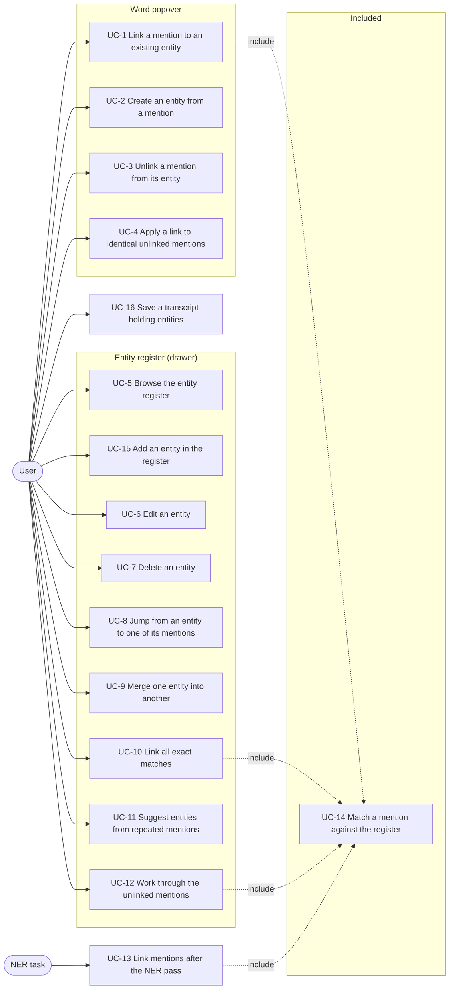
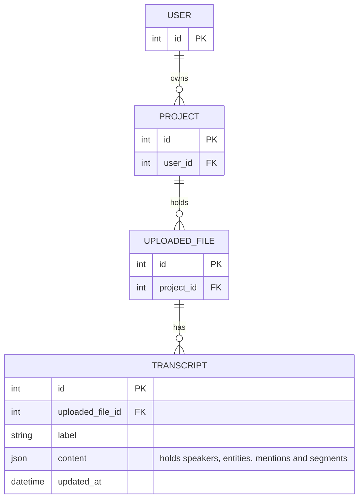
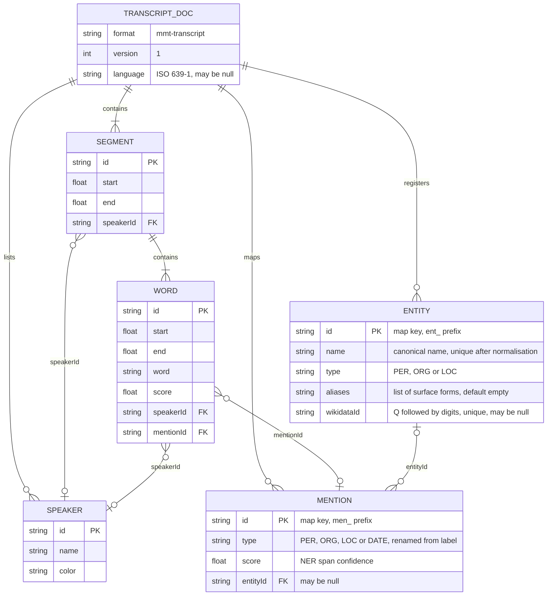

# Spec: canonical entities in the transcript

Status: in progress.

This document is an **executable spec** (spec-driven development): it is the
prompt an implementing session works from and the authoritative record of every
decision, not a background sketch. Resolve ambiguity by reading this document,
not by inventing; if a genuinely new decision comes up, write it into this
document as part of the task. Check off tasks (`[x]`, with date) as they land.
Do not duplicate CLAUDE.md conventions here (test-first, pytest style, vitest
for the frontend, both locale files for every new string).

The architectural overview that accompanies this spec is
[`docs/canonical-entities-architecture.md`](../docs/canonical-entities-architecture.md).
It records where the identity tier sits and why; this spec records what is
built. Where the two disagree, this spec is authoritative. The overview predates
the revision of 2026-09-26 (type equality, entities without mentions, unique
names) and is corrected in slice 3.

This spec supersedes [`docs/canonical-entities-plan.md`](../docs/canonical-entities-plan.md).
Where the two disagree, this spec is authoritative and the plan is stale.

The file names, functions and components this spec refers to were checked
against the code on 2026-09-26. Since the spec was first written, the editor
store has been split into one composable per tier (`useMentions.ts`,
`useSpeakers.ts` and others), speaker changes are tracked without marking
segments dirty, the settings drawer shows checkboxes for the visibility of
each type instead of a static legend, and redactions have been implemented.

## Motivation

The transcript already records **mentions**: one entry in the transcript-level
`mentions` map per occurrence of a named entity, produced by the NER pass or by
hand in the word popover, with a type (`PER`, `ORG`, `LOC`, `DATE`) and a
confidence score. Words point at a mention through `mentionId`.

A mention is an occurrence, not an identity. "Angela Merkel" said three times in
an interview is three mentions, and nothing in the stored content says that the
three are the same person. "Merkel" said a fourth time is a fourth mention that
nothing connects to the other three. A user who wants to know where a person
appears in an interview, or who wants to attach a Wikidata identifier to a
person once instead of once per occurrence, cannot express that today.

This feature adds an identity tier: a transcript-level `entities` map holding a
canonical name, a type, optional aliases and an optional Wikidata identifier,
and a nullable `entityId` on each mention pointing at one of those entities.
It adds the interface for linking a mention to an entity, an entity register in
a drawer beside the transcript, navigation from an entity to each of its
mentions, merging two entities, and a rule that links mentions whose surface
text matches an entity the register already holds.

`entityId: null` is a legal permanent state, not an unfinished task. Linking is
decoupled from mention creation: the NER pass and the word popover produce
unlinked mentions, and linking is a separate step the user performs or a rule
performs on the user's request.

An entity may exist without any mention. The register is a list of identities
the user has recorded for the transcript, and an identity keeps its name,
aliases and Wikidata identifier when its last mention is unlinked or when a new
NER pass replaces every mention.

## Non-goals

Do not add these, even where they would be easy:

- **No entity table in the database.** Entities live inside `Transcript.content`
  like speakers and mentions, and their scope is one transcript. Cross-transcript
  identity, meaning the same person recognised across interviews, is the trigger
  for a real database entity, and it is deferred by the same reasoning that
  defers a `Speaker` model in
  [`docs/mmt-transcript-format.md`](../docs/mmt-transcript-format.md).
- **No linkable DATE mentions.** `entity.type` is `PER`, `ORG` or `LOC` only,
  and the popover shows no entity row for a `DATE` mention. A date has no
  identity; making a date canonical means normalising it to a calendar value
  (ISO 8601 or EDTF), which is a different feature and would be a `value` field
  on the mention, not an entry in the entity register.
- **No coreference.** Pronouns and descriptions ("er", "der Zeitzeuge") are not
  mentions today, the NER service does not produce such spans, and this feature
  does not create them.
- **No silent entity creation.** No pass creates an entity on its own. Every
  entity in the register was created by an explicit user action: the combobox in
  the word popover, the add action in the register, or a confirmed suggestion in
  the register.
- **No overwriting of an existing link by a rule.** Every rule fills
  `entityId: null` and never replaces a link that is already there, whoever set
  it. There is therefore no link-provenance field in the format.
- **No mention-provenance field.** Whether a mention came from the NER pass or
  from the word popover is not recorded. No use case in this feature reads it;
  see the open questions.
- **No Wikidata lookup.** The `wikidataId` field exists from slice 1 and is
  typed by hand. Searching Wikidata for candidates and prefilling name and
  aliases from its labels is purely additive interface work on a field that
  already exists, and it needs a decision about client-side against
  backend-proxied requests that is not made here.
- **No entity output in any export.** The export formats in
  [`2026-07-30-transcript-export.md`](2026-07-30-transcript-export.md) carry
  neither mentions nor entities, and this feature does not change that. TEI is
  the format with a natural place for them and it stays an open question there.
- **No entity data in the read-only API.** The API in
  [`2026-07-30-read-only-api.md`](2026-07-30-read-only-api.md) serves
  `Transcript.content` unchanged at
  `GET /api/v1/transcripts/{id}/content`, so entities reach an API client as
  part of that document without any change to the API. No entity-specific
  endpoint is added.
- **No relationship to redactions.**
  [`2026-07-26-redactions.md`](2026-07-26-redactions.md) makes no decision
  about entities, and no decision here anticipates redactions.
- **No format version bump.** See the format extension below.

## Actors

- **User** — a logged-in account holder with the
  `transcripts.change_transcript` permission, editing one transcript in the
  transcript editor. The actor in every use case except UC-13.
- **NER task** — the Celery task `enrich_transcript` in
  [`app/mmt/transcripts/tasks.py`](../app/mmt/transcripts/tasks.py). A system
  actor, triggered by a user asking for named-entity recognition on a
  transcript, but running without a user present. The actor in UC-13.

## System use cases

The overview shows which actor triggers which use case. `<<include>>` marks a
use case that every dependent case performs as part of its own flow.



Each use case below is the authoritative description of one system behaviour.
The feature reference further down repeats the rules in a compact form; where
the two disagree, the feature reference is wrong and both are fixed together.

Every use case except UC-13 and UC-16 changes the editor's in-memory state
only. Nothing reaches the database until the user saves (UC-16).

### UC-1 Link a mention to an existing entity

- **Actor:** User.
- **Precondition:** The transcript is open in the editor, a word belonging to a
  mention with type `PER`, `ORG` or `LOC` is selected, and the mention has no
  entity.
- **Trigger:** The user opens the word popover and picks an entity from the
  entity combobox.
- **Main flow:**
  1. The popover's mention section shows an entity row holding a combobox whose
     query is prefilled with the mention's surface text.
  2. The system lists the register's entities ranked by the ranking rule, and
     preselects the entity that matches the mention (UC-14) when there is one.
  3. The user picks an entity.
  4. The system sets the mention's `entityId` to that entity's identifier and
     marks the register as changed.
  5. The popover switches the entity row to its linked form, showing the
     entity's name, type, aliases and Wikidata identifier, with actions to
     change the link and to unlink.
  6. When at least one unlinked mention has the same normalised surface text and
     the same type, the popover offers UC-4.
- **Alternative flow A — the entity's type differs from the mention's type:**
  The system sets the mention's `type` to the entity's type as part of step 4.
  Linking a mention to an entity of another type is the correction of the
  mention's type.
- **Alternative flow B — the mention's type is `DATE`:** No entity row is
  shown; there is nothing for the user to trigger.
- **Postcondition:** The mention's `entityId` names an entity in the register,
  and the mention's `type` equals the entity's `type`.

### UC-2 Create an entity from a mention

- **Actor:** User.
- **Precondition:** As UC-1.
- **Trigger:** The user picks the create item at the end of the combobox list,
  which reads `Create "<query>"`.
- **Main flow:**
  1. The system creates an entity with a fresh identifier, the name taken from
     the combobox query as typed and trimmed, the type taken from the mention's
     `type`, an empty alias list and no Wikidata identifier.
  2. The system links the mention to the new entity, exactly as in UC-1 step 4.
  3. The popover shows the linked form and, when applicable, offers UC-4.
- **Alternative flow A — the normalised query equals the normalised name or a
  normalised alias of any entity in the register, whatever its type:** The
  create item is not shown, because the register would violate invariant 4. The
  user picks the existing entity instead.
- **Alternative flow B — the query is empty after normalisation:** The create
  item is not shown.
- **Postcondition:** The register holds one more entity, referenced by the
  mention it was created from.

### UC-3 Unlink a mention from its entity

- **Actor:** User.
- **Precondition:** The selected word belongs to a linked mention.
- **Trigger:** The user activates the unlink action in the popover's entity row.
- **Main flow:**
  1. The system sets the mention's `entityId` to `null`. The mention keeps its
     `type`.
  2. The entity row returns to its unlinked form with the combobox.
- **Postcondition:** The mention has no entity. The entity stays in the
  register, also when no mention references it any more.

### UC-4 Apply a link to identical unlinked mentions

- **Actor:** User.
- **Precondition:** The user has just linked a mention (UC-1 or UC-2) and at
  least one other mention has the same normalised surface text, the same type,
  and no entity.
- **Trigger:** The user activates "Apply to N identical mentions" in the
  popover's entity row.
- **Main flow:**
  1. The system finds every mention in the document with `entityId: null`, the
     same `type` as the linked mention, and the same normalised surface text
     (match rule B).
  2. The system sets each of their `entityId` to the same entity.
  3. The action disappears, since no unlinked identical mention is left.
- **Alternative flow A — the user does not activate the action:** Nothing else
  is linked. This is a one-click offer, never automatic.
- **Postcondition:** Every mention with that surface text and that type points
  at the same entity. Mentions that were already linked to another entity are
  untouched.

### UC-5 Browse the entity register

- **Actor:** User.
- **Precondition:** The transcript is open in the editor.
- **Trigger:** The user opens the entity drawer on the left of the transcript.
- **Main flow:**
  1. The drawer opens docked: the transcript shifts to make room, stays visible
     and stays editable, and no backdrop is drawn.
  2. The register lists every entity by name, each with a type swatch, its name,
     its type and the number of mentions pointing at it, which may be zero.
  3. Above the list the system shows the number of unlinked mentions with a
     type of `PER`, `ORG` or `LOC`.
  4. A search field appears once the register holds more than eight entities and
     filters the list on the normalised name and aliases.
- **Alternative flow A — the register is empty:** The list is replaced by a
  sentence explaining that entities are added in the register or created by
  linking a mention in the word popover.
- **Alternative flow B — the viewport is narrower than the docked layout
  allows:** The drawer opens as an overlay with a backdrop, in the same way the
  existing settings drawer on the right does.
- **Postcondition:** None. Opening the drawer changes nothing. The register
  lists every entity whatever the type visibility checkboxes above it are set
  to; those checkboxes affect only the colouring of the transcript.

### UC-6 Edit an entity

- **Actor:** User.
- **Precondition:** The register lists the entity.
- **Trigger:** The user activates the edit action on an entity row.
- **Main flow:**
  1. The row becomes a form holding the name, the type, the alias list and the
     Wikidata identifier.
  2. The user changes any of them and confirms.
  3. The system writes the values to the entity and marks the register as
     changed.
- **Alternative flow A — the name is empty after normalisation:** Confirming is
  not possible; the entity keeps its values.
- **Alternative flow B — the Wikidata identifier does not match `Q` followed by
  digits:** Confirming is not possible and the field is marked as invalid. An
  empty field is valid and means no identifier.
- **Alternative flow C — an alias is empty after normalisation, or repeats the
  name or another alias of the same entity after normalisation:** That alias is
  dropped silently on confirmation. The remaining values are written.
- **Alternative flow D — the name or an alias, normalised, equals the
  normalised name or a normalised alias of another entity:** Confirming is not
  possible, and the field is marked with "Another entity already has this name
  or alias." The user merges the two entities instead (UC-9).
- **Alternative flow E — the Wikidata identifier is already held by another
  entity:** Confirming is not possible, and the field is marked with "Another
  entity already has this Wikidata ID."
- **Alternative flow F — the type changes:** The system sets the `type` of every
  mention linked to the entity to the new type, in the same step.
- **Postcondition:** The entity holds the new values, and every linked mention
  has the entity's type. Its identifier and the mentions pointing at it are
  unchanged, so a rename is one write.

### UC-7 Delete an entity

- **Actor:** User.
- **Precondition:** The register lists the entity.
- **Trigger:** The user activates the delete action on an entity row and
  confirms in place.
- **Main flow:**
  1. The system sets `entityId` to `null` on every mention pointing at the
     entity.
  2. The system removes the entity from the register.
- **Alternative flow A — the user cancels the confirmation:** Nothing changes.
- **Postcondition:** The mentions still exist, are still mentions, keep their
  type, and are unlinked. Deleting an entity never deletes a mention or a word.

### UC-8 Jump from an entity to one of its mentions

- **Actor:** User.
- **Precondition:** The register lists the entity.
- **Trigger:** The user expands an entity row and activates one of its mentions.
- **Main flow:**
  1. The expanded row lists the entity's mentions in document order, each with
     the start time of the mention's first word and a snippet of the surrounding
     words with the mention's own words marked.
  2. Activating a mention makes the system scroll the transcript so that the
     mention's segment is visible, mark that mention in the transcript as the
     focused one, and seek the media element to the start of the mention's first
     word without starting playback.
- **Alternative flow A — the user activates another mention:** The previous
  focus mark is removed and the new mention is marked. Exactly one mention is
  marked at a time, and the mark stays until the next jump.
- **Alternative flow B — the entity has no mention:** The expanded row shows
  "No mentions in this transcript." and nothing can be activated.
- **Postcondition:** None. Navigation changes no content.

### UC-9 Merge one entity into another

- **Actor:** User.
- **Precondition:** The register holds at least two entities of the same type.
- **Trigger:** The user activates "Merge into…" on an entity row and picks the
  target entity from a combobox.
- **Main flow:**
  1. The combobox lists the entities of the same type as the source, excluding
     the source itself, ranked by the same rule as the linking combobox and
     without a create item.
  2. The system points every mention of the source entity at the target entity.
  3. The system extends the target's alias list with the source's name followed
     by the source's aliases. Invariant 4 guarantees that none of them equals
     the target's name or an alias after normalisation, so nothing is dropped.
  4. The system gives the target the source's Wikidata identifier when the
     target has none, and keeps the target's otherwise.
  5. The system removes the source entity.
- **Alternative flow A — the register holds no other entity of the source's
  type:** The merge action is not offered.
- **Postcondition:** The source entity no longer exists, its mentions belong to
  the target, and the target can be found by the source's former name because it
  is now an alias. A wrong choice between creating and selecting an entity is
  repaired in two actions.

### UC-10 Link all exact matches

- **Actor:** User.
- **Precondition:** The register holds at least one entity.
- **Trigger:** The user activates "Link exact matches" in the register.
- **Main flow:**
  1. For every mention with `entityId: null` and a type of `PER`, `ORG` or
     `LOC`, the system determines the matching entity (UC-14).
  2. Where an entity matches, the system links the mention to it.
  3. The system reports how many mentions were linked.
- **Alternative flow A — nothing matches:** The report states that no mention
  was linked. Nothing changes.
- **Postcondition:** No existing link was changed. Running the action a second
  time changes nothing.

### UC-11 Suggest entities from repeated mentions

- **Actor:** User.
- **Precondition:** The transcript holds unlinked mentions.
- **Trigger:** The user activates "Suggest entities" in the register.
- **Main flow:**
  1. The system groups every mention with `entityId: null` and a type of `PER`,
     `ORG` or `LOC` by the pair of its normalised surface text and its type.
  2. The system discards every group whose normalised surface text equals the
     normalised name or a normalised alias of an entity in the register. A group
     of the same type as that entity is linked by UC-10; a group of another type
     cannot become an entity without violating invariant 4.
  3. The system proposes one entity per remaining group holding at least two
     mentions, with the name taken from the most frequent original spelling in
     the group, ties broken by the first occurrence in document order, and the
     type taken from the group's type.
  4. The system lists the proposals with their occurrence counts, and the user
     confirms or dismisses each one separately.
  5. Confirming a proposal creates the entity and links every mention of that
     group to it.
- **Alternative flow A — no group is left to propose:** The system reports that
  it found nothing to suggest. A single unlinked occurrence is not evidence of
  an identity worth recording.
- **Alternative flow B — two groups share a normalised surface text and differ
  in type:** Both are proposed. Confirming one of them removes the other from
  the list, because the other can no longer be created.
- **Alternative flow C — the user dismisses a proposal:** No entity is created
  and its mentions stay unlinked. The proposal reappears the next time the
  action runs, since nothing about the dismissal is stored.
- **Postcondition:** Every confirmed proposal is one new entity with at least
  two mentions. This is the answer to a transcript whose first NER pass produced
  mentions and no register.

### UC-12 Work through the unlinked mentions

- **Actor:** User.
- **Precondition:** At least one mention has `entityId: null` and a type of
  `PER`, `ORG` or `LOC`.
- **Trigger:** The user opens the review section of the register.
- **Main flow:**
  1. The system shows the unlinked mentions one at a time in document order,
     with the current mention's surface text, its type, its start time and its
     snippet, and it marks that mention in the transcript exactly as UC-8 does.
  2. The system offers the combobox of UC-1, including its create item and its
     preselection of the matching entity (UC-14), and a skip action.
  3. Picking an entity links the mention and advances to the next unlinked
     mention.
  4. Skipping advances without linking and without recording anything.
- **Alternative flow A — no unlinked mention is left:** The review section shows
  that everything is linked. This is a report, not a demand: leaving mentions
  unlinked is a legitimate final state.
- **Alternative flow B — the user leaves the review and returns:** The walk
  starts again at the first unlinked mention in document order. No position is
  stored.
- **Postcondition:** Every mention the user acted on is linked. Skipped mentions
  are unchanged.

### UC-13 Link mentions after the NER pass

- **Actor:** NER task.
- **Precondition:** `enrich_transcript` has applied the service's spans to the
  copied content with `apply_mention_spans`.
- **Trigger:** The step after `apply_mention_spans` and before validation, in
  the same task.
- **Main flow:**
  1. Every mention in the new content is unlinked, because
     `apply_mention_spans` mints the whole mentions map afresh. The `entities`
     map is carried over unchanged from the source transcript's content, since
     the task deep-copies that content.
  2. For every mention with a type of `PER`, `ORG` or `LOC`, the system
     determines the matching entity (UC-14) and links the mention to it.
  3. The task validates and stores the content as it does today.
- **Alternative flow A — the source content holds no entities:** Step 2 is a
  no-op and the produced transcript has an empty register, which is what a first
  NER run on a fresh transcript produces.
- **Postcondition:** The new transcript's register equals the source
  transcript's register. Each mention whose surface text matches an entity is
  linked to it; an entity whose name and aliases no longer occur has no mention.

### UC-14 Match a mention against the register

- **Actor:** Included by UC-1, UC-10, UC-12 and UC-13; never triggered on its
  own.
- **Precondition:** A mention and a register of entities.
- **Trigger:** Any of the including use cases.
- **Main flow:**
  1. The system computes the mention's surface text: the words of the whole
     document carrying that `mentionId`, in document order, joined with a single
     space.
  2. The system normalises that text (normalisation below).
  3. An entity matches when its `type` equals the mention's `type` **and** the
     normalised surface text equals the normalised entity name or one of the
     normalised aliases.
  4. The system returns the matching entity. Invariant 4 guarantees that at most
     one entity matches.
- **Alternative flow A — no entity matches:** The result is empty and the
  including use case leaves the mention unlinked.
- **Postcondition:** None. Matching writes nothing.

### UC-15 Add an entity in the register

- **Actor:** User.
- **Precondition:** The entity drawer is open.
- **Trigger:** The user activates "Add entity" in the register.
- **Main flow:**
  1. The register shows a form holding a name input and a type selector with
     `PER`, `ORG` and `LOC`, defaulting to `PER`.
  2. The user enters a name, picks a type and confirms.
  3. The system creates an entity with a fresh identifier, the trimmed name, the
     chosen type, an empty alias list and no Wikidata identifier, and marks the
     register as changed.
  4. The new entity appears in the list with a mention count of zero. Aliases
     and the Wikidata identifier are added through UC-6.
- **Alternative flow A — the name is empty after normalisation, or equals the
  normalised name or a normalised alias of an existing entity:** Confirming is
  not possible, with the same messages as UC-6.
- **Alternative flow B — the user cancels:** Nothing changes.
- **Postcondition:** The register holds one more entity, referenced by no
  mention. UC-10 and UC-13 link matching mentions to it.

### UC-16 Save a transcript holding entities

- **Actor:** User.
- **Precondition:** The editor holds unsaved changes, whether to segments, to
  words, or to the register alone.
- **Trigger:** The user activates the save action in the document bar.
- **Main flow:**
  1. The editor posts the content including the `entities` map and each
     mention's `entityId` to the existing update route.
  2. The backend validates it with `validate_mmt_content`, which also checks
     the entity invariants below, and stores the validated model, whose text
     fields are in canonical form.
  3. The editor clears its unsaved state, including the register's.
- **Alternative flow A — a change to the register or to a link is the only
  change:** The save action is enabled and the document bar shows "Unsaved
  changes", as it does for a change to the speakers alone. The change is
  tracked by `entitiesAreDirty` in the same way as `speakersAreDirty`; without
  it the change could not be saved, since the other dirty flags live on
  segments, words, speakers and the label.
- **Alternative flow B — the content fails validation:** The existing behaviour
  applies: the route answers `400` with the messages and the editor keeps its
  unsaved state. A dangling `entityId`, a type mismatch or a duplicate name
  reaching this point is a bug in the editor, not user input.
- **Postcondition:** `Transcript.content` holds the register and the links.

## Entity relationship model

Two diagrams. The first is the persisted graph, which this feature does not
change: entities are not a table. The second is the structure inside the
`content` column, which is where the whole feature lives.

### Persisted entities



Ownership is checked on the path the editor's routes already use:
`Transcript.objects.filter(pk=..., uploaded_file__project__user=user)`. This
feature adds no model and no query. It adds one data migration, which renames
the mention field `label` to `type` inside stored content.

### Structure of `Transcript.content`

The mmt-transcript document as defined in
[`app/mmt/transcripts/mmt_schema.py`](../app/mmt/transcripts/mmt_schema.py) and
described in [`docs/mmt-transcript-format.md`](../docs/mmt-transcript-format.md),
with `ENTITY` and the `entityId` reference added by this feature. Relations are
containment and reference within one JSON document, not foreign keys.



The cardinality of the new relation is the whole design: a mention points at
zero or one entity, and an entity is pointed at by zero or more mentions. The
zero on the mention side is the permanent legal state of an undisambiguated
mention; the zero on the entity side is an identity that the user has recorded
and that has no occurrence in the current mentions.

### Invariants

The strict validator enforces these, in addition to the ones it enforces today:

1. Entity identifiers are unique across every identifier in the document, in
   the same namespace as speaker, mention, segment and word identifiers.
2. Every `mention.entityId` that is not `null` resolves to a key of `entities`.
3. Every linked mention has the `type` of its entity.
4. Across the whole register, whatever the type, no two of the normalised names
   and normalised aliases are equal, and none of them is empty. This includes
   an alias repeating the name of its own entity.
5. No two entities carry the same `wikidataId`.

The validator deliberately does **not** enforce these:

- **An entity is referenced by a mention.** An entity without mentions is
  legal (see the motivation).
- **A type-to-type relationship for `DATE`.** A `DATE` mention simply never
  carries an `entityId`, because no entity has that type and invariant 3 would
  reject a link to anything else.

Invariants 4 and 5 are strict on purpose. Loosening either later, for example
to allow "Berlin" as both a `LOC` and an `ORG` entity, is backward compatible;
tightening it later would reject stored content.

## Feature reference

### Format extension

The format extends version 1 **in place**. There is no version bump.

The extension does not keep documents stored before it valid. `entities` is
required, like `speakers` and `segments`, so a document written before the field
existed is rejected by the validator. There is no upgrade path either:
`normalize_content` re-validates content that already carries
`format: "mmt-transcript"` rather than upgrading it, so `normalize_transcripts`
reports such a row as invalid and skips it. The format is in its development
phase, and breaking those rows is cheaper than carrying a default whose only
purpose is to accept the old shape.

`entityId` is defaulted rather than required, in the same way as `score` on a
mention and `mentionId` on a word: an absent key means `null`, which is the
state of an unlinked mention. This is a property of the field, not a concession
to content stored earlier.

The mention field `label` is renamed to `type`. The entity and the mention hold
the same value from the same vocabulary, and invariant 3 makes them equal on
every linked mention, so they carry the same name. `label` is not used for it,
because in Wikidata a label is a name, and `Transcript.label` is the title of a
transcript. The rename is done by the data migration
`app/mmt/transcripts/migrations/0007_rename_mention_label_to_type.py`, a
`RunPython` operation that renames the key in every mention of every
`Transcript.content` and whose reverse operation renames it back. The field of
the NER service's response spans stays `label`; `apply_mention_spans` writes it
into `type`. The rename changes the document that the read-only API serves,
which is accepted during the development phase.

The version stays at `1` regardless: a bump exists to trigger a migration of
stored content through the format's own upgrade path, and this change uses a
database migration instead.

The sentence in
[`docs/mmt-transcript-format.md`](../docs/mmt-transcript-format.md) that calls a
future `entities` map "a `version: 2` event" was corrected in slice 1. That
correction states the rule that holds from then on: once the format leaves the
development phase, an additive change to an `extra: forbid` schema is again a
version-bump event.

```jsonc
{
  "format": "mmt-transcript",
  "version": 1,
  "speakers": [ /* unchanged */ ],
  "entities": {
    "ent_9c2f4d1e8b6a4f0f9c1d2e3f4a5b6c7d": {
      "name": "Angela Merkel",
      "type": "PER",
      "aliases": ["Merkel"],
      "wikidataId": "Q567"
    },
    "ent_4b7e...": {
      "name": "Helmut Kohl",
      "type": "PER",
      "aliases": [],
      "wikidataId": null
    }
  },
  "mentions": {
    "men_7f3a...": { "type": "PER", "score": 0.93, "entityId": "ent_9c2f..." },
    "men_8b1c...": { "type": "PER", "score": 0.88, "entityId": null }
  },
  "segments": [ /* unchanged */ ]
}
```

The second entity has no mention, which is legal.

### Canonical text

Every stored transcript holds its text fields in canonical form. The canonical
form applies the first two steps of the normalisation below, with NFC in place
of NFKC:

1. Apply Unicode normalisation form NFC.
2. Replace every run of whitespace with a single space and remove leading and
   trailing whitespace.

NFC is used for storage and NFKC only for matching, because NFKC changes the
text: it turns `²` into `2`, `½` into `1⁄2` and `™` into `TM`. NFC only makes
different encodings of the same characters identical.

The fields in canonical form are `Word.word`, `Speaker.name`, `Entity.name`
and each entry of `Entity.aliases`. `Redaction.reason` is free text that may
span several lines and is left as written.

The schema converts rather than rejects: the fields are typed with an
`AfterValidator` running `canonical_text`, so a posted value in another form
is stored in canonical form and no save fails because of whitespace or
encoding. The update route and `enrich_transcript` already store
`validate_mmt_content(...).model_dump()`, so the canonical form reaches the
database without further changes. `Word.word` and `Entity.name` must be
non-empty after the conversion; the check runs on the converted value.

The editor does not apply the canonical form itself. The difference between a
value in the editor and its stored form is limited to whitespace and encoding,
and the next load shows the stored form.

```python
# mmt/transcripts/mmt_schema.py
def canonical_text(text: str) -> str: ...
```

### Schema

```python
# mmt/transcripts/mmt_schema.py
CanonicalText = Annotated[str, AfterValidator(canonical_text)]
EntityId = Annotated[str, StringConstraints(min_length=1)]
EntityType = Literal['PER', 'ORG', 'LOC']


class Entity(BaseModel):
    model_config = ConfigDict(extra='forbid')

    name: CanonicalText  # non-empty after conversion
    type: EntityType
    aliases: list[CanonicalText] = []
    wikidataId: str | None = Field(default=None, pattern=r'^Q[1-9][0-9]*$')


class Mention(BaseModel):
    model_config = ConfigDict(extra='forbid')

    type: Literal['PER', 'ORG', 'LOC', 'DATE']
    score: float = Field(default=1.0, ge=0, le=1)
    entityId: str | None = None


class Transcript(BaseModel):
    ...
    entities: dict[EntityId, Entity]
```

`_relations` on `Transcript` checks the invariants, following the shape of the
checks that are there: entity identifiers go through the existing `claim()` so
they share one namespace with every other identifier; each non-null `entityId`
is resolved against `self.entities`; a linked mention whose type differs raises
`mention <id>: type <type> differs from the type <type> of entity <id>`; a
second entity with the same `wikidataId` raises
`entity <id>: wikidataId <id> is already used by entity <id>`; and a normalised
name or alias that is empty or already seen raises
`entity <id>: name or alias <value> is empty or not unique after normalisation`.
The uniqueness check imports `normalized_surface` from `entity_linking.py`.
The orphaned-entity check of slice 1 is removed.

The Wikidata pattern rejects `Q0` and leading zeros, since neither is a Wikidata
identifier, and it is anchored so that a whole label ("Q567 (Angela Merkel)")
is rejected rather than partly accepted.

### Identifiers

Entity identifiers use the existing scheme. The backend mints them with
`_new_id('ent')` from
[`app/mmt/transcripts/normalize.py`](../app/mmt/transcripts/normalize.py),
producing `ent_<uuid4 hex>`; the editor mints them with `newId` from `new_id.ts`,
producing `ent_<crypto.randomUUID()>`. The two spellings differ in
punctuation and both are opaque strings that only have to be unique, which is
already true of the mention and word identifiers the two sides mint today.

### Surface text of a mention

A mention's surface text is every word of the **whole document** carrying that
`mentionId`, in document order, joined with a single space.

The existing `mentionText(segmentIndex, mentionId)` in `useMentions.ts` is
scoped to one segment, which is correct for the popover's extend and reduce
actions but wrong for a mention that crosses a segment boundary. The editor
never produces such a mention, since it refuses to split a segment inside a
mention, but `apply_mention_spans` does when an NER span crosses a boundary,
and the format allows it. Slice 5 adds a document-wide
`mentionSurface(mentionId)` to `useMentions.ts` and uses it everywhere the
identity of a mention is at stake: the combobox query, the popover's mention
title, the register, the review queue and every rule. `mentionText` keeps its
current callers in the extend and reduce logic.

The backend equivalent is `mention_surfaces(content) -> dict[str, str]`, which
walks the document once and returns the surface text of every mention, so that
no rule pass walks the segments per mention.

### Normalisation

One rule, implemented twice, verified against one file of shared test cases:

1. Apply Unicode normalisation form NFKC.
2. Replace every run of whitespace with a single space and remove leading and
   trailing whitespace.
3. Remove leading and trailing characters whose Unicode general category starts
   with `P` (punctuation) or `S` (symbol), repeatedly until the first and last
   character are neither, then remove whitespace again.
4. Lowercase.

```python
# mmt/transcripts/entity_linking.py
def normalized_surface(text: str) -> str: ...
```

```ts
// assets/js/transcript/entity_matching.ts
export function normalizedSurface(text: string): string;
```

Lowercasing uses Python's `str.lower()` and JavaScript's `toLowerCase()`.
Python's `str.casefold()` is the better rule for a single-language matcher, but
it maps `ß` to `ss` while `toLowerCase()` does not, and the two implementations
of this rule must agree on every input. A rule that behaves identically on both
sides is worth more than the additional match between "Straße" and "STRASSE".

Interior punctuation is kept, so "O'Brien" and "St. Pauli" normalise to
`o'brien` and `st. pauli`. Only the edges are stripped, which is what removes
the comma and the full stop that a spoken mention picks up from the surrounding
sentence.

The shared cases live in
`app/mmt/transcripts/tests/data/normalization_cases.json`, a list of
`{"input": ..., "expected": ...}` objects. The pytest test iterates it; the
vitest test imports it with a relative path, which requires adding
`"resolveJsonModule": true` to `app/tsconfig.json`. The file lives under the
backend because the backend owns the format and the rule; the frontend
implementation follows it.

The cases, at minimum:

| Input | Normalised |
| --- | --- |
| `Angela Merkel` | `angela merkel` |
| `MERKEL` | `merkel` |
| `  Angela   Merkel ` | `angela merkel` |
| `Merkel,` | `merkel` |
| `„Merkel“` | `merkel` |
| `(Merkel)` | `merkel` |
| `Merkel!?` | `merkel` |
| `Angela` + U+00A0 (no-break space) + `Merkel` | `angela merkel` |
| `ff` (U+FB00, the ff ligature) | `ff` |
| `O'Brien` | `o'brien` |
| `St. Pauli` | `st. pauli` |
| `Bundesrepublik€` | `bundesrepublik` |
| `...` | `` (empty) |
| `` | `` |

### Match rules

Two rules, used in different places and never confused:

**Rule A, register match.** Used by UC-14, and therefore by the combobox
preselection, "link exact matches", the review queue and the backend pass. A
mention matches an entity when `mention.type == entity.type` and the normalised
surface text equals the normalised `entity.name` or one of the normalised
`entity.aliases`. Invariant 4 makes the result unique.

```python
def matching_entity(surface: str, type: str, entities: dict) -> str | None:
    """Identifier of the entity that rule A matches, or None."""
```

**Rule B, identical surface.** Used only by UC-4. Two mentions are identical
when they have the same `type` and the same normalised surface text. Rule B
looks at mentions, not at entities, and it exists because the point of the
action is "every other place this exact wording occurs", not "every place this
entity is named".

Both rules only ever fill `entityId: null`. No rule anywhere replaces an
existing link. That makes every pass idempotent and monotonic, and it is the
reason the format carries no field recording who set a link. No rule changes
the type of a mention either; rule A requires the types to be equal already.

### Ranking in the combobox

The list is ordered by these groups, and within a group by name using
`localeCompare` with the document's language:

1. The entity that rule A matches.
2. Entities whose normalised name or an alias starts with the normalised query.
3. Entities whose normalised name or an alias contains the normalised query.
4. Every other entity.

Each entry shows the entity's type swatch and type, since picking an entity of
another type changes the mention's type (UC-1 alternative flow A). The create
item is last, unless UC-2 alternative flow A or B suppresses it. When rule A
matches an entity, that entity is preselected, so that confirming the
prefilled query is one keystroke.

The combobox is a text input with a listbox, keyboard-navigable with the arrow
keys, Enter and Escape, and it is the same component in the popover (UC-1), the
review queue (UC-12) and the merge action (UC-9). The merge use passes the
source entity's type as a filter and no create item.

### The word popover

The entity row is part of the existing mention section and is shown only when
`mention.type` is `PER`, `ORG` or `LOC`.

- **Unlinked:** the label "Entity", the combobox with the query prefilled with
  the mention's surface text. The existing type selector of the mention section
  is shown and edits `mention.type`.
- **Linked:** the entity's name, its type, its aliases when it has any, its
  Wikidata identifier as a link to `https://www.wikidata.org/wiki/<id>` when it
  has one, a change action reopening the combobox, and the unlink action. The
  type selector is hidden, because the type of a linked mention is the type of
  its entity and is changed on the entity (UC-6).
- **Propagation:** after linking, and only then, the offer of UC-4 with the
  count of identical unlinked mentions.

### Type of a linked mention

The type is stored on both the entity and the mention, and invariant 3 keeps
them equal. The alternative, a type stored only on the entity with
`mention.type` left empty on linked mentions, would make every reader of a
mention, including API clients, look up the entity to learn the type. Storing
it twice and checking the equality in the validator keeps the mention
self-contained.

The editor keeps the two equal in the store mutations that change either side:
`linkMention` sets the mention's type to the entity's type, and `updateEntity`
with a changed type sets it on every linked mention.

Slice 2 renames the frontend names that refer to the mention category:
`mentionLabel` becomes `mentionType` and `setMentionLabel` becomes
`setMentionType` in `useMentions.ts`, the `label` parameter of
`createMention` becomes `type`, and `ENTITY_LABELS` in `entities.ts` becomes
`ENTITY_TYPES`. `mentionType` returns `mention.type`; `transcript_word.vue`
uses it for the entity colouring of words, which needs no lookup of the entity.

### The entity drawer

`transcript_drawer.vue` gains three props:

```ts
defineProps<{
    label: string;               // the text of the tab
    side?: "left" | "right";     // default "right"
    mode?: "overlay" | "docked"; // default "overlay"
}>();
```

The tab currently shows the fixed text `$t("settings")`; the `label` prop
replaces it, and `transcript_table.vue` passes `$t('settings')` to the
settings drawer and `$t('entities')` to the entity drawer. The settings drawer
otherwise keeps the defaults and does not change. The entity register uses
`side="left" mode="docked"`, and `transcript_table.vue` places it beside the
existing `TranscriptDrawer`.

- `side` mirrors the fixed position, the tab, the border radius of the tab and
  the transform used to slide the panel, through the modifier classes
  `transcript-drawer--left` and `transcript-drawer--right`.
- `mode="docked"` draws no backdrop, so the transcript keeps receiving pointer
  events and the user edits with the register open. The transcript container
  receives a left padding equal to the drawer's width while a docked left drawer
  is open, so that the content shifts instead of being covered.
- In `mode="docked"` the Escape key does not close the drawer. The user works
  in the transcript and in the register's forms while the drawer is open, and
  Escape already cancels the combobox and the popovers there. The drawer is
  closed with its close button. In overlay mode, including the narrow-viewport
  fallback, Escape closes the drawer as it does today.
- Below `64rem` viewport width a docked drawer behaves as an overlay, with the
  backdrop, because shifting the content is not possible on a narrow screen.
  This is the first width media query in the stylesheet; it uses `rem` because
  `rlh` is not valid in a media query, which is the one exception to the `rlh`
  rule in CLAUDE.md.

The "Named entities" section of
[`transcript_sidebar.vue`](../app/assets/js/transcript/transcript_sidebar.vue)
moves from the settings drawer into the entity drawer, because the entity
drawer holds everything about entities. The section holds the "Show entities"
checkbox and one checkbox with a colour swatch per type, and it controls which
types are coloured in the transcript. It moves unchanged into its own
component, `entity_visibility.vue`, with the props and `update:` events for
`showEntities` and `visibleEntityTypes` that the sidebar has today, and
`toggleEntityType` moves with it. The entity drawer shows it above the
register. `transcript_table.vue` binds the same `showEntities` and
`visibleEntityTypes` refs to it, and `transcript_sidebar.vue` loses the
section, its two props and its two events. The register's type swatches take
their colours from `entityMeta` in `entities.ts`, as the checkboxes' swatches
do.

The drawer lands in slice 4 together with the moved checkboxes and the
read-only register list. Slice 7 adds the actions that change the register.

### The register

The list is sorted by name with `localeCompare`. Each row holds the type swatch
coloured from the `--entity-*-bg` custom properties, the name, the type and the
mention count, which may be zero. A search field appears once the register
holds more than eight entities and filters on the normalised name and aliases
with a containment test.

Above the list: the "Add entity" action (UC-15), the count of unlinked `PER`,
`ORG` and `LOC` mentions, the actions "Link exact matches" (UC-10) and
"Suggest entities" (UC-11), and the entry to the review queue (UC-12).

Adding (UC-15) shows a form above the list with a name input and a type
selector. Editing (UC-6) turns the row into a form. Aliases are edited as a list
of text inputs with an add and a remove action per row; the entity's name is not
repeated among them. Both forms check the name and aliases against the other
entities with `normalizedSurface` and disable confirming on a collision, so
invariant 4 cannot be violated from the interface.

Deleting (UC-7) confirms in place with the `icon-button` pattern the speaker
legend already uses, not with a modal dialog.

### Concordance navigation

An expanded entity row lists the entity's mentions in document order. Each entry
shows the start time of the mention's first word, formatted by the existing
timecode component, and a snippet: up to five words before and five words after
the mention within its segment, with the mention's own words marked, and an
ellipsis where the snippet was cut. An entity without mentions shows "No
mentions in this transcript." instead.

Activating an entry:

makes `entity_register.vue` emit a `jump` event carrying the entry's
`MentionRef`. `transcript_table.vue` handles the event in `jumpToMention`,
which

1. sets `focusedMentionId` in the store to that mention,
2. seeks the media element to the start of the mention's first word with
   `seekTo` on the media store, which does not start playback, exactly as
   clicking a segment does today,
3. scrolls the mention's segment into view with
   `scrollIntoView({ behavior: "smooth", block: "center" })`, through the
   same `segmentRefs` lookup that `jumpToCurrentSegment` already uses. That
   lookup is extracted into `scrollToSegment(segmentIndex)`, which both
   functions call.

The scroll is a direct call in response to the event, not a watcher on
`focusedMentionId`, so that a second jump to the same mention scrolls again,
and so that the scroll does not depend on the `autoScroll` setting.

`focusedMentionId` also drives a `transcript-word--focused-mention` class on the
words of that mention, so the target of the jump is visible after the scroll.
The class is applied whether or not the mention's type is switched on in the
visibility checkboxes. The mark stays until the next jump; there is no timer.

### Merge

```ts
function mergeEntities(sourceId: string, targetId: string): void;
```

Same-type merges only: the combobox lists only entities whose `type` equals the
source's. A wrongly typed entity is corrected first (UC-6) and merged after.
This removes the question of which type the merged entity has.

The alias policy of UC-9 step 3 is: the source's name becomes an alias of the
target, followed by the source's own aliases. Invariant 4 guarantees that none
of them duplicates a name or alias of the target, and after the source is
removed the register still satisfies invariant 4. The target is thereafter
findable by everything the source was findable by, which is what makes the
merge non-destructive for the matching rules.

The Wikidata policy of UC-9 step 4 keeps invariant 5: the target takes the
source's identifier only when it has none, and the source is removed in the
same step.

### The backend link pass

```python
# mmt/transcripts/entity_linking.py
def link_exact_mentions(content: dict) -> dict:
    """Link every unlinked mention that rule A matches. Mutates and returns content."""
```

`enrich_transcript` calls `link_exact_mentions` between `apply_mention_spans`
and `validate_mmt_content`. Without the call the task still produces valid
content: the register is carried over and every mention is unlinked. The call
restores the links that rule A can determine. A test asserts that a source
transcript with a register produces a new transcript with the same register and
with the matching mentions linked.

The pass is written against raw dicts, like the other functions in that flow,
because it runs on the content the task is mutating and before validation.

### The store

`transcript_store.ts` holds the shared state (`segments`, `speakers`,
`mentions`, `entities`, `redactions`) and exposes the operations of one
composable per tier. The `entities` ref already exists since slice 1. The
entity operations go into a new composable, `useEntities.ts`, which receives
`segments`, `mentions` and `entities` and follows the shape of
`useSpeakers.ts`: it owns a dirty flag and the functions that load the state
and mark it saved.

`useMentions.ts` grows `mentionSurface`, and its `mentionLabel` and
`setMentionLabel` are renamed as described under "Type of a linked mention".

```ts
// useMentions.ts
function mentionType(mentionId?: string | null): string | null;
function setMentionType(segmentIndex: number, mentionId: string, type: string): void;
function mentionSurface(mentionId: string): string;

// useEntities.ts
const entitiesAreDirty = ref(false);

function loadEntities(map: Record<string, Entity>): void;   // clears the flag
function markEntitiesSaved(): void;
function entity(entityId?: string | null): Entity | null;
function mentionCount(entityId: string): number;
function mentionsOfEntity(entityId: string): MentionRef[];   // document order
function unlinkedMentions(): MentionRef[];                    // PER, ORG, LOC
function createEntity(name: string, type: EntityType): string;  // returns the id
function linkMention(mentionId: string, entityId: string): void;
function unlinkMention(mentionId: string): void;
function updateEntity(entityId: string, values: Partial<Entity>): void;
function deleteEntity(entityId: string): void;
function mergeEntities(sourceId: string, targetId: string): void;
function linkIdenticalMentions(mentionId: string): number;    // rule B, returns count
function linkExactMatches(): number;                          // returns count
function entitySuggestions(): EntitySuggestion[];
function acceptSuggestion(suggestion: EntitySuggestion): void;
```

`MentionRef` carries what every caller of these lists needs without a second
lookup: `{ mentionId, segmentIndex, segmentId, start, surface, type }`.

`linkMention` and `updateEntity` keep invariant 3 as described under "Type of a
linked mention". `unlinkMention` and `deleteEntity` leave the entity's other
data untouched and remove nothing but the links, apart from `deleteEntity`
removing the entity itself.

`pruneOrphans` in `prune_orphans.ts` currently removes every entity that no
mention references, after removing the mentions that no word references. Slice
3 removes the entity step, so that `pruneOrphans` removes mentions and
redactions only. An entity whose last mention is removed through
`removeMention`, `reduceMention` or the removal of a word stays in the
register. `pruneOrphans` then no longer needs the `entities` parameter.

Every mutation in `useEntities.ts` sets `entitiesAreDirty`, including the ones
that only change a mention's `entityId` or `type`. They do not mark any
segment dirty, in the same way as speaker changes. `transcriptIsDirty` in the
store gains `|| entityOperations.entitiesAreDirty.value`, and `markSaved`
calls `markEntitiesSaved`. `markSaved` already runs only after the server
accepted the save. The document bar needs no change: it shows "Unsaved
changes" whenever `transcriptIsDirty` is true.

### Loading and saving

`loadTranscript` in `transcript_table.vue` currently assigns
`entities.value = json.entities`. Slice 6, the first slice with an entity
mutation, replaces the assignment with `store.loadEntities(json.entities)`, as
the speakers are loaded with `store.loadSpeakers`, so that loading and
discarding clear `entitiesAreDirty`. There is no fallback for a missing key:
such content does not validate and is not supported, and the editor does not
compensate for it.

`saveTranscript` in `transcript_table.vue` already sends `entities` alongside
`speakers` and `mentions`. `cleanTranscript` is unchanged: it strips the
editor's `dirty` markers from segments and words, and entities carry none.

### Translations

New vue-i18n keys, flat with an `entity_` prefix, in both
[`en.js`](../app/assets/js/locales/en.js) and
[`de.js`](../app/assets/js/locales/de.js). The existing keys `entity_type`
("Type"), `entity_per`, `entity_org`, `entity_loc` and `named_entities` are
reused and not added again:

| Key | English | German |
| --- | --- | --- |
| `entity_section` | Entity | Entität |
| `entities` | Entities | Entitäten |
| `entity_none` | Not linked | Nicht verknüpft |
| `entity_search_or_create` | Search or create… | Suchen oder anlegen… |
| `entity_create` | Create “{name}” | „{name}“ anlegen |
| `entity_change` | Change entity | Entität wechseln |
| `entity_unlink` | Unlink | Verknüpfung lösen |
| `entity_apply_identical` | Apply to {count} identical mention \| Apply to {count} identical mentions | Auf {count} gleiche Erwähnung anwenden \| Auf {count} gleiche Erwähnungen anwenden |
| `entity_add` | Add entity | Entität hinzufügen |
| `entity_name` | Name | Name |
| `entity_name_taken` | Another entity already has this name or alias. | Eine andere Entität hat bereits diesen Namen oder Alias. |
| `entity_aliases` | Aliases | Aliasse |
| `entity_add_alias` | Add alias | Alias hinzufügen |
| `entity_remove_alias` | Remove alias | Alias entfernen |
| `entity_wikidata_id` | Wikidata ID | Wikidata-ID |
| `entity_wikidata_taken` | Another entity already has this Wikidata ID. | Eine andere Entität hat bereits diese Wikidata-ID. |
| `entity_mention_count` | {count} mention \| {count} mentions | {count} Erwähnung \| {count} Erwähnungen |
| `entity_no_mentions` | No mentions in this transcript. | Keine Erwähnungen in diesem Transkript. |
| `entity_edit` | Edit entity | Entität bearbeiten |
| `entity_delete` | Delete entity | Entität löschen |
| `entity_delete_confirm` | : delete? Its mentions stay. | : löschen? Die Erwähnungen bleiben erhalten. |
| `entity_register_empty` | No entities yet. Add one here or link a mention in the word popover. | Noch keine Entitäten. Fügen Sie hier eine hinzu oder verknüpfen Sie eine Erwähnung im Wort-Popover. |
| `entity_search` | Search entities | Entitäten suchen |
| `entity_merge` | Merge into… | Zusammenführen mit… |
| `entity_unlinked_count` | {count} unlinked mention \| {count} unlinked mentions | {count} nicht verknüpfte Erwähnung \| {count} nicht verknüpfte Erwähnungen |
| `entity_link_exact` | Link exact matches | Eindeutige Treffer verknüpfen |
| `entity_link_exact_result` | {count} mention linked \| {count} mentions linked | {count} Erwähnung verknüpft \| {count} Erwähnungen verknüpft |
| `entity_suggest` | Suggest entities | Entitäten vorschlagen |
| `entity_suggest_empty` | No repeated unlinked mentions found. | Keine wiederholten nicht verknüpften Erwähnungen gefunden. |
| `entity_suggest_accept` | Create and link | Anlegen und verknüpfen |
| `entity_suggest_dismiss` | Dismiss | Verwerfen |
| `entity_review` | Review unlinked mentions | Nicht verknüpfte Erwähnungen prüfen |
| `entity_review_done` | All mentions are linked. | Alle Erwähnungen sind verknüpft. |
| `entity_review_skip` | Skip | Überspringen |

The whole feature is in the Vue editor, so no Django template string and no
`django.po` entry is added. If a slice does add one, the CLAUDE.md rule applies:
German translation and `compilemessages` in the same session.

## File layout

```
app/mmt/transcripts/
    mmt_schema.py                        canonical_text, Entity, Mention.type and
                                         entityId, extended _relations
    entity_linking.py                    normalisation, surfaces, rule A, link pass
    normalize.py                         apply_mention_spans writes type; _new_id('ent')
    tasks.py                             enrich_transcript calls link_exact_mentions
    migrations/0007_rename_mention_label_to_type.py
    tests/
        data/normalization_cases.json    shared with the vitest suite
        test_apply_mention_spans.py      extended: spans are written as type
        test_entity_linking.py
        test_mmt_schema.py               extended
        test_migrations.py               the label-to-type rename, both directions
        test_tasks.py                    extended
        test_views.py                    extended

app/assets/js/transcript/
    types.ts                 Entity, EntityType, Mention.type, Mention.entityId
    entity_matching.ts       normalizedSurface, matchingEntity, rankEntities
    entity_matching.test.ts
    entity_combobox.vue      select-or-create, shared by popover, review and merge
    entity_combobox.test.ts
    entity_register.vue      the drawer contents: list, add, edit, delete, merge, actions
    entity_register.test.ts
    entity_mention_list.vue  the concordance of one entity
    entity_review.vue        the unlinked-mention walk
    entity_review.test.ts
    entities.ts              ENTITY_LABELS renamed to ENTITY_TYPES
    useEntities.ts           entitiesAreDirty and the entity operations above
    useMentions.ts           mentionType, setMentionType, mentionSurface
    prune_orphans.ts         no longer removes entities
    word_popover.vue         entity row
    transcript_drawer.vue    label, side and mode props
    transcript_word.vue      focus mark
    entity_visibility.vue    the type checkboxes, moved from transcript_sidebar.vue
    transcript_sidebar.vue   loses the "Named entities" section
    transcript_table.vue     the entity drawer, loadEntities, jumpToMention, scrollToSegment
    transcript_store.ts      exposes useEntities, extends transcriptIsDirty and markSaved

app/assets/css/components/
    entity_register.css
    transcript_drawer.css    left and docked modifiers
```

Key signatures:

```python
# mmt/transcripts/mmt_schema.py
def canonical_text(text: str) -> str: ...

# mmt/transcripts/entity_linking.py
def normalized_surface(text: str) -> str: ...
def mention_surfaces(content: dict) -> dict[str, str]: ...
def matching_entity(surface: str, type: str, entities: dict) -> str | None: ...
def link_exact_mentions(content: dict) -> dict: ...
```

```ts
// assets/js/transcript/entity_matching.ts
export function normalizedSurface(text: string): string;
export function matchingEntity(
    surface: string,
    type: string,
    entities: Record<string, Entity>,
): string | null;
export function rankEntities(
    query: string,
    type: string,
    entities: Record<string, Entity>,
): RankedEntity[];
```

## Tests

Backend, pytest style:

- `test_entity_linking.py` — `normalized_surface` against every shared case;
  `mention_surfaces` for a single-word mention, a multi-word mention and a
  mention crossing a segment boundary; `matching_entity` for a name match, an
  alias match, a case and punctuation difference, and a type that differs from
  the entity's type (no match); `link_exact_mentions` linking a matching
  mention, never touching an existing link, keeping an entity that nothing
  references, and being idempotent when run twice.
- `test_mmt_schema.py` — a valid register validates; an entity without
  mentions validates; a `mention.entityId` naming no entity is rejected; a
  linked mention whose type differs from its entity's type is rejected; an
  entity identifier colliding with a mention or speaker identifier is rejected;
  `type: "DATE"` on an entity is rejected; a `wikidataId` of `Q0`, `567` or
  `Q567x` is rejected and `Q567` and `null` are accepted; two entities with the
  same `wikidataId` are rejected; two entities whose names differ only in case
  and edge punctuation are rejected, also when their types differ; an alias
  equal to another entity's name is rejected; an alias equal to its own
  entity's name is rejected; a name of `...` is rejected; `canonical_text`
  turns a decomposed `ü` into the composed one, collapses and trims whitespace,
  and leaves `²` unchanged; a posted word, speaker name, entity name and alias
  are dumped in canonical form; a word consisting only of whitespace is
  rejected.
- `test_migrations.py` — the migration renames `label` to `type` in every
  mention of stored content, and the reverse operation renames it back.
- `test_tasks.py` — `enrich_transcript` on a source transcript holding a
  register produces a transcript with the same register, whose mentions are
  linked where the surface matches, and whose entities that stopped occurring
  are kept without mentions.
- `test_views.py` — the update route answers `400` for content with a dangling
  `entityId`, for a type mismatch and for a duplicate name, and `200` for a
  valid register including an entity without mentions.

Frontend, vitest:

- `entity_matching.test.ts` — `normalizedSurface` against the same shared
  cases file, so the two implementations cannot drift; `matchingEntity` for
  the same cases as the backend; `rankEntities` for the group order and the
  preselected exact match.
- `transcript_store.test.ts` — `createEntity` mints an identifier and returns
  it; `linkMention` sets `entityId`, sets the mention's type to the entity's
  type and sets `entitiesAreDirty` without marking a segment dirty;
  `transcriptIsDirty` is true while only `entitiesAreDirty` is set, and
  `markSaved` clears it; `unlinkMention` keeps the entity also when it
  lost its last mention; `updateEntity` with a new type changes the type of
  every linked mention; `deleteEntity` unlinks its mentions and keeps them as
  mentions with their type; `mergeEntities` repoints the mentions, appends the
  source's name and aliases, takes the Wikidata identifier only when the target
  has none, and removes the source; `linkIdenticalMentions` links only unlinked
  mentions with an equal normalised surface and equal type and returns the
  count; `linkExactMatches` returns the count and changes no existing link;
  `mentionSurface` joins across a segment boundary; `entitySuggestions`
  proposes only groups of two or more, picks the most frequent spelling, and
  proposes no group whose surface is already a name or alias in the register;
  removing the last mention of an entity with `removeMention` keeps the entity.
- `entity_combobox.test.ts` — the query is prefilled with the surface text, the
  exact match is preselected, the create item is last, the create item is absent
  for a query equal to a name or alias of an entity of any type and for an empty
  query, and keyboard navigation selects and cancels.
- `word_popover.test.ts` — no entity row for a `DATE` mention; the combobox and
  the type selector in the unlinked state; the entity's name, type and Wikidata
  link in the linked state, without the type selector; the propagation offer
  with its count after a link.
- `entity_register.test.ts` — sorting by name, the mention counts including
  zero, the search field appearing above eight entities, the empty-register
  sentence, the add form creating an entity without mentions, the add and edit
  forms rejecting an empty name, a name or alias taken by another entity, a
  malformed Wikidata identifier and a Wikidata identifier taken by another
  entity, the edit form dropping an alias that repeats its own name, the delete
  confirmation, and the merge combobox listing only same-type entities.
- `transcript_drawer.test.ts` — extended: the tab shows the `label` prop, the
  left and docked modifier classes, no backdrop in docked mode, Escape leaving a
  docked drawer open, and the existing right overlay behaviour unchanged.
- `transcript_table.test.ts` — extended: a `jump` event from the register sets
  the focused mention, seeks the media to the mention's first word without
  starting playback, and scrolls the mention's segment into view, also with
  auto-scroll off.
- `entity_review.test.ts` — the walk in document order, the preselected match
  from rule A, picking an entity advances and links, skipping advances without
  linking, and the completed state.

## Slices and tasks

Each slice leaves the system working and independently deployable. Each task is
one session. The manual functions come first; the rule-driven functions (slices
11 and 12) come last. The order was revised on 2026-09-26.

- [x] 2026-08-05 **1 Format extension.** The `Entity` model, `entityId` on `Mention`,
  `entities` on `Transcript`, the three relational checks, the `Entity` and
  `EntityType` types in `types.ts`, loading and saving the map untouched in the
  editor, and the corrections to `mmt-transcript-format.md`. No interface.
  Done when the extended `test_mmt_schema.py` and the update-route tests in
  `test_views.py` pass, and a transcript whose content carries the map opens,
  saves and comes back with its register unchanged.
- [ ] **2 Rename `label` to `type` on mentions.** The schema field, the data
  migration `0007_rename_mention_label_to_type.py`, `apply_mention_spans`, and
  every frontend name listed under "Type of a linked mention": `types.ts`,
  `useMentions.ts`, `entities.ts`, `word_popover.vue`, `transcript_word.vue`,
  `transcript_sidebar.vue` and `transcript_table.vue`, with their tests; and the
  field description in `mmt-transcript-format.md`.
  Done when `test_migrations.py`, `test_apply_mention_spans.py` and the
  existing schema, task and frontend tests pass with the new name, and a
  development run shows a migrated transcript with its entity colours and type
  checkboxes working as before.
- [ ] **3 Revised invariants and canonical text.** `canonical_text` and the
  `CanonicalText` fields; invariant 3 (type equality) and invariant 5 (unique
  `wikidataId`); removal of the orphaned-entity check in the validator and of
  the entity step in `prune_orphans.ts`; the description of both in
  `mmt-transcript-format.md`; and the correction of
  `docs/canonical-entities-architecture.md` to type equality and entities
  without mentions.
  Done when the extended `test_mmt_schema.py` and `test_views.py` cases for
  these rules pass, and the store test for `removeMention` keeping the entity
  passes.
- [ ] **4 The drawer and the register list.** `label`, `side` and `mode` props
  on `transcript_drawer.vue`, the left and docked CSS with the narrow-viewport
  fallback, the settings drawer keeping its current behaviour, `useEntities.ts`
  with `entity` and `mentionCount`, and a read-only `entity_register.vue`: the
  list sorted by name with swatch, name, type and mention count, and the
  empty-register sentence. The type checkboxes move from
  `transcript_sidebar.vue` into `entity_visibility.vue` in the entity drawer,
  with the existing sidebar tests for them moved along.
  Done when the extended `transcript_drawer.test.ts` and the list cases of
  `entity_register.test.ts` pass, and a development run shows both drawers, the
  left one leaving the transcript editable.
- [ ] **5 Normalisation and matching.** `entity_linking.py` without the link
  pass, `entity_matching.ts`, the shared cases file, `resolveJsonModule` in
  `tsconfig.json`, `mentionSurface` in `useMentions.ts`, and invariant 4 in the
  validator. No interface.
  Done when `test_entity_linking.py`, the invariant 4 cases of
  `test_mmt_schema.py` and `entity_matching.test.ts` pass over the same cases.
- [ ] **6 Manual linking in the word popover.** The mutations in
  `useEntities.ts` (`createEntity`, `linkMention` setting the type,
  `unlinkMention`), `entitiesAreDirty` with `loadEntities` and
  `markEntitiesSaved` wired into the store and `transcript_table.vue`, the
  `entity_combobox`
  component, the entity row in the popover with the type selector hidden while
  linked, and the translations. This is the end-to-end minimum: two "Angela
  Merkel" mentions can be made to point at one entity.
  Done when `entity_combobox.test.ts`, the popover tests and the store tests for
  these mutations pass, and a development run links two mentions, saves, reloads
  and finds them still linked.
- [ ] **7 Editing the register.** The search field, the add form, the edit form with its collision checks,
  `updateEntity` changing the type of linked mentions, delete, and the
  translations.
  Done when `entity_register.test.ts` passes and a development run adds an
  entity, renames an entity, adds an alias, saves and reloads.
- [ ] **8 Concordance navigation.** `focusedMentionId` in the store, the mention
  list per entity with its timecodes and snippets and the text for an entity
  without mentions, the `jump` event and `jumpToMention` with
  `scrollToSegment` in `transcript_table.vue`, the seek,
  and the focus mark in `transcript_word.vue`.
  Done when the store and table tests pass and a development run jumps from an
  entity to each of its mentions in a real transcript.
- [ ] **9 Merge.** `mergeEntities` with the alias and Wikidata policies, the
  merge action in the register reusing the combobox with the same-type filter,
  and the translations.
  Done when the merge store tests and the register's merge test pass, and a
  development run repairs a wrongly created duplicate entity in two actions.
- [ ] **10 Propagation after a manual link.** `linkIdenticalMentions` (rule B)
  and the "Apply to N identical mentions" offer in the popover.
  Done when the store test and the popover test pass and a development run links
  every occurrence of a repeated name in one action.
- [ ] **11 The backend link pass.** `link_exact_mentions` wired into
  `enrich_transcript` between `apply_mention_spans` and validation.
  Done when the extended `test_tasks.py` passes, including the case where a
  carried-over register keeps an entity whose name no longer occurs.
- [ ] **12 Batch actions and the review queue.** `linkExactMatches`,
  `entitySuggestions` and `acceptSuggestion` in the store, the two actions and
  the unlinked count in the register, the `entity_review` component, and the
  translations.
  Done when `entity_review.test.ts` and the store tests for these functions
  pass, and a development run takes a freshly NER-processed transcript with an
  empty register to a fully linked one without leaving the drawer.

## Open questions

Recorded, not blocking. Do not decide these while implementing; raise them.

- Whether a linked mention should be visually distinguishable from an unlinked
  one in the transcript itself, for example by an underline, so that the review
  progress is visible without opening the register. The colouring currently
  shows the type and says nothing about the link.
- Whether the review queue should stay in the drawer or become a mode of the
  transcript view that walks the mentions in place. The drawer is where slice 12
  puts it because it needs no new layout.
- Whether the register should offer a per-entity note field. Nothing in this
  feature needs one, and Wikidata covers the identity case.
- What date normalisation will look like when it lands: a `value` field on
  `DATE` mentions or a parallel structure. It is out of scope here precisely
  because it is normalisation and not identity.
- When the identity tier justifies a real database entity, which is the same
  trigger the format document records for `Speaker`: a register shared across
  the transcripts of one project, or of one user.
- Whether mentions should record their provenance (NER pass or word popover).
  It cannot be derived today, because a manual mention receives the default
  `score` of 1.0, which the NER service can also return. It becomes necessary
  when a repeated NER pass is to keep the mentions a user created by hand:
  `apply_mention_spans` currently replaces the whole mentions map. That is a
  separate feature.
- Whether invariant 4 should be loosened to uniqueness per type, so that
  "Berlin" can be both a `LOC` and an `ORG` entity. The strict form is the
  starting point because loosening is backward compatible.
