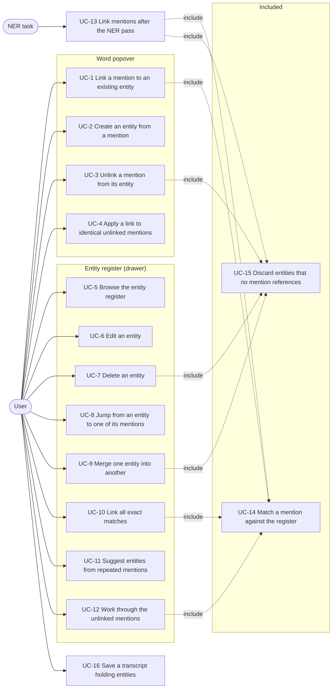
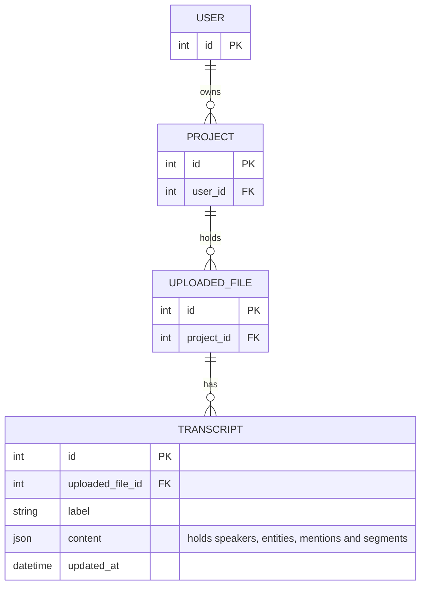

# Spec: canonical entities in the transcript

Status: draft, not started.

This document is an **executable spec** (spec-driven development): it is the
prompt an implementing session works from and the authoritative record of every
decision, not a background sketch. Resolve ambiguity by reading this document,
not by inventing; if a genuinely new decision comes up, write it into this
document as part of the task. Check off tasks (`[x]`, with date) as they land.
Do not duplicate CLAUDE.md conventions here (test-first, pytest style, vitest
for the frontend, both locale files for every new string).

The architectural overview that accompanies this spec is
[`docs/canonical-entities-architecture.md`](../docs/canonical-entities-architecture.md).
It records where the identity tier sits and why; this spec records what is
built.

This spec supersedes [`docs/canonical-entities-plan.md`](../docs/canonical-entities-plan.md).
Where the two disagree, this spec is authoritative and the plan is stale.

## Motivation

The transcript already records **mentions**: one entry in the transcript-level
`mentions` map per occurrence of a named entity, produced by the NER pass or by
hand in the word popover, with a label (`PER`, `ORG`, `LOC`, `DATE`) and a
confidence score. Words point at a mention through `mentionId`.

A mention is an occurrence, not an identity. "Angela Merkel" said three times in
an interview is three mentions, and nothing in the stored content says that the
three are the same person. "Merkel" said a fourth time is a fourth mention that
nothing connects to the other three. A user who wants to know where a person
appears in an interview, or who wants to attach a Wikidata identifier to a
person once instead of once per occurrence, cannot express that today.

This feature adds an identity tier: a transcript-level `entities` map holding a
canonical name, a type, optional aliases and an optional Wikidata identifier,
and a nullable `entityId` on each mention pointing at one of those entities.
It adds the interface for linking a mention to an entity, an entity register in
a drawer beside the transcript, navigation from an entity to each of its
mentions, merging two entities, and a rule that links mentions whose surface
text matches an entity the register already holds.

`entityId: null` is a legal permanent state, not an unfinished task. Linking is
decoupled from mention creation: the NER pass and the word popover produce
unlinked mentions, and linking is a separate step the user performs or a rule
performs on the user's request.

## Non-goals

Do not add these, even where they would be easy:

- **No entity table in the database.** Entities live inside `Transcript.content`
  like speakers and mentions, and their scope is one transcript. Cross-transcript
  identity, meaning the same person recognised across interviews, is the trigger
  for a real database entity, and it is deferred by the same reasoning that
  defers a `Speaker` model in
  [`docs/mmt-transcript-format.md`](../docs/mmt-transcript-format.md).
- **No linkable DATE mentions.** `entity.type` is `PER`, `ORG` or `LOC` only,
  and the popover shows no entity row for a `DATE` mention. A date has no
  identity; making a date canonical means normalising it to a calendar value
  (ISO 8601 or EDTF), which is a different feature and would be a `value` field
  on the mention, not an entry in the entity register.
- **No coreference.** Pronouns and descriptions ("er", "der Zeitzeuge") are not
  mentions today, the NER service does not produce such spans, and this feature
  does not create them.
- **No silent entity creation.** No pass creates an entity on its own. Every
  entity in the register was created by an explicit user action: the combobox in
  the word popover, or a confirmed suggestion in the register.
- **No overwriting of an existing link by a rule.** Every rule fills
  `entityId: null` and never replaces a link that is already there, whoever set
  it. There is therefore no link-provenance field in the format.
- **No Wikidata lookup.** The `wikidataId` field exists from slice 1 and is
  typed by hand. Searching Wikidata for candidates and prefilling name and
  aliases from its labels is purely additive interface work on a field that
  already exists, and it needs a decision about client-side against
  backend-proxied requests that is not made here.
- **No entity output in any export.** The export formats in
  [`2026-07-30-transcript-export.md`](2026-07-30-transcript-export.md) carry
  neither mentions nor entities, and this feature does not change that. TEI is
  the format with a natural place for them and it stays an open question there.
- **No entity data in the read-only API.** The API in
  [`2026-07-30-read-only-api.md`](2026-07-30-read-only-api.md) serves
  `Transcript.content` unchanged at
  `GET /api/v1/transcripts/{id}/content`, so entities reach an API client as
  part of that document without any change to the API. No entity-specific
  endpoint is added.
- **No relationship to redactions.**
  [`2026-07-26-redactions.md`](2026-07-26-redactions.md) is not implemented, and
  no decision here anticipates it.
- **No standalone entity creation.** There is no "add entity" button that
  creates an entity without a mention, because the validator rejects an entity
  that no mention references. If preparing a register before reading a
  transcript turns out to be a real need, the validator is loosened then, which
  is the backward-compatible direction.
- **No format version bump.** See the format extension below.

## Actors

- **User** — a logged-in account holder with the
  `transcripts.change_transcript` permission, editing one transcript in the
  transcript editor. The actor in every use case except UC-13.
- **NER task** — the Celery task `enrich_transcript` in
  [`app/mmt/transcripts/tasks.py`](../app/mmt/transcripts/tasks.py). A system
  actor, triggered by a user asking for named-entity recognition on a
  transcript, but running without a user present. The actor in UC-13.

## System use cases

The overview shows which actor triggers which use case. `<<include>>` marks a
use case that every dependent case performs as part of its own flow.



Each use case below is the authoritative description of one system behaviour.
The feature reference further down repeats the rules in a compact form; where
the two disagree, the feature reference is wrong and both are fixed together.

Every use case except UC-13 and UC-16 changes the editor's in-memory state
only. Nothing reaches the database until the user saves (UC-16).

### UC-1 Link a mention to an existing entity

- **Actor:** User.
- **Precondition:** The transcript is open in the editor, a word belonging to a
  mention with label `PER`, `ORG` or `LOC` is selected, and the mention has no
  entity.
- **Trigger:** The user opens the word popover and picks an entity from the
  entity combobox.
- **Main flow:**
  1. The popover's mention section shows an entity row holding a combobox whose
     query is prefilled with the mention's surface text.
  2. The system lists the register's entities ranked by the ranking rule, and
     preselects the single entity that matches the mention (UC-14) when there is
     exactly one.
  3. The user picks an entity.
  4. The system sets the mention's `entityId` to that entity's identifier and
     marks the register as changed.
  5. The popover switches the entity row to its linked form, showing the
     entity's name, type, aliases and Wikidata identifier, with actions to
     change the link and to unlink.
  6. When at least one unlinked mention has the same normalised surface text and
     the same label, the popover offers UC-4.
- **Alternative flow A — the entity's type differs from the mention's label:**
  The link is made anyway and the entity row shows the warning "This mention is
  tagged {label}, but the entity has the type {type}." The mention's `label`
  keeps its value.
- **Alternative flow B — the mention's label is `DATE`:** No entity row is
  shown; there is nothing for the user to trigger.
- **Postcondition:** The mention's `entityId` names an entity in the register.
  The mention's `label` is unchanged.

### UC-2 Create an entity from a mention

- **Actor:** User.
- **Precondition:** As UC-1.
- **Trigger:** The user picks the create item at the end of the combobox list,
  which reads `Create "<query>"`.
- **Main flow:**
  1. The system creates an entity with a fresh identifier, the name taken from
     the combobox query as typed and trimmed, the type taken from the mention's
     `label`, an empty alias list and no Wikidata identifier.
  2. The system links the mention to the new entity, exactly as in UC-1 step 4.
  3. The popover shows the linked form and, when applicable, offers UC-4.
- **Alternative flow A — the query, normalised, equals the normalised name of a
  listed entity of the same type:** The create item is not shown. An entity that
  a rule could never distinguish from an existing one is not created; the user
  picks the existing entity instead.
- **Alternative flow B — the query is empty after trimming:** The create item is
  not shown.
- **Postcondition:** The register holds one more entity, referenced by at least
  the mention it was created from.

### UC-3 Unlink a mention from its entity

- **Actor:** User.
- **Precondition:** The selected word belongs to a linked mention.
- **Trigger:** The user activates the unlink action in the popover's entity row.
- **Main flow:**
  1. The system sets the mention's `entityId` to `null`.
  2. The system discards the entity when no mention references it any more
     (UC-15).
  3. The entity row returns to its unlinked form with the combobox.
- **Alternative flow A — this is the last mention of the entity:** The action
  first asks for confirmation in place, in the same way the speaker legend
  confirms a deletion, with the text "Last mention: unlinking deletes the
  entity." Confirming performs the main flow; cancelling changes nothing. The
  confirmation exists because the entity holds hand-entered aliases and a
  Wikidata identifier that the deletion discards.
- **Postcondition:** The mention has no entity. Every entity in the register is
  referenced by at least one mention.

### UC-4 Apply a link to identical unlinked mentions

- **Actor:** User.
- **Precondition:** The user has just linked a mention (UC-1 or UC-2) and at
  least one other mention has the same normalised surface text, the same label,
  and no entity.
- **Trigger:** The user activates "Apply to N identical mentions" in the
  popover's entity row.
- **Main flow:**
  1. The system finds every mention in the document with `entityId: null`, the
     same `label` as the linked mention, and the same normalised surface text
     (match rule B).
  2. The system sets each of their `entityId` to the same entity.
  3. The action disappears, since no unlinked identical mention is left.
- **Alternative flow A — the user does not activate the action:** Nothing else
  is linked. This is a one-click offer, never automatic.
- **Postcondition:** Every mention with that surface text and that label points
  at the same entity. Mentions that were already linked to another entity are
  untouched.

### UC-5 Browse the entity register

- **Actor:** User.
- **Precondition:** The transcript is open in the editor.
- **Trigger:** The user opens the entity drawer on the left of the transcript.
- **Main flow:**
  1. The drawer opens docked: the transcript shifts to make room, stays visible
     and stays editable, and no backdrop is drawn.
  2. The register lists every entity by name, each with a type swatch, its name,
     its type and the number of mentions pointing at it.
  3. Above the list the system shows the number of unlinked mentions with a
     label of `PER`, `ORG` or `LOC`.
  4. A search field appears once the register holds more than eight entities and
     filters the list on the normalised name and aliases.
- **Alternative flow A — the register is empty:** The list is replaced by a
  sentence explaining that entities are created by linking a mention in the word
  popover.
- **Alternative flow B — the viewport is narrower than the docked layout
  allows:** The drawer opens as an overlay with a backdrop, in the same way the
  existing settings drawer on the right does.
- **Postcondition:** None. Opening the drawer changes nothing.

### UC-6 Edit an entity

- **Actor:** User.
- **Precondition:** The register lists the entity.
- **Trigger:** The user activates the edit action on an entity row.
- **Main flow:**
  1. The row becomes a form holding the name, the type, the alias list and the
     Wikidata identifier.
  2. The user changes any of them and confirms.
  3. The system writes the values to the entity and marks the register as
     changed.
- **Alternative flow A — the name is empty after trimming:** Confirming is not
  possible; the entity keeps its values.
- **Alternative flow B — the Wikidata identifier does not match `Q` followed by
  digits:** Confirming is not possible and the field is marked as invalid. An
  empty field is valid and means no identifier.
- **Alternative flow C — an alias is empty after trimming, or repeats the name
  or another alias of the same entity after normalisation:** That alias is
  dropped silently on confirmation. The remaining values are written.
- **Alternative flow D — the type changes to one that differs from the `label`
  of one of its mentions:** The change is made. The mismatch warning of UC-1
  applies from then on to the affected mentions.
- **Postcondition:** The entity holds the new values. Its identifier and the
  mentions pointing at it are unchanged, so a rename is one write.

### UC-7 Delete an entity

- **Actor:** User.
- **Precondition:** The register lists the entity.
- **Trigger:** The user activates the delete action on an entity row and
  confirms in place.
- **Main flow:**
  1. The system sets `entityId` to `null` on every mention pointing at the
     entity.
  2. The system removes the entity from the register (UC-15).
- **Alternative flow A — the user cancels the confirmation:** Nothing changes.
- **Postcondition:** The mentions still exist, are still mentions, and are
  unlinked. Deleting an entity never deletes a mention or a word.

### UC-8 Jump from an entity to one of its mentions

- **Actor:** User.
- **Precondition:** The register lists the entity and the entity has at least
  one mention.
- **Trigger:** The user expands an entity row and activates one of its mentions.
- **Main flow:**
  1. The expanded row lists the entity's mentions in document order, each with
     the start time of the mention's first word and a snippet of the surrounding
     words with the mention's own words marked.
  2. Activating a mention makes the system scroll the transcript so that the
     mention's segment is visible, mark that mention in the transcript as the
     focused one, and seek the media element to the start of the mention's first
     word without starting playback.
- **Alternative flow A — the user activates another mention:** The previous
  focus mark is removed and the new mention is marked. Exactly one mention is
  marked at a time, and the mark stays until the next jump.
- **Postcondition:** None. Navigation changes no content.

### UC-9 Merge one entity into another

- **Actor:** User.
- **Precondition:** The register holds at least two entities of the same type.
- **Trigger:** The user activates "Merge into…" on an entity row and picks the
  target entity from a combobox.
- **Main flow:**
  1. The combobox lists the entities of the same type as the source, excluding
     the source itself, ranked by the same rule as the linking combobox and
     without a create item.
  2. The system points every mention of the source entity at the target entity.
  3. The system extends the target's alias list with the source's name followed
     by the source's aliases, dropping any whose normalised form already equals
     the target's normalised name or one of the target's normalised aliases.
  4. The system gives the target the source's Wikidata identifier when the
     target has none, and keeps the target's otherwise.
  5. The system removes the source entity (UC-15).
- **Alternative flow A — the register holds no other entity of the source's
  type:** The merge action is not offered.
- **Postcondition:** The source entity no longer exists, its mentions belong to
  the target, and the target can be found by the source's former name because it
  is now an alias. A wrong choice between creating and selecting an entity is
  repaired in two actions.

### UC-10 Link all exact matches

- **Actor:** User.
- **Precondition:** The register holds at least one entity.
- **Trigger:** The user activates "Link exact matches" in the register.
- **Main flow:**
  1. For every mention with `entityId: null` and a label of `PER`, `ORG` or
     `LOC`, the system determines the matching entities (UC-14).
  2. Where exactly one entity matches, the system links the mention to it.
  3. The system reports how many mentions were linked and how many were left
     unlinked because more than one entity matched.
- **Alternative flow A — nothing matches:** The report states that no mention
  was linked. Nothing changes.
- **Postcondition:** No existing link was changed. Running the action a second
  time changes nothing.

### UC-11 Suggest entities from repeated mentions

- **Actor:** User.
- **Precondition:** The transcript holds unlinked mentions.
- **Trigger:** The user activates "Suggest entities" in the register.
- **Main flow:**
  1. The system groups every mention with `entityId: null` and a label of `PER`,
     `ORG` or `LOC` by the pair of its normalised surface text and its label.
  2. The system proposes one entity per group holding at least two mentions,
     with the name taken from the most frequent original spelling in the group,
     ties broken by the first occurrence in document order, and the type taken
     from the label.
  3. The system lists the proposals with their occurrence counts, and the user
     confirms or dismisses each one separately.
  4. Confirming a proposal creates the entity and links every mention of that
     group to it.
- **Alternative flow A — no group holds two or more mentions:** The system
  reports that it found nothing to suggest. A single unlinked occurrence is not
  evidence of an identity worth recording.
- **Alternative flow B — the user dismisses a proposal:** No entity is created
  and its mentions stay unlinked. The proposal reappears the next time the
  action runs, since nothing about the dismissal is stored.
- **Postcondition:** Every confirmed proposal is one new entity with at least
  two mentions. This is the answer to a transcript whose first NER pass produced
  mentions and no register.

### UC-12 Work through the unlinked mentions

- **Actor:** User.
- **Precondition:** At least one mention has `entityId: null` and a label of
  `PER`, `ORG` or `LOC`.
- **Trigger:** The user opens the review section of the register.
- **Main flow:**
  1. The system shows the unlinked mentions one at a time in document order,
     with the current mention's surface text, its label, its start time and its
     snippet, and it marks that mention in the transcript exactly as UC-8 does.
  2. The system offers the matching entities as candidates (UC-14), the same
     combobox as UC-1 including its create item, and a skip action.
  3. Accepting a candidate or picking an entity links the mention and advances
     to the next unlinked mention.
  4. Skipping advances without linking and without recording anything.
- **Alternative flow A — no unlinked mention is left:** The review section shows
  that everything is linked. This is a report, not a demand: leaving mentions
  unlinked is a legitimate final state.
- **Alternative flow B — the user leaves the review and returns:** The walk
  starts again at the first unlinked mention in document order. No position is
  stored.
- **Postcondition:** Every mention the user acted on is linked. Skipped mentions
  are unchanged.

### UC-13 Link mentions after the NER pass

- **Actor:** NER task.
- **Precondition:** `enrich_transcript` has applied the service's spans to the
  copied content with `apply_mention_spans`.
- **Trigger:** The step after `apply_mention_spans` and before validation, in
  the same task.
- **Main flow:**
  1. Every mention in the new content is unlinked, because
     `apply_mention_spans` mints the whole mentions map afresh. The `entities`
     map, however, is carried over from the source transcript's content, since
     the task deep-copies that content.
  2. For every mention with a label of `PER`, `ORG` or `LOC`, the system
     determines the matching entities (UC-14) and links the mention when exactly
     one matches.
  3. The system discards every entity that no mention now references (UC-15).
     This step is what keeps the resulting content valid: an entity carried over
     from the source whose name no longer occurs would otherwise be an orphan
     and would fail validation, which would fail the task.
  4. The task validates and stores the content as it does today.
- **Alternative flow A — the source content holds no entities:** Every step is a
  no-op and the produced transcript has an empty register, which is what a first
  NER run on a fresh transcript produces.
- **Alternative flow B — two entities match one mention:** The mention stays
  unlinked. The user resolves it in UC-12.
- **Postcondition:** The new transcript's register holds exactly those entities
  of the source transcript whose name or one of whose aliases still occurs as a
  mention, each linked to the mentions that match it.

### UC-14 Match a mention against the register

- **Actor:** Included by UC-1, UC-10, UC-12 and UC-13; never triggered on its
  own.
- **Precondition:** A mention and a register of entities.
- **Trigger:** Any of the including use cases.
- **Main flow:**
  1. The system computes the mention's surface text: the words of the whole
     document carrying that `mentionId`, in document order, joined with a single
     space.
  2. The system normalises that text (match rule A, normalisation below).
  3. An entity matches when its `type` equals the mention's `label` **and** the
     normalised surface text equals the normalised entity name or one of the
     normalised aliases.
  4. The system returns the matching entities.
- **Alternative flow A — no entity matches:** The result is empty and the
  including use case leaves the mention unlinked.
- **Alternative flow B — two or more entities match:** The result holds all of
  them. A rule-driven caller (UC-10, UC-13) leaves the mention unlinked; an
  interactive caller (UC-1, UC-12) offers them as candidates and lets the user
  decide.
- **Postcondition:** None. Matching writes nothing.

### UC-15 Discard entities that no mention references

- **Actor:** Included by UC-3, UC-7, UC-9 and UC-13; never triggered on its own.
- **Precondition:** An operation has just removed one or more links.
- **Trigger:** The end of the including operation.
- **Main flow:** The system removes from the register every entity whose
  identifier no mention carries.
- **Postcondition:** The relational invariant holds: every entity is referenced
  by at least one mention. This mirrors what editors already do for mentions
  that no word references.

### UC-16 Save a transcript holding entities

- **Actor:** User.
- **Precondition:** The editor holds unsaved changes, whether to segments, to
  words, or to the register alone.
- **Trigger:** The user activates the save action in the document bar.
- **Main flow:**
  1. The editor posts the content including the `entities` map and each
     mention's `entityId` to the existing update route.
  2. The backend validates it with `validate_mmt_content`, which now also
     checks that every `entityId` resolves and that every entity is referenced.
  3. The backend stores the content and the editor clears its unsaved state,
     including the register's.
- **Alternative flow A — a change to the register is the only change:** The save
  action is enabled and the document bar reports "Entity register changed"
  instead of a segment count. Without this the change could not be saved at all,
  since the dirty flags live on segments and words.
- **Alternative flow B — the content fails validation:** The existing behaviour
  applies: the route answers `400` with the messages and the editor keeps its
  unsaved state. A dangling `entityId` or an orphaned entity reaching this point
  is a bug in the editor, not user input.
- **Postcondition:** `Transcript.content` holds the register and the links.

## Entity relationship model

Two diagrams. The first is the persisted graph, which this feature does not
change: entities are not a table. The second is the structure inside the
`content` column, which is where the whole feature lives.

### Persisted entities



Ownership is checked on the path the editor's routes already use:
`Transcript.objects.filter(pk=..., uploaded_file__project__user=user)`. This
feature adds no model, no migration and no query.

### Structure of `Transcript.content`

The mmt-transcript document as defined in
[`app/mmt/transcripts/mmt_schema.py`](../app/mmt/transcripts/mmt_schema.py) and
described in [`docs/mmt-transcript-format.md`](../docs/mmt-transcript-format.md),
with `ENTITY` and the `entityId` reference added by this feature. Relations are
containment and reference within one JSON document, not foreign keys.


The cardinality of the new relation is the whole design: a mention points at
zero or one entity, and an entity is pointed at by one or more mentions. The
zero side is the permanent legal state of an undisambiguated mention; the one-or-
more side is the invariant that keeps the register free of entries nothing uses.

### Invariants

The strict validator enforces these, in addition to the ones it enforces today:

1. Entity identifiers are unique across every identifier in the document, in
   the same namespace as speaker, mention, segment and word identifiers.
2. Every `mention.entityId` that is not `null` resolves to a key of `entities`.
3. Every key of `entities` is the `entityId` of at least one mention.

The validator deliberately does **not** enforce these:

- **`mention.label` equal to `entity.type`.** The label is the raw claim of the
  NER pass and is kept as provenance; the type is the user's decision about the
  identity. A user linking a mention the model labelled `ORG` to a person is
  making a correction, not a mistake, and the interface warns rather than
  refuses (UC-1 alternative flow A).
- **Distinct entity names.** Two entities may carry the same name, and two
  entities may share an alias. Such a register makes the match rule ambiguous,
  which is a defined outcome (UC-14 alternative flow B) rather than an error.
  The interface avoids producing the situation (UC-2 alternative flow A), and
  merge (UC-9) repairs it.
- **A type-to-label relationship for `DATE`.** A `DATE` mention simply never
  carries an `entityId`, because no entity has that type and rule 2 above would
  reject a link to anything else.

## Feature reference

### Format extension

The format extends version 1 **in place**. There is no version bump and no
migration.

The mmt-transcript format is in its development phase, both new fields have
defaults (`entities: {}`, `entityId: null`), and every stored document validates
unchanged against the extended schema and gains the fields the next time it is
saved. Bumping to version 2 would mean writing a migration for a shape nothing
in production distinguishes from the old one.

The sentence in
[`docs/mmt-transcript-format.md`](../docs/mmt-transcript-format.md) that calls a
future `entities` map "a `version: 2` event" is corrected in slice 1, together
with the description of the new fields. That correction states the rule that
holds from then on: once the format leaves the development phase, an additive
change to an `extra: forbid` schema is again a version-bump event.

```jsonc
{
  "format": "mmt-transcript",
  "version": 1,
  "speakers": [ /* unchanged */ ],
  "entities": {
    "ent_9c2f4d1e8b6a4f0f9c1d2e3f4a5b6c7d": {
      "name": "Angela Merkel",
      "type": "PER",
      "aliases": ["Merkel"],
      "wikidataId": "Q567"
    }
  },
  "mentions": {
    "men_7f3a...": { "label": "PER", "score": 0.93, "entityId": "ent_9c2f..." },
    "men_8b1c...": { "label": "PER", "score": 0.88, "entityId": null }
  },
  "segments": [ /* unchanged */ ]
}
```

The field is named `name` and not `label`, matching `Speaker.name` and avoiding
a clash with `mention.label`, which means something else. It is named `type` and
not `label` for the same reason.

### Schema

```python
# mmt/transcripts/mmt_schema.py
EntityId = Annotated[str, StringConstraints(min_length=1)]
Alias = Annotated[str, StringConstraints(min_length=1)]


class Entity(BaseModel):
    model_config = ConfigDict(extra='forbid')

    name: str = Field(min_length=1)
    type: Literal['PER', 'ORG', 'LOC']
    aliases: list[Alias] = []
    wikidataId: str | None = Field(default=None, pattern=r'^Q[1-9][0-9]*$')


class Mention(BaseModel):
    ...
    entityId: str | None = None


class Transcript(BaseModel):
    ...
    entities: dict[EntityId, Entity] = {}
```

`_relations` on `Transcript` grows three checks, following the shape of the ones
that are there: entity identifiers go through the existing `claim()` so they
share one namespace with every other identifier; each non-null `entityId` is
resolved against `self.entities` and recorded; and after the walk, every key of
`entities` that no mention referenced raises
`orphaned entity '<id>': no mention references it`, mirroring the existing
orphaned-mention message.

The Wikidata pattern rejects `Q0` and leading zeros, since neither is a Wikidata
identifier, and it is anchored so that a whole label ("Q567 (Angela Merkel)")
is rejected rather than partly accepted.

### Identifiers

Entity identifiers use the existing scheme. The backend mints them with
`_new_id('ent')` from
[`app/mmt/transcripts/normalize.py`](../app/mmt/transcripts/normalize.py),
producing `ent_<uuid4 hex>`; the editor mints them with the store's `newId`
helper, producing `ent_<crypto.randomUUID()>`. The two spellings differ in
punctuation and both are opaque strings that only have to be unique, which is
already true of the mention and word identifiers the two sides mint today.

### Surface text of a mention

A mention's surface text is every word of the **whole document** carrying that
`mentionId`, in document order, joined with a single space.

The store's existing `mentionText(segmentIndex, mentionId)` is scoped to one
segment, which is correct for the popover's extend and reduce actions but wrong
for a mention that crosses a segment boundary, which the format allows. Slice 2
adds a document-wide `mentionSurface(mentionId)` and uses it everywhere the
identity of a mention is at stake: the combobox query, the popover's mention
title, the register, the review queue and every rule. `mentionText` keeps its
current callers in the extend and reduce logic.

The backend equivalent is `mention_surfaces(content) -> dict[str, str]`, which
walks the document once and returns the surface text of every mention, so that
no rule pass walks the segments per mention.

### Normalisation

One rule, implemented twice, verified against one file of shared test vectors:

1. Apply Unicode normalisation form NFKC.
2. Replace every run of whitespace with a single space and remove leading and
   trailing whitespace.
3. Remove leading and trailing characters whose Unicode general category starts
   with `P` (punctuation) or `S` (symbol), repeatedly until the first and last
   character are neither, then remove whitespace again.
4. Lowercase.

```python
# mmt/transcripts/entity_linking.py
def normalized_surface(text: str) -> str: ...
```

```ts
// assets/js/transcript/entity_matching.ts
export function normalizedSurface(text: string): string;
```

Lowercasing uses Python's `str.lower()` and JavaScript's `toLowerCase()`.
Python's `str.casefold()` is the better rule for a single-language matcher, but
it maps `ß` to `ss` while `toLowerCase()` does not, and the two implementations
of this rule must agree on every input. A rule that behaves identically on both
sides is worth more than the additional match between "Straße" and "STRASSE".

Interior punctuation is kept, so "O'Brien" and "St. Pauli" normalise to
`o'brien` and `st. pauli`. Only the edges are stripped, which is what removes
the comma and the full stop that a spoken mention picks up from the surrounding
sentence.

The shared vectors live in
`app/mmt/transcripts/tests/data/normalization_vectors.json`, a list of
`{"input": ..., "expected": ...}` objects. The pytest test iterates it; the
vitest test imports it with a relative path, which requires adding
`"resolveJsonModule": true` to `app/tsconfig.json`. The file lives under the
backend because the backend owns the format and the rule; the frontend
implementation follows it.

The vectors, at minimum:

| Input | Normalised |
| --- | --- |
| `Angela Merkel` | `angela merkel` |
| `MERKEL` | `merkel` |
| `  Angela   Merkel ` | `angela merkel` |
| `Merkel,` | `merkel` |
| `„Merkel“` | `merkel` |
| `(Merkel)` | `merkel` |
| `Merkel!?` | `merkel` |
| `Angela` + U+00A0 (no-break space) + `Merkel` | `angela merkel` |
| `ff` (U+FB00, the ff ligature) | `ff` |
| `O'Brien` | `o'brien` |
| `St. Pauli` | `st. pauli` |
| `Bundesrepublik€` | `bundesrepublik` |
| `...` | `` (empty) |
| `` | `` |

### Match rules

Two rules, used in different places and never confused:

**Rule A, register match.** Used by UC-14, and therefore by the combobox
preselection, "link exact matches", the review queue's candidates and the
backend pass. A mention matches an entity when
`mention.label == entity.type` and the normalised surface text equals the
normalised `entity.name` or one of the normalised `entity.aliases`.

```python
def matching_entities(surface: str, label: str, entities: dict[str, Entity]) -> list[str]:
    """Identifiers of every entity that rule A matches, in the register's order."""
```

**Rule B, identical surface.** Used only by UC-4. Two mentions are identical
when they have the same `label` and the same normalised surface text. Rule B
looks at mentions, not at entities, and it exists because the point of the
action is "every other place this exact wording occurs", not "every place this
entity is named".

Both rules only ever fill `entityId: null`. No rule anywhere replaces an
existing link. That makes every pass idempotent and monotonic, and it is the
reason the format carries no field recording who set a link.

### Ranking in the combobox

The list is ordered by these groups, and within a group by name using
`localeCompare` with the document's language:

1. Entities that rule A matches.
2. Entities whose normalised name or an alias starts with the normalised query.
3. Entities whose normalised name or an alias contains the normalised query.
4. Every other entity.

Within each group, entities whose `type` equals the mention's `label` come
before those whose type differs, and a type-mismatched entity is marked in the
list. The create item is last, unless UC-2 alternative flow A or B suppresses
it. When rule A produces exactly one entity, that entity is preselected, so that
confirming the prefilled query is one keystroke.

The combobox is a text input with a listbox, keyboard-navigable with the arrow
keys, Enter and Escape, and it is the same component in the popover (UC-1), the
review queue (UC-12) and the merge action (UC-9). The merge use passes the
source entity's type as a filter and no create item.

### The word popover

The entity row is part of the existing mention section and is shown only when
`mention.label` is `PER`, `ORG` or `LOC`.

- **Unlinked:** the label "Entity", the combobox with the query prefilled with
  the mention's surface text.
- **Linked:** the entity's name, its type, its aliases when it has any, its
  Wikidata identifier as a link to `https://www.wikidata.org/wiki/<id>` when it
  has one, a change action reopening the combobox, and the unlink action with
  the last-mention confirmation of UC-3 alternative flow A.
- **Type mismatch:** a warning line below the name, present whenever
  `mention.label != entity.type`, both directly after linking and on any later
  opening of the popover.
- **Propagation:** after linking, and only then, the offer of UC-4 with the
  count of identical unlinked mentions.

The existing type selector in the mention section keeps editing `mention.label`.
It is the NER claim and stays editable and visible; the entity's type is a
separate value shown in the entity row.

### Effective label of a linked mention

`store.mentionLabel(mentionId)` returns the entity's `type` when the mention is
linked and the entity exists, and `mention.label` otherwise. This is the single
function that drives the entity colouring of words in the transcript, so a
mention linked to a person is coloured as a person even when the NER pass
claimed an organisation. The raw label remains visible in the popover, which is
the place provenance belongs.

### The entity drawer

`transcript_drawer.vue` gains two props:

```ts
defineProps<{
    side?: "left" | "right";   // default "right"
    mode?: "overlay" | "docked"; // default "overlay"
}>();
```

The existing settings drawer keeps the defaults and does not change. The entity
register uses `side="left" mode="docked"`.

- `side` mirrors the fixed position, the tab, the border radius of the tab and
  the transform used to slide the panel, through the modifier classes
  `transcript-drawer--left` and `transcript-drawer--right`.
- `mode="docked"` draws no backdrop, so the transcript keeps receiving pointer
  events and the user edits with the register open. The transcript container
  receives a left padding equal to the drawer's width while a docked left drawer
  is open, so that the content shifts instead of being covered.
- Below `64rem` viewport width a docked drawer behaves as an overlay, with the
  backdrop, because shifting the content is not possible on a narrow screen.
  This is the first width media query in the stylesheet; it uses `rem` because
  `rlh` is not valid in a media query, which is the one exception to the `rlh`
  rule in CLAUDE.md.

The register replaces the static entity legend in
[`transcript_sidebar.vue`](../app/assets/js/transcript/transcript_sidebar.vue),
which lists the four label colours and nothing else. That section is removed in
slice 3; the type swatches in the register carry the same colours and the label
legend has no reader once the register exists.

### The register

The list is sorted by name with `localeCompare`. Each row holds the type swatch
coloured from the `--entity-*-bg` custom properties, the name, the type and the
mention count. A search field appears once the register holds more than eight
entities and filters on the normalised name and aliases with a containment test.

Above the list: the count of unlinked `PER`, `ORG` and `LOC` mentions, the
actions "Link exact matches" (UC-10) and "Suggest entities" (UC-11), and the
entry to the review queue (UC-12).

Editing (UC-6) turns the row into a form. Aliases are edited as a list of text
inputs with an add and a remove action per row; the entity's name is not
repeated among them.

Deleting (UC-7) and unlinking the last mention (UC-3) confirm in place with the
`icon-button` pattern the speaker legend already uses, not with a modal dialog.

### Concordance navigation

An expanded entity row lists the entity's mentions in document order. Each entry
shows the start time of the mention's first word, formatted by the existing
timecode component, and a snippet: up to five words before and five words after
the mention within its segment, with the mention's own words marked, and an
ellipsis where the snippet was cut.

Activating an entry:

1. sets `focusedMentionId` in the store to that mention,
2. seeks `#media-player` to the start of the mention's first word with
   `seekMedia`, which does not start playback, exactly as clicking a segment
   does today,
3. relies on `transcript_segment.vue` to scroll itself into view: the component
   watches whether any of its words carries the focused mention identifier and
   calls `scrollIntoView({ behavior: "smooth", block: "center" })` when that
   becomes true, which is the mechanism it already uses for the current segment
   under auto-scroll.

`focusedMentionId` also drives a `transcript-word--focused-mention` class on the
words of that mention, so the target of the jump is visible after the scroll.
The mark stays until the next jump; there is no timer.

### Merge

```ts
function mergeEntities(sourceId: string, targetId: string): void;
```

Same-type merges only: the combobox lists only entities whose `type` equals the
source's. A wrongly typed entity is corrected first (UC-6) and merged after.
This removes the question of which type the merged entity has and the question
of what a type change means for the mentions of both sides.

The alias policy of UC-9 step 3, which resolves the open question the plan
recorded, is: the source's name always becomes an alias of the target, followed
by the source's own aliases, and any of them whose normalised form duplicates
the target's normalised name or an existing normalised alias is dropped. The
target is thereafter findable by everything the source was findable by, which is
what makes the merge non-destructive for the matching rules.

### The backend link pass

```python
# mmt/transcripts/entity_linking.py
def link_exact_mentions(content: dict) -> dict:
    """Link every unlinked mention that rule A matches to exactly one entity,
    then drop entities no mention references. Mutates and returns content."""


def drop_unreferenced_entities(content: dict) -> dict:
    """Remove every entity that no mention's entityId names."""
```

`enrich_transcript` calls `link_exact_mentions` between `apply_mention_spans`
and `validate_mmt_content`. The order matters and is not optional:
`apply_mention_spans` mints a fresh mentions map, so every link is gone and
every carried-over entity is orphaned at that moment. Without the linking step
and the garbage collection that follows it, the validation at the end of the
task raises on the orphaned entities and the task fails. A test asserts exactly
that path: a source transcript with a register produces a new transcript whose
register holds only the entities that still occur.

The pass is written against raw dicts, like the other functions in that flow,
because it runs on the content the task is mutating and before validation.

### The store

The Pinia store grows:

```ts
const entities = ref<Record<string, Entity>>({});
const registerDirty = ref(false);

function entity(entityId?: string | null): Entity | null;
function mentionSurface(mentionId: string): string;
function mentionsOfEntity(entityId: string): MentionRef[];   // document order
function unlinkedMentions(): MentionRef[];                    // PER, ORG, LOC
function createEntity(name: string, type: EntityType): string;  // returns the id
function linkMention(mentionId: string, entityId: string): void;
function unlinkMention(mentionId: string): void;
function updateEntity(entityId: string, values: Partial<Entity>): void;
function deleteEntity(entityId: string): void;
function mergeEntities(sourceId: string, targetId: string): void;
function linkIdenticalMentions(mentionId: string): number;    // rule B, returns count
function linkExactMatches(): { linked: number; ambiguous: number };
function entitySuggestions(): EntitySuggestion[];
function acceptSuggestion(suggestion: EntitySuggestion): void;
```

`MentionRef` carries what every caller of these lists needs without a second
lookup: `{ mentionId, segmentIndex, segmentId, start, surface, label }`.

`unlinkMention`, `deleteEntity` and `mergeEntities` run the garbage collection
of UC-15 themselves, so no caller can leave an orphan behind.

Every one of these mutations sets `registerDirty`. `transcriptIsDirty` becomes
`dirtySegmentCount > 0 || registerDirty`, `loadTranscript` sets `registerDirty`
to `false` after filling the store, and `saveTranscript` clears it only after
the server accepted the save, which is how the segment dirty flags are already
handled.

Entities are transcript-level data like mentions, so a change to them does not
mark any segment dirty. The document bar therefore shows, in this order: the
segment count when segments are dirty, "Entity register changed" when only the
register changed, and "No changes" otherwise.

### Loading and saving

`loadTranscript` reads `entities.value = json.entities ?? {}`. The fallback is
needed because `detail_json` returns the stored content unchanged and content
stored before this feature has no `entities` key.

`saveTranscript` sends `entities: entities.value` alongside `speakers` and
`mentions`. `cleanTranscript` is unchanged: it strips the editor's `dirty`
markers from segments and words, and entities carry none.

### Translations

New vue-i18n keys, flat with an `entity_` prefix, in both
[`en.js`](../app/assets/js/locales/en.js) and
[`de.js`](../app/assets/js/locales/de.js):

| Key | English | German |
| --- | --- | --- |
| `entity_section` | Entity | Entität |
| `entities` | Entities | Entitäten |
| `entity_none` | Not linked | Nicht verknüpft |
| `entity_search_or_create` | Search or create… | Suchen oder anlegen… |
| `entity_create` | Create “{name}” | „{name}“ anlegen |
| `entity_change` | Change entity | Entität wechseln |
| `entity_unlink` | Unlink | Verknüpfung lösen |
| `entity_unlink_last_confirm` | Last mention: unlinking deletes the entity. | Letzte Erwähnung: Beim Lösen wird die Entität gelöscht. |
| `entity_type_mismatch` | This mention is tagged {label}, but the entity has the type {type}. | Diese Erwähnung ist als {label} markiert, die Entität hat den Typ {type}. |
| `entity_apply_identical` | Apply to {count} identical mention \| Apply to {count} identical mentions | Auf {count} gleiche Erwähnung anwenden \| Auf {count} gleiche Erwähnungen anwenden |
| `entity_name` | Name | Name |
| `entity_aliases` | Aliases | Aliasse |
| `entity_add_alias` | Add alias | Alias hinzufügen |
| `entity_remove_alias` | Remove alias | Alias entfernen |
| `entity_wikidata_id` | Wikidata ID | Wikidata-ID |
| `entity_mention_count` | {count} mention \| {count} mentions | {count} Erwähnung \| {count} Erwähnungen |
| `entity_edit` | Edit entity | Entität bearbeiten |
| `entity_delete` | Delete entity | Entität löschen |
| `entity_delete_confirm` | : delete? Its mentions stay. | : löschen? Die Erwähnungen bleiben erhalten. |
| `entity_register_empty` | No entities yet. Link a mention in the word popover to create one. | Noch keine Entitäten. Verknüpfen Sie eine Erwähnung im Wort-Popover, um eine anzulegen. |
| `entity_search` | Search entities | Entitäten suchen |
| `entity_merge` | Merge into… | Zusammenführen mit… |
| `entity_unlinked_count` | {count} unlinked mention \| {count} unlinked mentions | {count} nicht verknüpfte Erwähnung \| {count} nicht verknüpfte Erwähnungen |
| `entity_link_exact` | Link exact matches | Eindeutige Treffer verknüpfen |
| `entity_link_exact_result` | {linked} linked, {ambiguous} ambiguous | {linked} verknüpft, {ambiguous} mehrdeutig |
| `entity_suggest` | Suggest entities | Entitäten vorschlagen |
| `entity_suggest_empty` | No repeated unlinked mentions found. | Keine wiederholten nicht verknüpften Erwähnungen gefunden. |
| `entity_suggest_accept` | Create and link | Anlegen und verknüpfen |
| `entity_suggest_dismiss` | Dismiss | Verwerfen |
| `entity_review` | Review unlinked mentions | Nicht verknüpfte Erwähnungen prüfen |
| `entity_review_done` | All mentions are linked. | Alle Erwähnungen sind verknüpft. |
| `entity_review_skip` | Skip | Überspringen |
| `register_changed` | Entity register changed | Entitätsregister geändert |

The whole feature is in the Vue editor, so no Django template string and no
`django.po` entry is added. If a slice does add one, the CLAUDE.md rule applies:
German translation and `compilemessages` in the same session.

## File layout

```
app/mmt/transcripts/
    mmt_schema.py                        Entity, Mention.entityId, extended _relations
    entity_linking.py                    normalisation, surfaces, rule A, link pass, GC
    normalize.py                         unchanged apart from _new_id('ent') use
    tasks.py                             enrich_transcript calls link_exact_mentions
    tests/
        data/normalization_vectors.json  shared with the vitest suite
        test_entity_linking.py
        test_mmt_schema.py               extended
        test_tasks.py                    extended

app/assets/js/transcript/
    types.ts                 Entity, EntityType, Mention.entityId
    entity_matching.ts       normalizedSurface, matchingEntities, rankEntities
    entity_matching.test.ts
    entity_combobox.vue      select-or-create, shared by popover, review and merge
    entity_combobox.test.ts
    entity_register.vue      the drawer contents: list, edit, delete, merge, actions
    entity_register.test.ts
    entity_mention_list.vue  the concordance of one entity
    entity_review.vue        the unlinked-mention walk
    entity_review.test.ts
    word_popover.vue         entity row
    transcript_drawer.vue    side and mode props
    transcript_store.ts      entities, registerDirty and the mutations above

app/assets/css/components/
    entity_register.css
    transcript_drawer.css    left and docked modifiers
```

Key signatures:

```python
# mmt/transcripts/entity_linking.py
def normalized_surface(text: str) -> str: ...
def mention_surfaces(content: dict) -> dict[str, str]: ...
def matching_entities(surface: str, label: str, entities: dict) -> list[str]: ...
def link_exact_mentions(content: dict) -> dict: ...
def drop_unreferenced_entities(content: dict) -> dict: ...
```

```ts
// assets/js/transcript/entity_matching.ts
export function normalizedSurface(text: string): string;
export function matchingEntities(
    surface: string,
    label: string,
    entities: Record<string, Entity>,
): string[];
export function rankEntities(
    query: string,
    label: string,
    entities: Record<string, Entity>,
): RankedEntity[];
```

## Tests

Backend, pytest style:

- `test_entity_linking.py` — `normalized_surface` against every shared vector;
  `mention_surfaces` for a single-word mention, a multi-word mention and a
  mention crossing a segment boundary; `matching_entities` for a name match, an
  alias match, a case and punctuation difference, a label that differs from the
  type (no match), and two entities matching one surface (two results);
  `link_exact_mentions` linking the unambiguous case, leaving the ambiguous case
  unlinked, never touching an existing link, dropping the entity that nothing
  references, and being idempotent when run twice.
- `test_mmt_schema.py` — content without `entities` validates and dumps with an
  empty map and `entityId: null` on every mention; a valid register validates; a
  `mention.entityId` naming no entity is rejected; an entity that no mention
  references is rejected; an entity identifier colliding with a mention or
  speaker identifier is rejected; `type: "DATE"` is rejected; a `wikidataId` of
  `Q0`, `567` or `Q567x` is rejected and `Q567` and `null` are accepted; a label
  differing from the type validates.
- `test_tasks.py` — `enrich_transcript` on a source transcript holding a
  register produces a transcript whose mentions are linked where the surface
  matches, and whose register no longer holds the entities that stopped
  occurring; the task does not fail on a source with a register, which is the
  regression this ordering exists to prevent.
- `test_views.py` — the update route answers `400` for content with a dangling
  `entityId` and for content with an orphaned entity, and `200` for a valid
  register.

Frontend, vitest:

- `entity_matching.test.ts` — `normalizedSurface` against the same shared
  vectors file, so the two implementations cannot drift; `matchingEntities` for
  the same cases as the backend; `rankEntities` for the group order, the
  type-match order within a group, and the preselected exact match.
- `transcript_store.test.ts` — `createEntity` mints an identifier and returns
  it; `linkMention` sets `entityId` and `registerDirty`; `unlinkMention` deletes
  an entity that lost its last mention and keeps one that did not;
  `deleteEntity` unlinks its mentions and keeps them as mentions;
  `mergeEntities` repoints the mentions, adds the source's name and aliases
  without duplicates, takes the Wikidata identifier only when the target has
  none, and removes the source; `linkIdenticalMentions` links only unlinked
  mentions with an equal normalised surface and equal label and returns the
  count; `linkExactMatches` reports linked and ambiguous counts and changes no
  existing link; `mentionSurface` joins across a segment boundary;
  `mentionLabel` returns the entity's type for a linked mention and the raw
  label otherwise; `entitySuggestions` proposes only groups of two or more and
  picks the most frequent spelling.
- `entity_combobox.test.ts` — the query is prefilled with the surface text, the
  exact match is preselected, the create item is last, the create item is absent
  for a query equal to an existing entity of the same type and for an empty
  query, and keyboard navigation selects and cancels.
- `word_popover.test.ts` — no entity row for a `DATE` mention; the combobox in
  the unlinked state; the entity's name, type and Wikidata link in the linked
  state; the mismatch warning when type and label differ; the unlink
  confirmation appearing only for the last mention; the propagation offer with
  its count after a link.
- `entity_register.test.ts` — sorting by name, the mention counts, the search
  field appearing above eight entities, the empty-register sentence, the edit
  form rejecting an empty name and a malformed Wikidata identifier and dropping
  a duplicate alias, the delete confirmation, and the merge combobox listing
  only same-type entities.
- `transcript_drawer.test.ts` — extended: the left and docked modifier classes,
  no backdrop in docked mode, and the existing right overlay behaviour
  unchanged.
- `entity_review.test.ts` — the walk in document order, candidates from rule A,
  accepting advances and links, skipping advances without linking, and the
  completed state.

## Slices and tasks

Each slice leaves the system working and independently deployable. Each task is
one session.

- [ ] **1 Format extension.** The `Entity` model, `entityId` on `Mention`,
  `entities` on `Transcript`, the three relational checks, the `Entity` and
  `EntityType` types in `types.ts`, loading and saving the map untouched in the
  editor, and the corrections to `mmt-transcript-format.md`. No interface.
  Done when the extended `test_mmt_schema.py` and the update-route tests in
  `test_views.py` pass, and an existing transcript opens, saves and comes back
  with `entities: {}` and `entityId: null` on every mention.
- [ ] **2 Normalisation and matching.** `entity_linking.py`,
  `entity_matching.ts`, the shared vector file, `resolveJsonModule` in
  `tsconfig.json`, and the store's `mentionSurface`. No interface.
  Done when `test_entity_linking.py` and `entity_matching.test.ts` pass over the
  same vectors.
- [ ] **3 Manual linking in the word popover.** The store mutations
  (`createEntity`, `linkMention`, `unlinkMention` with garbage collection),
  `registerDirty` and the document bar's state, the `entity_combobox`
  component, the entity row in the popover with the mismatch warning and the
  last-mention confirmation, the effective label in `mentionLabel`, and the
  translations. This is the end-to-end minimum: two "Angela Merkel" mentions can
  be made to point at one entity.
  Done when `entity_combobox.test.ts`, the popover tests and the store tests for
  these mutations pass, and a development run links two mentions, saves, reloads
  and finds them still linked.
- [ ] **4 The drawer.** `side` and `mode` props on `transcript_drawer.vue`, the
  left and docked CSS with the narrow-viewport fallback, and the settings drawer
  keeping its current behaviour.
  Done when the extended `transcript_drawer.test.ts` passes and a development
  run shows both drawers, the left one leaving the transcript editable.
- [ ] **5 The entity register.** The list with swatches, counts and search, the
  edit form, delete, the removal of the static entity legend from the sidebar,
  and the translations.
  Done when `entity_register.test.ts` passes and a development run renames an
  entity, adds an alias, saves and reloads.
- [ ] **6 Concordance navigation.** `focusedMentionId` in the store, the mention
  list per entity with its timecodes and snippets, the scroll behaviour in
  `transcript_segment.vue`, the seek, and the focus mark in
  `transcript_word.vue`.
  Done when the store and segment tests pass and a development run jumps from an
  entity to each of its mentions in a real transcript.
- [ ] **7 Merge.** `mergeEntities` with the alias policy, the merge action in
  the register reusing the combobox with the same-type filter, and the
  translations.
  Done when the merge store tests and the register's merge test pass, and a
  development run repairs a wrongly created duplicate entity in two actions.
- [ ] **8 The backend link pass.** `link_exact_mentions` and
  `drop_unreferenced_entities` wired into `enrich_transcript` between
  `apply_mention_spans` and validation.
  Done when the extended `test_tasks.py` passes, including the case where a
  carried-over register would otherwise orphan an entity and fail the task.
- [ ] **9 Propagation after a manual link.** `linkIdenticalMentions` (rule B)
  and the "Apply to N identical mentions" offer in the popover.
  Done when the store test and the popover test pass and a development run links
  every occurrence of a repeated name in one action.
- [ ] **10 Batch actions and the review queue.** `linkExactMatches`,
  `entitySuggestions` and `acceptSuggestion` in the store, the two actions and
  the unlinked count in the register, the `entity_review` component, and the
  translations.
  Done when `entity_review.test.ts` and the store tests for these functions
  pass, and a development run takes a freshly NER-processed transcript with an
  empty register to a fully linked one without leaving the drawer.

## Open questions

Recorded, not blocking. Do not decide these while implementing; raise them.

- Whether a linked mention should be visually distinguishable from an unlinked
  one in the transcript itself, for example by an underline, so that the review
  progress is visible without opening the register. The colouring currently
  shows the type and says nothing about the link.
- Whether the review queue should stay in the drawer or become a mode of the
  transcript view that walks the mentions in place. The drawer is where slice 10
  puts it because it needs no new layout.
- Whether the register should offer a per-entity note field. Nothing in this
  feature needs one, and Wikidata covers the identity case.
- What date normalisation will look like when it lands: a `value` field on
  `DATE` mentions or a parallel structure. It is out of scope here precisely
  because it is normalisation and not identity.
- When the identity tier justifies a real database entity, which is the same
  trigger the format document records for `Speaker`: a register shared across
  the transcripts of one project, or of one user.
- Whether the ambiguous case of rule A should be surfaced anywhere other than
  the review queue, for example as a warning count in the register.
