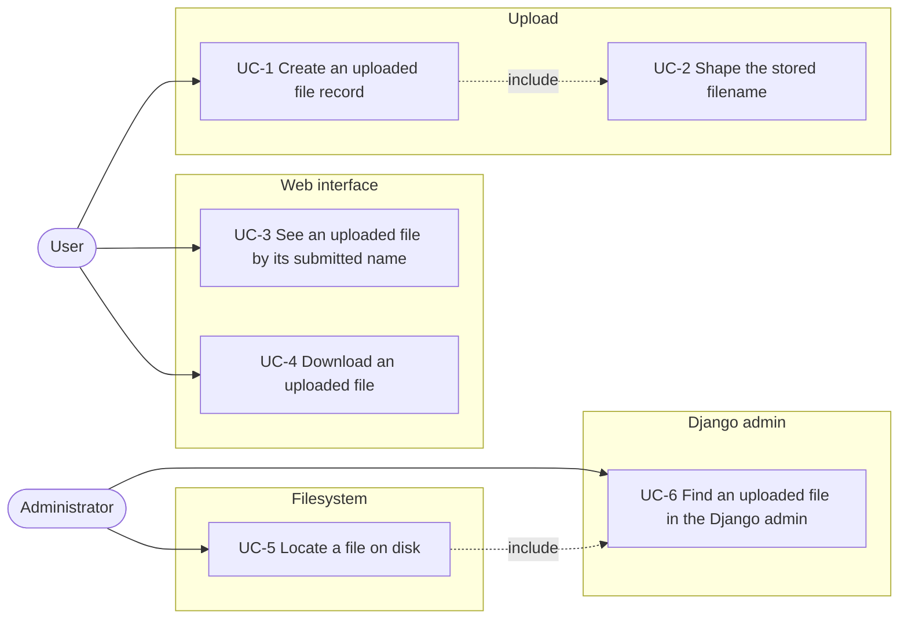
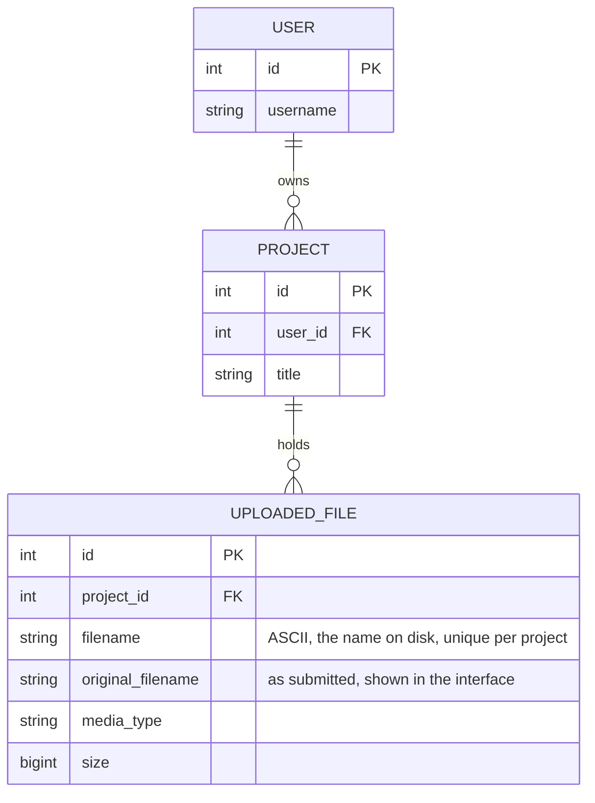

# Spec: ASCII filenames for uploaded files

Status: not started.

This document is an **executable spec** (spec-driven development): it is the
prompt an implementing session works from and the authoritative record of every
decision, not a background sketch. Resolve ambiguity by reading this document,
not by inventing; if a genuinely new decision comes up, write it into this
document as part of the task. Check off tasks (`[x]`, with date) as they land.
Do not duplicate CLAUDE.md conventions here (test-first, pytest style, both
locale files for every new string).

## Motivation

An uploaded file is stored on disk under `UploadedFile.filename`, which today is
`fit_filename(get_valid_filename(submitted_name))`. `get_valid_filename` keeps
every Unicode word character, so Georgian, Japanese, Cyrillic and accented Latin
names reach the filesystem unchanged: `რთ.mp4` is stored under that name.

The people who work with these files on the filesystem are the administrators.
They read a directory listing, type a name into a shell and copy files out of a
project directory. A name they cannot type is a name they cannot work with, and
a script they cannot read gives them nothing to match against the web interface.

This feature transliterates the stored name to ASCII with `anyascii` and shows
the submitted name in the web interface instead, so that nothing the user needs
is lost: the database already keeps `UploadedFile.original_filename`.

## Non-goals

Do not add these, even where they would be easy:

- **No transliteration rules of our own.** What `anyascii` produces for a script
  is what is stored, whether or not a German reader would have romanised it that
  way. No per-script table, no correction of individual mappings, no second
  library consulted when the result reads oddly.
- **No renaming of files already on disk.** The rule applies to uploads created
  after it lands. Existing rows keep their stored name; a migration that renames
  the file on disk together with the row is a separate change.
- **No opaque stored names.** The stored name stays a readable derivation of
  what the user submitted, not a uuid or a primary key, because it exists for a
  human reading a directory listing.
- **No change to the duplicate suffix.** The existing timestamp suffix on a
  collision stays exactly as it is, including its one-second resolution.
- **No case-insensitive uniqueness.** The unique constraint on
  `(project, filename)` stays as it is.

## Actors

- **User** — an authenticated account holder who uploads files into their own
  project and reads the web interface.
- **Administrator** — a staff account holder who reaches every project's uploads
  in the Django admin, and who also works directly on the filesystem of the
  server, outside the application. The filesystem half is not authenticated by
  the application and is the reason the stored name is shaped the way it is; the
  Django admin is where the two names are matched against each other.

## System use cases



### UC-1 Create an uploaded file record

- **Actor:** User.
- **Precondition:** The user owns the project and holds
  `uploaded_files.add_uploadedfile`.
- **Trigger:** `POST /projects/<pk>/create-file/` with the submitted filename.
- **Main flow:**
  1. The system stores the submitted name unchanged in `original_filename`.
  2. The system shapes the stored name (UC-2) and puts it in `filename`.
  3. On a collision with an existing name in the same project, the existing
     timestamp suffix is appended, unchanged from today.
- **Alternative flow A — the submitted name is empty or the form rejects it:**
  The existing `400` response is unchanged.
- **Postcondition:** One `UploadedFile` row whose `filename` is ASCII and whose
  `original_filename` is what the user submitted.

### UC-2 Shape the stored filename

- **Actor:** None; included by UC-1.
- **Trigger:** UC-1 step 2.
- **Main flow:** The transformation pinned in the feature reference below.
- **Postcondition:** A non-empty name matching `[a-z0-9._-]+`, at most 200
  bytes, that neither starts nor ends with `.`, `-` or `_`.

### UC-3 See an uploaded file by its submitted name

- **Actor:** User.
- **Precondition:** The user owns the project and holds
  `uploaded_files.view_uploadedfile`.
- **Trigger:** The user opens any page naming an uploaded file.
- **Main flow:**
  1. Every page names the file by `original_filename`: the upload detail page
     (title, breadcrumb, heading), the file table and the transcription job
     table of a project, and the transcript detail and edit pages.
  2. The details block of the upload detail page shows the stored name under
     "Filename on disk" whenever it differs from the submitted name.
- **Postcondition:** None.

### UC-4 Download an uploaded file

- **Actor:** User.
- **Trigger:** `GET /uploaded-files/<pk>/download/`.
- **Main flow:** The file is served as an attachment named by
  `original_filename`, encoded per RFC 5987 when it is not ASCII.
- **Postcondition:** None.

### UC-5 Locate a file on disk

- **Actor:** Administrator.
- **Trigger:** The administrator has a file in a project directory and wants the
  record that belongs to it, or the reverse.
- **Main flow:**
  1. The administrator lists `project.upload_directory`, where every name is
     ASCII and can be typed and copied in a shell.
  2. To go from a name on disk to the record, the administrator searches the
     Django admin (UC-6). To go the other way, the administrator reads
     "Filename on disk" in the details block of the upload detail page, or the
     same column in the Django admin.
- **Postcondition:** None.

### UC-6 Find an uploaded file in the Django admin

- **Actor:** Administrator.
- **Precondition:** The administrator is staff and holds
  `uploaded_files.view_uploadedfile`. The Django admin is not restricted to one
  user's projects, which is what makes it the place where a file on disk is
  identified.
- **Trigger:** The administrator opens the uploaded file changelist, coming
  either from a name on disk or from a name a user reported.
- **Main flow:**
  1. The administrator searches. `search_fields` covers `filename` and
     `original_filename`, so either name finds the row, which is what makes the
     mapping work in both directions.
  2. The changelist shows both names in their own columns: the stored name
     first, linked to the change page, and the submitted name beside it. Both
     are truncated to 60 characters with the full value in a `title` attribute.
  3. The change page shows both names as read-only fields, as it does today.
- **Alternative flow A — the two names are equal:** Both columns show the same
  value. No column is hidden and no row is marked; a name that needed no
  transformation is not a special case worth an indicator.
- **Postcondition:** None. Uploaded files are not created or edited here;
  `has_add_permission` stays `False` and both name fields stay read-only.

## Entity relationship model

Nothing is added to the schema. The feature is a rule about the value written
into one existing column and about which of two existing columns is displayed.



`filename` is a path component: `project.upload_directory / filename` is the
file, and `web/<filename>.mp4` beside it is the derived web video.
`original_filename` is display text and is never used as a path.

## Architecture

The transformation is a pure function whose only dependency is `anyascii`. It
touches no Django model, request or setting, so it is testable on its own and
callable from a future importer or management command:

```
submitted name ──▶ storage_filename() ──▶ UploadedFile.filename   (disk, admins)
       │
       └────────────────────────────────▶ UploadedFile.original_filename
                                                  │
                                                  ▼
                                          display_name (interface)
```

Three properties this layout has to keep:

- **One call site.** `storage_filename` is applied exactly where an
  `UploadedFile` row is created, in `mmt.projects.views.create_uploaded_file`.
  No other code shapes a filename, and nothing re-derives the stored name from
  the submitted one later.
- **Applied on write, never on read.** The stored name is computed once and read
  verbatim afterwards. Changing the rule therefore never moves an existing file.
- **The interface reads a model property, not a field.** `display_name` returns
  `original_filename`, falling back to `filename`, so templates hold no
  conditional and rows predating `original_filename` still render.

## Feature reference

### The transformation

`storage_filename(name: str, limit: int = 200) -> str`, in
`mmt/uploaded_files/filenames.py`, applied to the submitted name in this order.
The extension is split off first and each part is transformed separately, so an
empty stem is detected as such.

1. **Split.** `PurePosixPath(name)` gives `stem` and `suffix`. A leading dot
   belongs to the stem, not to an extension.
2. **Transliterate.** `anyascii(part)`. One call replaces both a table for the
   letters whose diacritic is part of the glyph (`ß→ss`, `ł→l`, `ø→o`, `æ→ae`)
   and a Unicode normalisation step: `file` becomes `file`, and a script with no
   ASCII base letter at all is romanised rather than deleted, which is what
   makes `რთ.mp4` readable as `rt.mp4`.
3. **Lowercase, then replace spaces.** `str.lower()`, then every space becomes
   `_`. Lowercasing is mandatory, not optional: the character set in step 4
   holds no uppercase letters, so a capital that survives this step is deleted
   rather than folded. `anyascii` preserves case, so this step does real work.
4. **Validate the character set.** Remove every character outside
   `[a-z0-9._-]`. `anyascii` emits ASCII but not only these characters: it
   writes an apostrophe in a Cyrillic romanisation (`Интервью` → `Interv'yu`)
   and wraps an emoji in colons (`😀` → `:grinning:`).
5. **Tidy.** Collapse runs of `_` into one; strip `.`, `-` and `_` from both
   ends of the stem. A leading dot hides the file from a directory listing and a
   leading dash is read as an option by command line tools such as ffmpeg.
6. **Fall back.** If the stem is empty, it becomes `file`. With transliteration
   this is rare: it is reached by a name made only of punctuation or of symbols
   `anyascii` maps to nothing, not by a name in a non-Latin script.
7. **Fit.** `fit_filename(stem + suffix, limit=limit)` applies the existing
   200-byte rule. A romanisation can be longer than the name it came from, so
   the limit is applied after transliteration, not before.

### Examples

| submitted | stored |
|---|---|
| `rita fernández 2` | `rita_fernandez_2` |
| `Ana González nur audio` | `ana_gonzalez_nur_audio` |
| `Ölbäume Übersicht.mp4` | `olbaume_ubersicht.mp4` |
| `Straße.mp4` | `strasse.mp4` |
| `Łódź.mp4` | `lodz.mp4` |
| `file.mp4` | `file.mp4` |
| `Interview.MP4` | `interview.mp4` |
| `-i tricky.mp4` | `i_tricky.mp4` |
| `.htaccess` | `htaccess` |
| `რთ.mp4` | `rt.mp4` |
| `interview რთ.mp4` | `interview_rt.mp4` |
| `Интервью.mp4` | `intervyu.mp4` |
| `日本語.mp3` | `ribenyu.mp3` |
| `Ελλάδα.mp4` | `ellada.mp4` |
| `😀.mp4` | `grinning.mp4` |
| `...` | `file` |

The last three rows are the results that look surprising and are pinned so that
they are not read as defects. An emoji becomes its CLDR name because `anyascii`
renders it as `:grinning:` and step 4 removes the colons. CJK becomes a
concatenated romanisation, which is typeable and stable but says little to a
reader; the transliteration is not corrected, per the non-goal above.

### Display

`UploadedFile.display_name` returns `original_filename or filename`. The
templates listed in UC-3 use it. The details block shows `filename` under
"Filename on disk" (German: "Dateiname auf dem Dateisystem") when
`filename_altered` is true, replacing the "Original filename" row, which becomes
redundant once the heading is the original name.

### The Django admin

`UploadedFileDisplayMixin` gains an `original_filename_display` column,
described "Original filename", truncated to 60 characters with the full value in
a `title` attribute, exactly like the existing `filename_display`. It is added
to `UploadedFileAdmin.list_display` and to `UploadedFileInline.fields` directly
after the stored name, so the changelist and the inline on the project page stay
identical, which is what the mixin exists for.

`filename_display` keeps showing `filename` and stays the first column, because
the changelist links its first column to the change page and because the
administrator's reason for being here is the file on disk. `search_fields`,
`readonly_fields` and `has_add_permission` are unchanged; the search already
covers both names.

`serve_file` builds `Content-Disposition` with
`django.utils.http.content_disposition_header`. Interpolating the name into the
header by hand makes Django encode a non-ASCII value as an RFC 2047 word, which
browsers do not read in this header.

## File layout

```
app/mmt/
    uploaded_files/
        filenames.py        + storage_filename, _to_ascii
        models.py           + UploadedFile.display_name
        views.py            download: filename=display_name
        admin.py            + original_filename_display on the shared mixin
        templates/uploaded_files/
            _metadata.html          "Filename on disk"
            detail.html             display_name
            create_transcript.html  display_name
        tests/
            test_filenames.py       + storage_filename cases
            test_uploaded_file.py   + display_name
            test_views.py           + detail page, download header
            test_admin.py           + the changelist column
    projects/
        views.py            create_uploaded_file calls storage_filename
        admin.py            + the column on UploadedFileInline.fields
        templates/projects/
            _file_table.html
            _transcription_jobs_table.html
    transcripts/templates/transcripts/
        detail.html
        edit.html
    core/file_serving.py    content_disposition_header
app/pyproject.toml          + anyascii~=0.3.3
```

`anyascii` is a pure-Python package with no compiled parts and no dependencies
of its own. It is a runtime dependency, not a development one: an upload cannot
be created without it.

## Slices and tasks

- [ ] **1 The stored name.** The `anyascii` dependency, `storage_filename` and
  its tests, called from `create_uploaded_file`. Done when `test_filenames.py` covers every row of the
  examples table and the existing upload tests still pass. No interface change:
  the pages still show `filename`, which is now the ASCII name.
- [ ] **2 The submitted name in the interface.** `display_name`, the templates
  of UC-3, the download attachment name, the `content_disposition_header` fix,
  the `original_filename_display` column of UC-6, and the German translation of
  "Filename on disk". Done when a development run uploads a file named
  `რთ.mp4`, shows `რთ.mp4` on every page, lists `rt.mp4` under "Filename on
  disk", shows both names side by side in the Django admin changelist and in the
  project inline, and downloads the file under its Georgian name.

## Decisions that were open

Both were resolved on 2026-08-31 and are recorded here rather than deleted,
because each looks like an oversight otherwise.

- **The fallback stem is `file`.** Transliteration makes it rare enough that the
  collisions it used to cause are not a reason to choose anything else. It is
  left as it is until a real name reaches it.
- **`anyascii` may be upgraded freely.** Its tables change between versions, so
  the same submitted name can transliterate differently after an upgrade. Stored
  names are never recomputed, so nothing on disk moves; the only visible effect
  is that two uploads of one name, on either side of an upgrade, can be stored
  under two different names instead of colliding. That is accepted.
