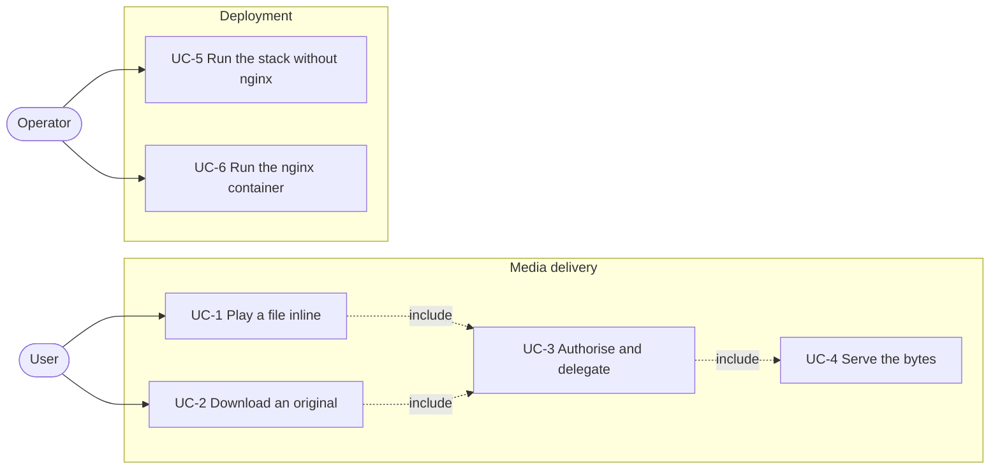

# Spec: Serve media files through nginx with X-Accel-Redirect

Status: proposed.

This document is an **executable spec** (spec-driven development): it is the
prompt an implementing session works from and the authoritative record of every
decision, not a background sketch. Resolve ambiguity by reading this document,
not by inventing; if a genuinely new decision comes up, write it into this
document as part of the task. Check off tasks (`[x]`, with date) as they land.
Do not duplicate CLAUDE.md conventions here (test-first, pytest style, both
locale files for every new string).

## Motivation

`mmt.core.file_serving.serve_file` reads the file in 64 KiB chunks and yields
them from a `StreamingHttpResponse`. Every byte of every media file therefore
passes through Python. The application runs under `uvicorn --workers 4`
(`app/Dockerfile`), and the views are synchronous, so each response occupies a
thread of the ASGI thread pool for the entire duration of the transfer, not
just for the time it takes to authorise the request.

The files are interview recordings, frequently several gigabytes each. A user
who downloads an original holds a thread for as long as their connection needs;
a user who seeks in the player produces a further request for each range. The
web container is capped at 1.5 GB of memory (`deploy/create-mmt-app-web`),
which the chunked reads do not exhaust, but the thread pool is a fixed
resource and file transfer is the one workload that occupies it for minutes at
a time.

nginx serves a file from disk with `sendfile()`, handles `Range`, `If-Range`
and conditional requests itself, and does not involve the application. With
`X-Accel-Redirect` the authorisation stays in Django, unchanged: the view runs
the same permission check and the same ownership lookup, then answers with an
empty body and a header naming an internal location. nginx discards that body
and serves the file. The Django request becomes a session lookup and one
`SELECT`, a few milliseconds, and the thread is released before the first byte
of media reaches the client.

## Non-goals

Do not add these, even where they would be easy:

- **No signed URLs.** `ngx_http_secure_link_module` would remove Django from
  the range requests entirely, at the price of a bearer token in the URL that
  stays valid until it expires and cannot be revoked when a user logs out.
  That trade-off was considered and deferred. Access stays session
  authenticated and every range request still reaches Django; the change here
  is what that request costs, not how many there are.
- **No `auth_request`.** It produces one Django subrequest per range request,
  which is the same request count as this design plus an extra hop.
- **No removal of `serve_file`'s range implementation.** It remains the code
  path for development, for the test suite and for any deployment that runs no
  nginx. Both paths stay covered by tests.
- **No decision about TLS.** The new nginx container speaks plain HTTP. Where
  production terminates TLS is unchanged by this spec.
- **No move of static files.** Whitenoise keeps serving them.
- **No caching or expiry headers on media.** nginx's defaults for a static
  file apply; `Cache-Control`, `Expires` and `ETag` tuning is a separate
  change.
- **No change to the upload path.** Chunked upload keeps writing through
  Django. Only reads are delegated.

## Actors

- **User** — an authenticated account holder who plays and downloads files in
  their own projects. Nothing about the interface changes for them; the
  feature is visible only as a faster transfer that no longer competes with
  the rest of the application.
- **Operator** — the administrator who runs the containers on the server. This
  feature adds a container to operate and a directory that must be mounted
  into it, and it makes the reverse proxy part of the application's
  deployment rather than an unversioned piece of the host.

## System use cases



### UC-1 Play a file inline

- **Actor:** User.
- **Precondition:** The user owns the project and holds
  `uploaded_files.view_uploadedfile`. `MMT_X_ACCEL_LOCATION` is set.
- **Trigger:** `GET /uploaded-files/<pk>/stream/`, with or without a `Range`
  header, from the player on the upload detail page or in the transcript
  editor.
- **Main flow:**
  1. The view resolves the file as it does today, via
     `UploadedFile.stream_source()`, which returns the derived web video when
     it exists and the original otherwise.
  2. The view delegates (UC-3) with that path and content type, inline.
  3. nginx serves the file or the requested range (UC-4).
- **Alternative flow A — the file is not on disk:** unchanged. The view
  returns `404` with the body `File does not exist.` before any delegation.
- **Alternative flow B — the user is not logged in or does not own the file:**
  unchanged. Logged out redirects to the login page; another user's file is a
  `404` from `get_object_or_404`.
- **Postcondition:** None.

### UC-2 Download an original

- **Actor:** User.
- **Precondition:** As UC-1.
- **Trigger:** `GET /uploaded-files/<pk>/download/`.
- **Main flow:** As UC-1, except that the path is always
  `UploadedFile.file_path`, the content type is `application/octet-stream`,
  and the response is an attachment named by `display_name`.
- **Postcondition:** None.

### UC-3 Authorise and delegate

- **Actor:** None; included by UC-1 and UC-2.
- **Precondition:** The calling view has completed its permission check.
- **Main flow:**
  1. `serve_file` reads `settings.MMT_X_ACCEL_LOCATION`. When it is empty the
     existing range implementation runs and the rest of this flow does not
     apply.
  2. The file path is expressed relative to `settings.MMT_USER_FILES_DIR` and
     percent-encoded into an internal URI.
  3. The response carries no body, the `X-Accel-Redirect` header, the content
     type, and the same `Content-Disposition` the direct path would have set.
- **Alternative flow A — the path is not under `MMT_USER_FILES_DIR`:** the
  helper raises `SuspiciousFileOperation`. This is a programming error, not a
  user-reachable state; every path the two views pass is inside a project
  directory under the user files root.
- **Postcondition:** None.

### UC-4 Serve the bytes

- **Actor:** None; included by UC-3.
- **Trigger:** nginx receives a response carrying `X-Accel-Redirect`.
- **Main flow:**
  1. nginx discards the upstream body and issues an internal redirect to the
     named location, keeping the client's request headers, including `Range`.
  2. The location is marked `internal`, so the same URI requested directly by
     a client is a `404`.
  3. nginx serves the file with `sendfile()`, answering `200`, `206` or `416`
     and setting `Accept-Ranges`, `Content-Length` and `Content-Range` itself.
  4. The `Content-Type` and `Content-Disposition` set by Django are passed
     through to the client.
- **Postcondition:** None.

### UC-5 Run the stack without nginx

- **Actor:** Operator, and every developer.
- **Trigger:** `X_ACCEL_LOCATION` is unset, which is the default.
- **Main flow:** `serve_file` serves the file itself, with the range support
  it has today. The development server, the test suite and any deployment
  without a reverse proxy that can see the media directory are unaffected by
  this feature.
- **Postcondition:** None.

### UC-6 Run the nginx container

- **Actor:** Operator.
- **Precondition:** The host directory holding the user files is the one bind
  mounted into the web and celery containers as `$MMT_DATA_DIR`.
- **Main flow:**
  1. The operator runs `deploy/create-mmt-nginx`, which mounts that directory
     read-only and publishes the HTTP port.
  2. The operator points whatever terminates TLS in front of the application
     at the nginx container's port instead of the web container's port.
  3. `X_ACCEL_LOCATION=/internal-media/` is added to `env.list`, and the web
     container is recreated so it picks the variable up.
- **Alternative flow A — the variable is set but nginx is not in front:** the
  client receives an empty `200` with an `X-Accel-Redirect` header and no
  media. This is a misconfiguration the application cannot detect, because
  Django cannot tell what is in front of it. The ordering in the main flow
  (nginx first, variable second) is the way to avoid it, and the task list
  makes the same ordering explicit.
- **Postcondition:** None.

## Entity relationship model

Nothing is added to the schema. The feature changes how a response is
produced, not what is stored.

## Architecture

```
GET /uploaded-files/7/stream/  Range: bytes=2-5
        │
        ▼
     nginx  ────proxy_pass────▶  uvicorn / Django
        │                            │  permission_required
        │                            │  get_object_or_404(project__user=…)
        │                            │  stream_source() → path, content type
        │      X-Accel-Redirect      │
        │◀───  (empty 200)  ─────────┘   thread released here
        │
        ▼
  internal location  →  alias /srv/user_files/…  →  sendfile()  →  206
```

Three properties this layout has to keep:

- **One decision point.** The choice between the two paths lives in
  `serve_file` and nowhere else. A view calls `serve_file` and does not know
  which one runs; adding a third file-serving view therefore needs no
  knowledge of nginx.
- **Authorisation stays in Django.** The internal location is not reachable
  from outside, so a URI that leaks grants nothing. There is no token, no
  expiry and nothing to revoke.
- **The setting is the only switch.** Its absence is a complete deployment,
  not a degraded one. Nothing else in the code branches on the presence of
  nginx.

## Feature reference

### The setting

`MMT_X_ACCEL_LOCATION`, read from the environment variable
`X_ACCEL_LOCATION`, declared in the `environ.Env` defaults as `(str, '')` and
assigned next to `MMT_USER_FILES_DIR` in `app/mmt/settings.py`.

- Empty (the default) means the feature is off.
- A non-empty value must start with `/` and is normalised to end with `/`; a
  value that does not start with `/` raises `ImproperlyConfigured` at startup,
  in the same style as the existing `DJANGO_ENV` check.
- The value used in every deployment file this spec adds is
  `/internal-media/`.

### The delegating response

`x_accel_response(file_path, *, content_type, as_attachment, filename)` in
`app/mmt/core/file_serving.py`, called from `serve_file` when the setting is
non-empty:

1. `relative = file_path.resolve().relative_to(settings.MMT_USER_FILES_DIR.resolve())`.
   Both sides are resolved so that a symlinked user files directory, which is
   normal in development, does not defeat the comparison. A `ValueError`
   becomes `SuspiciousFileOperation`.
2. `uri = settings.MMT_X_ACCEL_LOCATION + quote(str(relative))`.
   `urllib.parse.quote` with its default `safe='/'` keeps the separators and
   encodes everything else. Filenames written since the ASCII filenames
   feature need this only for spaces and punctuation, but rows predating it
   can hold any Unicode name, and nginx unescapes the header value as a URI.
3. The response is `HttpResponse(content_type=content_type)` with an empty
   body, carrying:
   - `X-Accel-Redirect: <uri>`
   - `Content-Disposition`, built by `content_disposition_header` exactly as
     the direct path builds it, so the RFC 8187 encoding of a non-ASCII
     attachment name is unchanged.
   - no `Content-Length`. Django sets `0` for an empty body; the length that
     belongs on the response is the length of the file or of the range, which
     nginx determines. The header is deleted before returning.
4. `Accept-Ranges` and `Content-Range` are not set. They are nginx's to send.

The `Range` header of the incoming request is ignored on this path. nginx
applies it to the internal request.

### `serve_file`

Gains a branch at the top and keeps its signature and its docstring's promise:

```python
def serve_file(request, file_path, *, content_type, as_attachment=False, filename=''):
    if settings.MMT_X_ACCEL_LOCATION:
        return x_accel_response(file_path, content_type=content_type,
                                as_attachment=as_attachment, filename=filename)
    ...
```

Everything below the branch is unchanged.

### The views

`stream` and `download` in `app/mmt/uploaded_files/views.py` are unchanged,
including the `is_file()` check that precedes them. The check stays because it
produces the application's own `404` body; without it nginx would answer a
missing file with its own `404` page, which is a different response for the
same condition depending on the deployment.

### nginx

`docker/nginx/default.conf.template`, rendered by the official image's
`envsubst` startup step, so that one file serves both the compose stack and
the podman deployment:

```nginx
server {
    listen 8080;
    server_name _;

    # Uploads are chunked at 10 MB but the limit is per request body, and the
    # non-chunked upload path posts the whole file. nginx must not impose a
    # limit of its own, and must not buffer a multi-gigabyte body to disk
    # before the application sees it.
    client_max_body_size 0;
    proxy_request_buffering off;

    location /internal-media/ {
        internal;
        alias /srv/user_files/;
    }

    location / {
        proxy_pass http://${MMT_WEB_UPSTREAM};
        proxy_http_version 1.1;
        proxy_set_header Host $host;
        proxy_set_header X-Forwarded-For $proxy_add_x_forwarded_for;
        proxy_set_header X-Forwarded-Proto $scheme;
    }
}
```

- `X-Forwarded-Proto` is what `SECURE_PROXY_SSL_HEADER` already reads
  (`app/mmt/settings.py`), and `$scheme` is `http` here because TLS is
  terminated further out. Where this container is the outermost proxy, the
  value has to be set to `https` by hand; that case is out of scope, see the
  non-goals.
- `/srv/user_files/` is the read-only mount of the user files directory. The
  trailing slashes on both the location and the `alias` are required for the
  path to be joined correctly.
- `MMT_WEB_UPSTREAM` is `web:8000` in the compose stack and
  `host.containers.internal:$MMT_WEB_PORT` in the podman deployment, where the
  containers do not share a network and the web container publishes its port
  on the host.

### The compose stack and the deploy script

- `docker/docker-compose.yml` gains an `nginx` service on the `mmt` network,
  mounting `user_files:/srv/user_files:ro` and
  `./nginx:/etc/nginx/templates:ro`, publishing `8080`, with
  `MMT_WEB_UPSTREAM=web:8000` and `depends_on: web`. The `web` service keeps
  publishing `8000` so that the direct path stays testable side by side.
- `docker/env.list` gains `X_ACCEL_LOCATION=/internal-media/`.
- `deploy/create-mmt-nginx` follows the shape of the existing scripts: it
  requires `MMT_DATA_DIR` and `MMT_HTTP_PORT`, mounts the data directory at
  `/srv/user_files:ro`, mounts the template directory, passes
  `MMT_WEB_UPSTREAM`, and publishes `$MMT_HTTP_PORT:8080`.
- `deploy/README.md` gains the container in the script table, the two
  variables in the environment table, and loses the proxy from its TODO.

## File layout

```
app/mmt/
    settings.py                 + X_ACCEL_LOCATION default, MMT_X_ACCEL_LOCATION
    core/
        file_serving.py         + x_accel_response, branch in serve_file
        tests/
            test_file_serving.py    + new file: both paths of serve_file
    uploaded_files/tests/
        test_views.py           + stream and download under the setting
    projects/views.py           (slice 3) download_download → serve_file
    my_account/views.py         (slice 3) download_dpa → serve_file
docker/
    nginx/default.conf.template + new
    docker-compose.yml          + nginx service
    env.list                    + X_ACCEL_LOCATION
deploy/
    create-mmt-nginx            + new
    README.md                   + the container, the variables, TODO
```

## Slices and tasks

- [ ] **1 Delegation in Django.** The setting, `x_accel_response`, the branch
  in `serve_file`. Tests first, in pytest style, in a new
  `app/mmt/core/tests/test_file_serving.py` and alongside the existing stream
  tests. Done when, with `MMT_X_ACCEL_LOCATION='/internal-media/'` overridden:
  the stream view answers `200` with an empty body, the `X-Accel-Redirect`
  header holding the path of the file relative to the user files directory
  prefixed with the location, the content type from `stream_source()` and
  `Content-Disposition: inline`; the download view answers with
  `attachment` and the RFC 8187 encoded `display_name`; a file whose name is
  not ASCII is percent-encoded in the header; no `Content-Length` is present;
  a path outside the user files directory raises `SuspiciousFileOperation`; a
  missing file is still a `404`; a logged out request still redirects and
  another user's file is still a `404`. With the setting empty, every existing
  range test passes unchanged. `uv run pytest` is green.

- [ ] **2 The nginx container.** The template, the compose service, the deploy
  script, `env.list`, `deploy/README.md`. Done when, against the compose stack
  with the variable set: a logged in `GET .../stream/` through port 8080
  returns the media, `curl -r 100-199` returns `206` with a correct
  `Content-Range` and the right four bytes, `curl` of
  `/internal-media/<path>` directly returns `404`, a logged out request to the
  stream URL still redirects to the login page, seeking in the browser player
  works on a file of several hundred megabytes, and an upload of a file larger
  than nginx's default body limit still succeeds. The `web` service on port
  8000 without the variable still serves the same file directly.

- [ ] **3 The remaining file responses.** `projects.download_download` and
  `my_account.download_dpa` build `StreamingHttpResponse` from `file_data`
  with a hand-built `Content-Disposition` and no range support. Move both to
  `serve_file`, which gives them range support, the RFC 8187 encoding and the
  delegation at once. Done when their existing tests pass with the
  disposition assertions updated to the encoded form, a new test covers a
  download name that is not ASCII, and both views carry the
  `X-Accel-Redirect` header under the overridden setting. The DPA file is a
  `FileField` under `MEDIA_ROOT`, which is `MMT_USER_FILES_DIR`, so it is
  inside the served root; assert that in a test rather than assuming it.
