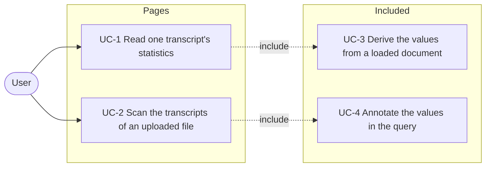
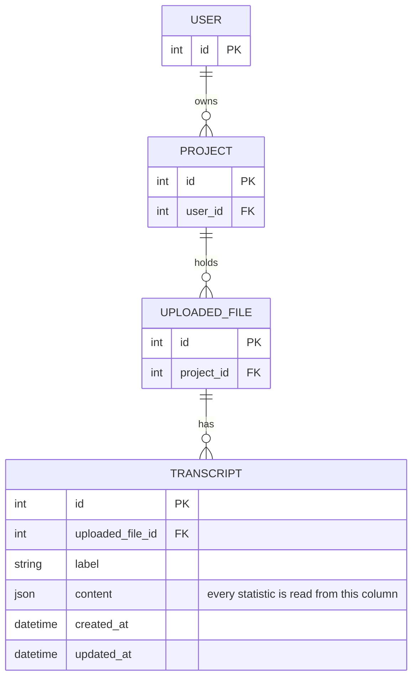
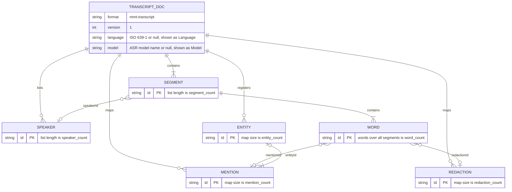

# Spec: Transcript statistics on the detail and list pages

Status: proposed.

This document is an **executable spec** (spec-driven development): it is the
prompt an implementing session works from and the authoritative record of every
decision, not a background sketch. Resolve ambiguity by reading this document,
not by inventing; if a genuinely new decision comes up, write it into this
document as part of the task. Check off tasks (`[x]`, with date) as they land.
Do not duplicate CLAUDE.md conventions here (test-first, pytest style, both
locale files for every new string).

## Motivation

The content holds facts a user wants to see without opening the editor: which
language and model produced the transcript, how long it is, and how much of it
is marked as an entity or a redaction. Both pages currently defer the content
column, which is the property worth keeping: the detail page can afford to load
one document, a list of transcripts cannot afford one per row.

## Non-goals

- **No derived columns and no stored statistics.** Nothing is written to the
  database, so no value can be stale and no migration is needed. The two use
  cases are display only; filtering, sorting and aggregating across transcripts
  are not supported and would be the trigger to revisit this decision.
- **No change to the read-only API.** `TranscriptOut` keeps the fields
  [`2026-07-30-read-only-api.md`](2026-07-30-read-only-api.md) specifies, and
  its open question about denormalised columns stays open.
- **No word count on the list page.** See the decision below.

## Actors

- **User** — a logged-in account holder with `transcripts.view_transcript` and
  `uploaded_files.view_uploadedfile`, reading their own projects. The actor in
  every use case.

There is no system actor. Both values are computed while a request is served
and nothing about them is scheduled, queued or stored.

## System use cases

The overview shows which actor triggers which use case. `<<include>>` marks a
use case that every dependent case performs as part of its own flow.



Each use case below is the authoritative description of one system behaviour.
The feature reference further down repeats the rules in a compact form; where
the two disagree, the feature reference is wrong and both are fixed together.

### UC-1 Read one transcript's statistics

- **Actor:** User.
- **Precondition:** The transcript belongs to a project the user owns.
- **Trigger:** `GET /transcripts/<pk>/`.
- **Main flow:**
  1. The view loads the transcript with its `content` column.
  2. The view derives the eight values (UC-3) and puts them into the context.
  3. The metadata sidebar renders one `dt`/`dd` pair per value, above the
     existing timestamps.
- **Alternative flow A — a value is `None`:** The pair is still rendered and
  the `dd` holds an em dash. A row is never omitted, so the sidebar has the
  same shape for every transcript.
- **Alternative flow B — the content predates the mmt format or is
  malformed:** Every value is `None` and the page renders eight em dashes. No
  error is raised and no error is shown.
- **Postcondition:** None. Nothing is written.

### UC-2 Scan the transcripts of an uploaded file

- **Actor:** User.
- **Precondition:** The uploaded file belongs to a project the user owns.
- **Trigger:** `GET /uploaded-files/<pk>/`.
- **Main flow:**
  1. The view builds the transcript queryset with `content` still deferred and
     asks for the annotations (UC-4).
  2. The transcript table renders Language, Model and Segments between the
     Label and Created at columns.
- **Alternative flow A — an annotated value is `NULL`:** The cell holds an em
  dash, matching the detail page's treatment of `None`.
- **Postcondition:** None.

### UC-3 Derive the values from a loaded document

- **Actor:** None; included by UC-1.
- **Precondition:** The caller holds the parsed `content` of one transcript.
- **Main flow:**
  1. `derive_statistics` reads `language` and `model` from the mapping.
  2. It counts the speakers, segments, mentions, entities and redactions by
     the length of the corresponding collection.
  3. It counts the words in one pass over the segments.
  4. It returns the eight keys, every value read with `.get()`.
- **Alternative flow A — the content is not a mapping, or a key is absent:**
  The affected value is `None`. A count of `0` therefore means the document has
  none of that thing, and `None` means the document does not carry the key.
- **Alternative flow B — a key holds a value of the wrong type:** The affected
  value is `None`. The function never raises.
- **Postcondition:** None.

### UC-4 Annotate the values in the query

- **Actor:** None; included by UC-2.
- **Precondition:** The caller holds a `Transcript` queryset.
- **Main flow:**
  1. `with_statistics()` annotates `language` and `model` from the JSON column
     with `KeyTextTransform`.
  2. It annotates `segment_count` with MySQL's `JSON_LENGTH` over
     `$.segments`.
  3. The rows carry the three values without `content` being selected, so
     `get_deferred_fields()` of each instance still reports `content`.
- **Alternative flow A — the path is absent from the document:** MySQL returns
  `NULL`, which reaches the template as `None` and matches what UC-3 returns
  for the same document.
- **Postcondition:** None.

## Entity relationship model

Two diagrams. The first is the persisted graph, which this feature does not
change: nothing is added and no value is stored. The second is the structure
inside the `content` column, which is where every statistic is read from.

### Persisted entities



Ownership is checked on the path both views already use:
`filter(pk=..., uploaded_file__project__user=user)` for the detail page and
`uploaded_file.transcripts` for the list. This feature adds no model, no field
and no migration; it adds one queryset method, which needs none.

### Structure of `Transcript.content`

The mmt-transcript document as defined in
[`app/mmt/transcripts/mmt_schema.py`](../app/mmt/transcripts/mmt_schema.py) and
described in [`docs/mmt-transcript-format.md`](../docs/mmt-transcript-format.md).
Relations are containment and reference within one JSON document, not foreign
keys. The comments name the statistic each part produces.



Two of the eight values are scalars and six are the size of a collection. That
is why the values need no traversal of the reference edges: nothing here is
resolved, joined or deduplicated, so a count is correct even when the document
would fail strict validation.

## Architecture

```
GET /transcripts/7/                        GET /uploaded-files/3/
        │                                          │
        ▼                                          ▼
 transcripts.views.detail                uploaded_files.views.detail
  Transcript.objects                     transcripts.defer('content')
   (content loaded)                          .with_statistics()
        │                                          │
        ▼                                          ▼
 derive_statistics(content)              content->>'$.language'
  one pass in Python                     content->>'$.model'
  eight values                           JSON_LENGTH(content, '$.segments')
        │                                          │
        ▼                                          ▼
 context['statistics']                   three annotations per row
        │                                          │
        ▼                                          ▼
 _metadata.html, one dt/dd pair          _transcript_table.html, three columns
```

Three properties this layout has to keep:

- **The content column is loaded on exactly one page.** The detail page loads
  one document per request. Every other page that lists transcripts keeps
  `.defer('content')`, and a test asserts that the instances in the uploaded
  file's context still report `content` in `get_deferred_fields()`.
- **The two implementations agree.** The same three values are produced twice,
  once in Python and once in SQL. They are pinned to each other by a test that
  asserts the annotations of a stored transcript equal the corresponding keys
  of `derive_statistics` for the same content, including the `None` case.
- **Absence is `None` on both paths.** A missing key yields `None` in Python
  and `NULL` in MySQL, and both render as an em dash. No value is ever
  substituted with a zero.

## Feature reference

### The derived values

`app/mmt/transcripts/statistics.py` holds one function:

```python
def derive_statistics(content) -> dict:
    """Numbers derived from mmt-transcript content, for display."""
```

It returns exactly these keys, read with `.get()`:

| Key | Value |
| --- | --- |
| `language` | `content['language']` |
| `model` | `content['model']` |
| `speaker_count` | `len(content['speakers'])` |
| `segment_count` | `len(content['segments'])` |
| `word_count` | the number of word objects over all segments |
| `mention_count` | `len(content['mentions'])` |
| `entity_count` | `len(content['entities'])` |
| `redaction_count` | `len(content['redactions'])` |

Every value is `None` when the content is not a mapping or the key is absent, so
a count of `0` means the document has none and `None` means the document predates
the mmt format. The function never raises on malformed content.

### Detail page

[`transcripts/views.py`](../app/mmt/transcripts/views.py) `detail` drops
`.defer('content')` and puts `derive_statistics(transcript.content)` into the
context as `statistics`.
[`transcripts/_metadata.html`](../app/mmt/transcripts/templates/transcripts/_metadata.html)
renders one `dt`/`dd` pair per value, above the existing timestamps, labelled
Language, Model, Speakers, Segments, Words, Mentions, Entities and Redactions. A
`None` renders as an em dash.

### List page

[`uploaded_files/views.py`](../app/mmt/uploaded_files/views.py) `detail` keeps
`.defer('content')` and calls a new queryset method on `Transcript`:

```python
class TranscriptQuerySet(models.QuerySet):
    def with_statistics(self):
        """Annotate the values the transcript table shows, so the list does
        not have to load the content column."""
```

It annotates `language` and `model` with `KeyTextTransform`, and `segment_count`
with `Func(F('content'), Value('$.segments'), function='JSON_LENGTH')`. MySQL
returns `NULL` for an absent path, which matches the `None` of the Python
function. Adding the manager needs no migration.

[`_transcript_table.html`](../app/mmt/uploaded_files/templates/uploaded_files/_transcript_table.html)
gains Language, Model and Segments columns between Label and Created at, each
rendering an em dash when the value is `NULL`.

### Pinned decisions

- **MySQL-specific SQL is acceptable.** Development, test and production all run
  MySQL, so `JSON_LENGTH` needs no cross-backend fallback.
- **The list page shows three of the eight values.** The table already scrolls
  sideways on a narrow screen, so it takes only the values that identify the
  transcript and its length. The remaining counts are detail-page only.
- **The word count is not annotated.** Counting words per segment needs
  `JSON_TABLE`, which does not belong in a queryset annotation. The detail page
  computes it in Python, where it is one loop.

## File layout

```
app/mmt/
    transcripts/
        statistics.py                       + new: derive_statistics
        models.py                           + TranscriptQuerySet, objects
        views.py                            detail: no defer, statistics context
        templates/transcripts/
            _metadata.html                  + eight dt/dd pairs
        tests/
            test_statistics.py              + new: both implementations
            test_views.py                   + the detail page renders the counts
    uploaded_files/
        views.py                            detail: with_statistics()
        templates/uploaded_files/
            _transcript_table.html          + three columns
        tests/test_views.py                 + annotations, defer preserved
locale/de/LC_MESSAGES/django.po             + the new column and row labels
```

## Slices and tasks

- [ ] **1 Detail page.** Add `statistics.py`, drop the defer in
  `transcripts.views.detail`, and render the eight values in the metadata
  sidebar. Done when `tests/test_statistics.py` asserts the values for the
  `export_content` fixture, including `model` as `None` because that fixture
  does not carry the key, and asserts that `{}` yields every value as `None`,
  and a view test finds the segment and word counts in the rendered detail page.
- [ ] **2 List page.** Add `TranscriptQuerySet.with_statistics()` and the three
  columns. Done when a test asserts the annotated values of a stored transcript
  equal the corresponding values of `derive_statistics` for the same content,
  that the annotations are `None` for a row whose content is `{}`, and that the
  transcripts in the uploaded file detail context still report `content` in
  `get_deferred_fields()`.
