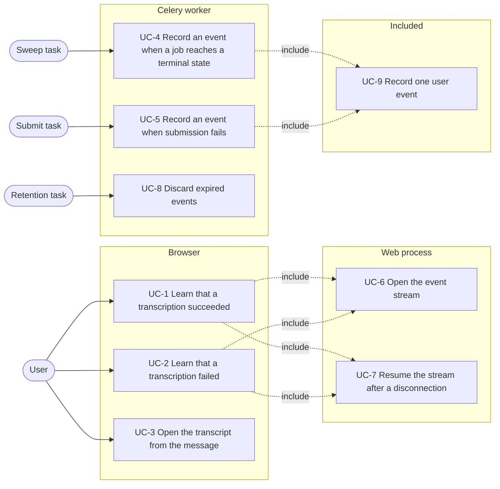
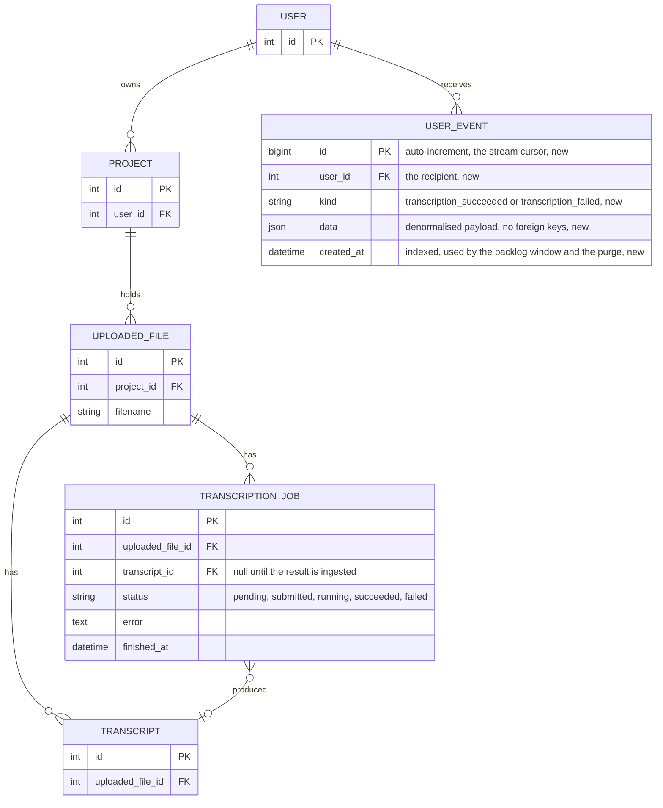
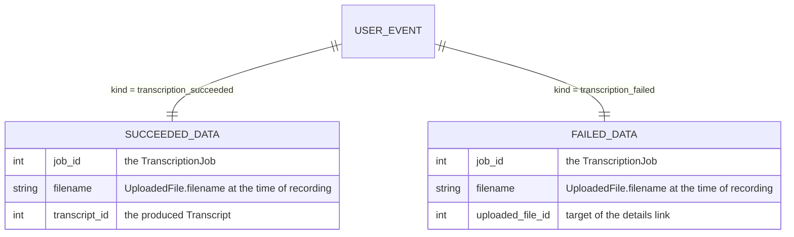
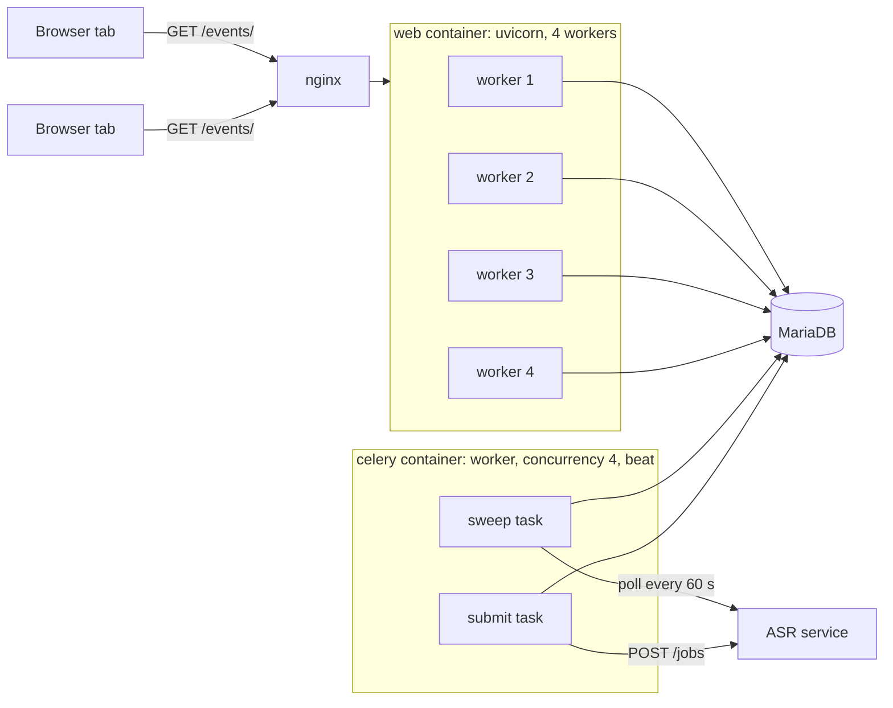

# Spec: notifications when a transcription ends

Status: not started. Written on 2026-09-18 on the branch
`experiment/server-sent-events`, which carries the throwaway event stream at
`/events/` that this feature replaces.

This document is an **executable spec** (spec-driven development): it is the
prompt an implementing session works from and the authoritative record of every
decision, not a background sketch. Resolve ambiguity by reading this document,
not by inventing; if a genuinely new decision comes up, write it into this
document as part of the task. Check off tasks (`[x]`, with date) as they land.
Do not duplicate CLAUDE.md conventions here (test-first, pytest style, vitest
for the frontend, both locale files for every new string, `rlh` units,
alphabetical CSS properties).

The architecture note belongs to this feature and is a section of this document
rather than a separate file under `docs/`; the feature is one endpoint, one
model and one client module, which does not warrant a second document.

This feature reverses one non-goal of
[`2026-07-24-asr-app-integration.md`](2026-07-24-asr-app-integration.md), which
reads "No live progress push. Progress is visible after a page reload, no
websockets and no polling from the browser." The reversal is deliberate and
partial: the terminal transition of a job is pushed, progress is not. When this
spec is implemented, that non-goal in the older spec is amended to name progress
only.

## Motivation

A transcription runs for minutes to hours. Today the only way to learn that it
ended is to open the uploaded file's page or the project's page and read the job
table. A user who starts a transcription and then works elsewhere in the
application learns nothing until they navigate back and reload, and a user who
starts several transcriptions has to poll the pages by hand.

The branch `experiment/server-sent-events` established that the mechanism works:
`GET /events/` answers `text/event-stream` under uvicorn, and a client module
turns each event into a message in the existing message stack. That endpoint
sends a fixed sequence of test events and carries no application data.

This feature replaces the test sequence with the user's own event stream, and
fills it from one source: a `TranscriptionJob` reaching `succeeded` or `failed`.
A user with any page of the application open receives one message when a
transcription of theirs ends, with a link to the resulting transcript or to the
file's page carrying the error.

## Non-goals

Do not add these, even where they would be easy:

- **No progress push.** `progress` is written by the sweep every 60 seconds and
  is visible after a page reload, as before. Only the transition into
  `succeeded` or `failed` produces an event.
- **No notification inbox.** There is no page listing past notifications, no
  unread count and no read state. The job table on the file's page stays the
  record of what happened; a notification is a transient message.
- **No delivery guarantee.** A user with no page open at the time misses the
  message, apart from the short backlog window defined below. This is acceptable
  precisely because the job table is the record.
- **No email and no browser notifications.** No `Notification` API, no service
  worker, no push subscription, no mail.
- **No websockets and no django-channels.** Server-sent events over the existing
  ASGI stack, one direction only.
- **No Redis pub/sub.** See the architecture note for the reasoning and the
  conditions under which this would change.
- **No events for other background work.** Uploads (which have their own poller
  in [`upload_status_poller.ts`](../app/assets/js/upload_status_poller.ts)), NER
  enrichment, waveform generation and web-video derivation produce no events.
  The model is general enough to carry them; adding a kind is a later change.
- **No admin or cross-user stream.** A stream carries the events of the
  authenticated user and of nobody else, superuser included.
- **No reuse of the stream by the transcript editor.** The editor keeps its own
  request paths; nothing in this feature pushes transcript content.
- **No message queue semantics.** No acknowledgement from the client, no
  redelivery on failure, no per-tab deduplication beyond the cursor rules below.

## Actors

- **User** — a logged-in account holder with any page of the application open in
  a browser. The actor in UC-1 through UC-3.
- **Sweep task** — the Celery task `task_sweep_transcription_jobs` in
  [`app/mmt/transcripts/tasks.py`](../app/mmt/transcripts/tasks.py), run by
  Celery beat every 60 seconds. A system actor. The actor in UC-4.
- **Submit task** — the Celery task `task_submit_transcription_job` in the same
  module, run once per job. A system actor. The actor in UC-5.
- **Retention task** — the Celery task `task_purge_user_events`, run daily by
  Celery beat. A system actor. The actor in UC-8.

## System use cases

The overview shows which actor triggers which use case. `<<include>>` marks a
use case that every dependent case performs as part of its own flow.



Each use case below is the authoritative description of one system behaviour.
The feature reference further down repeats the rules in a compact form; where
the two disagree, the feature reference is wrong and both are fixed together.

### UC-1 Learn that a transcription succeeded

- **Actor:** User.
- **Precondition:** The user is logged in, has at least one page of the
  application open, and the browser holds an open stream (UC-6). A
  transcription job of a file in one of the user's projects is in progress.
- **Trigger:** The sweep records a `transcription_succeeded` event (UC-4) whose
  identifier is greater than the connection's cursor.
- **Main flow:**
  1. The stream sends one event block carrying the event's identifier and a
     JSON payload with level `success`, the message text, the transcript's URL
     and the link text.
  2. The client builds a message element with the same structure as
     `_messages.html`, appends it to the message stack and wires its dismissal.
  3. The message reads "The transcription of {filename} is finished." and
     carries a link reading "Open transcript".
  4. The message dismisses itself after the animation defined in
     [`messages.css`](../app/assets/css/components/messages.css), as every
     `success` message does.
  5. The client stores the event's identifier as the tab's cursor.
- **Alternative flow A — the user has several tabs open:** Each tab holds its
  own stream and its own cursor, so the message appears once per tab. This is
  accepted, not prevented.
- **Alternative flow B — the user has no page open:** No stream exists, nothing
  is delivered, and the event expires unseen. The job table on the file's page
  shows the outcome.
- **Postcondition:** The message stack of every open tab of that user holds one
  more message. Nothing in the database changes.

### UC-2 Learn that a transcription failed

- **Actor:** User.
- **Precondition:** As UC-1.
- **Trigger:** The sweep or the submit task records a `transcription_failed`
  event (UC-4, UC-5).
- **Main flow:**
  1. As UC-1, with level `error`, the text "The transcription of {filename}
     failed." and a link reading "Show details" pointing at the uploaded file's
     page.
  2. The client adds a close button to the message, because a message of level
     `error` does not dismiss itself.
- **Alternative flow A — the error text is long:** The error is not part of the
  payload. It is shown in the job row on the file's page, which the link opens.
- **Postcondition:** As UC-1. The message stays until the user dismisses it or
  leaves the page.

### UC-3 Open the transcript from the message

- **Actor:** User.
- **Precondition:** A message from UC-1 or UC-2 is visible.
- **Trigger:** The user activates the link in the message.
- **Main flow:** The browser navigates to the transcript's detail page or to the
  uploaded file's page. The current page is left, the stream is closed by the
  browser, and the new page opens a new stream (UC-6) with the cursor the tab
  stored.
- **Alternative flow A — the payload's URL is not an internal path:** The client
  renders the text without a link. A payload whose `url` does not begin with a
  single `/` is malformed; the message is still worth showing.
- **Postcondition:** The user is on the linked page.

### UC-4 Record an event when a job reaches a terminal state

- **Actor:** Sweep task.
- **Precondition:** A job in status `submitted` or `running` is polled.
- **Trigger:** The polled status is `succeeded` or `failed`, or the service
  answers `404` for the job.
- **Main flow:**
  1. The task writes the job's new status as it does today.
  2. After the job is saved, the task records one user event (UC-9) for the
     owner of the project the job's file belongs to.
  3. For a succeeded job the kind is `transcription_succeeded` and the payload
     carries the job identifier, the file name and the produced transcript's
     identifier.
  4. For a failed job the kind is `transcription_failed` and the payload carries
     the job identifier, the file name and the uploaded file's identifier.
- **Alternative flow A — the result is ingested but fails validation:**
  `_ingest_result` sets the status to `failed`; the failed event is recorded, as
  in step 4.
- **Alternative flow B — the polled status is `queued` or `running`:** No event
  is recorded. Only a transition into a terminal state produces one.
- **Alternative flow C — recording the event raises:** The exception is caught
  and logged by the sweep's existing per-job error handling, so one failure to
  record does not stop the sweep. The job keeps its terminal status; the event
  is lost and is not retried.
- **Postcondition:** One row exists in the event table for every job the sweep
  moved into a terminal state.

### UC-5 Record an event when submission fails

- **Actor:** Submit task.
- **Precondition:** A job in status `pending` is handed to the ASR service.
- **Trigger:** The service is unreachable, the request fails, or the service
  answers `400`.
- **Main flow:** The task marks the job failed as it does today and then records
  one `transcription_failed` event (UC-9).
- **Alternative flow A — the submission succeeds:** No event. The job enters
  `submitted`, which is not terminal.
- **Postcondition:** As UC-4.

### UC-6 Open the event stream

- **Actor:** Included by UC-1 and UC-2.
- **Precondition:** A page extending `base.html` has loaded.
- **Trigger:** `main.ts` calls `connectEventStream` on page load.
- **Main flow:**
  1. The client reads the stream URL from the message stack element. The
     attribute is rendered only for an authenticated user.
  2. The client reads the tab's cursor from `sessionStorage` and appends it as
     the `after` query parameter when it holds a value.
  3. The browser requests the stream with the session cookie.
  4. The server resolves the cursor, sends the reconnection interval, and then
     sends every event of the user whose identifier is greater than the cursor,
     in identifier order.
  5. The server polls for new events every 5 seconds, sends a comment line as a
     heartbeat when 25 seconds have passed without a write, and ends the
     response after 10 minutes.
- **Alternative flow A — the attribute is absent:** The user is anonymous. The
  client opens no stream and returns `null`.
- **Alternative flow B — the request carries no valid session:** The server
  answers `403` with an empty body. The client's error handling applies (UC-7).
- **Postcondition:** One open response per tab, or none.

### UC-7 Resume the stream after a disconnection

- **Actor:** Included by UC-1 and UC-2.
- **Precondition:** A stream was open and ended, because the maximum lifetime
  was reached, the web process restarted, or the network dropped.
- **Trigger:** The browser's `EventSource` reconnects on its own after the
  reconnection interval.
- **Main flow:** The browser sends `Last-Event-ID` carrying the identifier of
  the last event it received. The server uses it as the cursor, so no event
  delivered before the disconnection is delivered again and no event recorded
  during it is skipped.
- **Alternative flow A — five consecutive errors without an event in between:**
  The client closes the stream and does not reconnect. This covers an expired
  session, which would otherwise produce a `403` every 5 seconds for as long as
  the page stays open.
- **Postcondition:** Either an open stream with an unbroken cursor, or a closed
  one that stays closed until the next page load.

### UC-8 Discard expired events

- **Actor:** Retention task.
- **Trigger:** Celery beat, once a day.
- **Main flow:** Every event older than 7 days is deleted.
- **Postcondition:** The event table holds at most 7 days of rows.

### UC-9 Record one user event

- **Actor:** Included by UC-4 and UC-5.
- **Trigger:** A caller asks for an event to be recorded for one user.
- **Main flow:** One row is written with the user, the kind, a JSON payload and
  the creation time. The identifier is the table's auto-increment primary key,
  which makes it monotonic per database and therefore usable as the stream's
  cursor.
- **Alternative flow A — the payload carries no text:** The text is rendered at
  delivery time, not here, so that it is translated into the language of the
  connection that receives it rather than the language of the worker.
- **Postcondition:** One row, visible to every web process.

## Entity relationship model

### Persisted entities

`USER_EVENT` is the only table this feature adds. It carries no foreign key to
the job, the file or the transcript: the payload is denormalised on purpose, so
that deleting a file or a transcript cannot break the delivery of an event that
is already recorded, and so that the stream needs no join.



The recipient is `job.uploaded_file.project.user`, resolved when the event is
recorded. Ownership is therefore decided once, in the worker, and the stream
filters on `user_id` alone.

### Structure of `USER_EVENT.data`

One shape per kind. Both carry the file name rather than the file identifier
alone, so that the message can be rendered without a query.



### Invariants

1. `kind` is one of the two values above. An unknown kind is not written and,
   should one be read, it is skipped by the stream rather than raised on.
2. `data` holds every key its kind's shape names, and no others.
3. Identifiers are monotonic. The cursor depends on this, which is why the
   ordering is by `id` and not by `created_at`.

## Architecture note

### Process topology



### Why the database is the hand-off

The event is produced in the Celery container and consumed in one of four
uvicorn worker processes. Nothing is shared between them but the database and
Redis. Redis is present as the Celery broker, so pub/sub is available without a
new service, and it is still not used here:

- A pub/sub message reaches only the subscribers connected at that moment. An
  event published while the user's tab is between two page loads is lost. The
  table plus a cursor gives replay, which is what makes the backlog window and
  `Last-Event-ID` resumption possible at all.
- A pub/sub fan-out needs an async Redis client, a subscription per connection
  and a reconnection strategy of its own, against a poll of one indexed query.
- The latency the poll adds is small against the latency that already exists:
  the sweep learns of the service's outcome up to 60 seconds late, so 5 seconds
  more is not a change the user can perceive.

Redis pub/sub becomes worth adding when the poll rate is the problem, meaning
several hundred tabs open at once, or when sub-second latency is required.
Neither is true for this deployment. The client contract, the payload and the
event identifiers would not change if the delivery inside the web process were
replaced by a subscription, which is why this choice is reversible.

### Load and limits

- One stream per open tab. Queries per second against MariaDB are the number of
  open tabs divided by the 5-second poll interval, each one an indexed lookup on
  `(user_id, id)` returning few or no rows.
- `CONN_MAX_AGE` is not configured, so every query opens and closes a database
  connection. This is the existing behaviour of every view, and the poll makes
  it periodic rather than per request.
- The view is asynchronous and uses the asynchronous ORM interface, which runs
  the query in the thread pool. The maximum stream lifetime of 10 minutes bounds
  how long any one connection can hold resources after the client is gone
  without the operating system noticing the disconnection.
- HTTP/1.1 allows six connections per origin. One of them is now the event
  stream for as long as the tab is open, which is the reason for one stream per
  tab and not one per component. The media player, the chunked upload and the
  editor's requests share the remaining five.
- nginx needs no change. Buffering is disabled per response by
  `X-Accel-Buffering: no`, which the branch's view already sets, and the default
  `proxy_read_timeout` of 60 seconds is longer than the 25-second heartbeat.
- The development server (`runserver`, WSGI) collects a streaming response
  before sending it. Developing this feature requires the uvicorn command the
  README documents.

### Failure modes

- **Web process restarts.** Every stream ends; each browser reconnects with
  `Last-Event-ID` and loses nothing.
- **Database unreachable.** The query raises, the stream ends, the browser
  reconnects, and the same happens again until the database returns. Five such
  attempts in a row without an event close the stream.
- **Event recording raises in the worker.** The job's status is already written.
  The event is lost; the job table remains correct. This is the ordering the
  sweep must use: save the job first, record the event second.
- **Clock skew between containers.** Only `created_at` is time-based, and it is
  used for the backlog window and the purge, neither of which is exact. The
  cursor is an identifier, not a time.

## Feature reference

### The model

`UserEvent` in [`app/mmt/core/models.py`](../app/mmt/core/models.py). Not a
`TimestampedModel`: an event is never updated, so `updated_at` would carry no
information.

| field | type | notes |
|---|---|---|
| `id` | `BigAutoField` | the primary key, used as the SSE event identifier |
| `user` | `ForeignKey('my_account.User', on_delete=CASCADE, related_name='events')` | the recipient |
| `kind` | `CharField(max_length=40, choices=KIND_CHOICES)` | see below |
| `data` | `JSONField(default=dict)` | the payload of the kind |
| `created_at` | `DateTimeField(auto_now_add=True, db_index=True)` | backlog window and purge |

`Meta.ordering = ['id']`, `Meta.indexes = [models.Index(fields=['user', 'id'])]`,
verbose names translated as everywhere else. The model is registered in the
Django admin read-only, with `user`, `kind` and `created_at` as list display,
because an admin debugging a missing message needs to see whether the row
exists.

Kinds are the constants `UserEvent.TRANSCRIPTION_SUCCEEDED =
'transcription_succeeded'` and `UserEvent.TRANSCRIPTION_FAILED =
'transcription_failed'`.

### Recording

`record_user_event(user, kind, **data) -> UserEvent` in
[`app/mmt/core/events.py`](../app/mmt/core/events.py) creates one row. It is
called from the transcripts tasks at every point where a job becomes terminal:

- `task_submit_transcription_job`: the `ConnectionError` path, the
  `RequestException` path and the `400` path.
- `_poll_job`: the `404` path and the `failed` path.
- `_ingest_result`: the validation-failure path and the success path. The
  function sets the job's fields and its caller saves, so the recording happens
  in `_poll_job` after `job.save()`, driven by the status the job then has, not
  inside `_ingest_result`.

A single helper in the transcripts app keeps the payload construction in one
place:

```python
def record_job_event(job: TranscriptionJob) -> None: ...
```

It reads `job.status`, builds the payload for the matching kind and calls
`record_user_event` for `job.uploaded_file.project.user`. It does nothing for a
non-terminal status, so the callers do not have to branch.

### Rendering

`render_event(event) -> dict | None` in `core/events.py` returns the payload the
client receives, translated into the active language, or `None` for an unknown
kind. The renderers are a module-level dict `RENDERERS` keyed by kind.

| kind | level | text | url | link text |
|---|---|---|---|---|
| `transcription_succeeded` | `success` | "The transcription of {filename} is finished." | `transcripts:detail` of `transcript_id` | "Open transcript" |
| `transcription_failed` | `error` | "The transcription of {filename} failed." | `uploaded_files:detail` of `uploaded_file_id` | "Show details" |

The payload is `{"level": str, "text": str, "url": str, "linkText": str}`.

Rendering happens in the web process at delivery time, so the language is the
one `AccountLocaleMiddleware` activated from the recipient's profile for that
connection, not the language the worker happened to have active. The stream
wraps each rendering in `translation.override(language)` with the language
captured from the request before the response body is iterated, because the
generator runs after the middleware has returned.

### The endpoint

| method & path | name | auth | result |
|---|---|---|---|
| `GET /events/` | `events` | session, any authenticated user | `200 text/event-stream`, or `403` with an empty body |

The route already exists from the branch and keeps its name. The view is
asynchronous, decorated with `require_GET`, and obtains the user with `await
request.auser()`. An anonymous request receives `HttpResponseForbidden` rather
than a redirect to the login page, because a redirect to HTML would be reported
to the client as an ordinary stream error and hide the cause.

Response headers: `Content-Type: text/event-stream`, `Cache-Control: no-cache`,
`X-Accel-Buffering: no`. The first two are what the branch already sets.

### Cursor rules

The cursor is an integer; only events with a greater identifier are sent. It is
resolved once, at stream open, in this order:

1. The `Last-Event-ID` request header, when it parses as a non-negative integer.
   The browser sends it on its own reconnections.
2. The `after` query parameter, when it parses as a non-negative integer. The
   client sends it on a first connection from a tab that already has a cursor.
3. Otherwise the largest identifier among the user's events older than the
   backlog window, or `0` when the user has none. The effect is that a fresh tab
   receives events recorded in the last 60 seconds and nothing older.

A value that does not parse is treated as absent, not as an error.

The 60-second backlog covers the gap between two page loads, so that an event
recorded while the user navigates is still delivered. It also means that
reloading a page within 60 seconds of an event shows that message a second time
in a tab that has no stored cursor. That is accepted.

### Wire format

Sent once at stream open:

```
retry: 5000

```

One block per event, in identifier order:

```
id: 42
data: {"level":"success","text":"…","url":"/transcripts/7/","linkText":"Open transcript"}

```

There is no `event:` field, so every block arrives as the default `message`
type, which is what the client listens for. The `done` event of the test stream
is removed together with the test sequence: this stream ends without a marker,
so that the browser reconnects on its own.

A heartbeat is the comment line `: heartbeat` followed by the blank line. It is
sent when `EVENT_HEARTBEAT_SECONDS` have passed since the last write of any
kind.

### Constants

Module constants in `core/events.py`, not settings, because they are not
deployment-specific:

```python
EVENT_POLL_SECONDS = 5
EVENT_HEARTBEAT_SECONDS = 25
EVENT_STREAM_MAX_SECONDS = 600
EVENT_BACKLOG_SECONDS = 60
EVENT_RETRY_MS = 5000
EVENT_RETENTION_DAYS = 7
```

`EVENT_COUNT` and `EVENT_INTERVAL_SECONDS` in `core/views.py` are deleted with
the test sequence.

### Retention

`task_purge_user_events` in [`app/mmt/core/tasks.py`](../app/mmt/core/tasks.py)
deletes every event with `created_at` older than `EVENT_RETENTION_DAYS`. It is
added to `CELERY_BEAT_SCHEDULE` in
[`app/mmt/settings.py`](../app/mmt/settings.py) as `purge-user-events` with
`'schedule': 86400.0`, next to the existing sweep entry.

### The client

[`app/assets/js/events.ts`](../app/assets/js/events.ts) keeps its shape and
gains the cursor, the link and the close button.

- `connectEventStream(doc = document, create = …): EventSource | null` reads
  `data-events-url` from the message stack element and returns `null` when the
  attribute is absent. The URL is no longer a constant in the module.
- The cursor is stored per tab in `sessionStorage` under the key
  `mmt.events.lastId` and written on every received event. `sessionStorage`
  survives a reload of the same tab and is not shared with other tabs, which is
  the behaviour the cursor rules assume. Reading and writing it is wrapped, so a
  browser that denies storage still receives messages.
- On `message`: the payload is parsed, rendered and appended, and the cursor is
  written from `event.lastEventId`.
- On `error`: a counter is incremented; at five consecutive errors without an
  intervening message the source is closed. A received message resets it. The
  source is not closed otherwise, so ordinary reconnection is left to the
  browser.

The message element the client builds keeps the structure of
[`_messages.html`](../app/mmt/core/templates/_messages.html) and adds two
things:

- The link, appended inside `.message__text` after the sentence, styled by the
  existing `.message__text a` rule. No new CSS. The `href` is used only when the
  payload's `url` begins with exactly one `/`; any other value, including a
  protocol-relative or absolute URL, renders the message without a link.
- The close button, for levels `error` and `warning`, with the `x` icon and the
  translated `aria-label`. Without it a message of those levels can never be
  dismissed, because `messages.css` sets `animation: none` for them. The label
  comes from `data-dismiss-label` on the message stack element.

Every text node is written with `textContent`, never `innerHTML`. The only
`innerHTML` in the module stays the icon markup, which is a module constant.

### Template

`_messages.html` renders two attributes on the stack element:

```html
<div class="message-stack" data-placement="top" role="region"
     aria-label=""
     data-dismiss-label=""
     data-events-url="">
```

The existing `aria-label` is currently untranslated; it is translated here
because the attribute list is being touched anyway.

### Translations

New strings in `locale/de/LC_MESSAGES/django.po`:

| English | German |
|---|---|
| The transcription of %(filename)s is finished. | Die Transkription von %(filename)s ist fertig. |
| The transcription of %(filename)s failed. | Die Transkription von %(filename)s ist fehlgeschlagen. |
| Open transcript | Transkript öffnen |
| Show details | Details anzeigen |
| Messages | Meldungen |
| user event | Benutzerereignis |
| user events | Benutzerereignisse |

No vue-i18n keys: the stream's text is rendered by Django, and `events.ts` is
not part of the Vue application.

## File layout

```
app/mmt/core/
    events.py                       constants, record_user_event, cursor, rendering, blocks
    models.py                       UserEvent
    admin.py                        UserEvent, read-only
    tasks.py                        task_purge_user_events
    views.py                        events, rewritten; test sequence removed
    migrations/00XX_userevent.py
    templates/_messages.html        data-events-url, data-dismiss-label
    tests/test_events.py            rewritten
    tests/test_user_events.py       new

app/mmt/transcripts/
    tasks.py                        record_job_event and its call sites
    tests/test_asr_tasks.py         extended

app/assets/js/
    events.ts                       cursor, link, close button, error counting
    events.test.ts                  extended

app/mmt/settings.py                 purge-user-events in CELERY_BEAT_SCHEDULE
locale/de/LC_MESSAGES/django.po
```

Key signatures:

```python
# mmt/core/events.py
def record_user_event(user, kind: str, **data) -> UserEvent: ...
def render_event(event: UserEvent) -> dict | None: ...
def event_block(event: UserEvent, payload: dict) -> bytes: ...
async def resolve_cursor(request, user_id: int) -> int: ...
async def events_after(user_id: int, cursor: int) -> list[UserEvent]: ...
async def event_stream(user_id: int, cursor: int, language: str) -> AsyncIterator[bytes]: ...
```

```python
# mmt/transcripts/tasks.py
def record_job_event(job: TranscriptionJob) -> None: ...
```

```ts
// assets/js/events.ts
export function connectEventStream(
    doc?: Document,
    create?: (url: string) => EventSource,
): EventSource | null;
export function handleEvent(data: string, id: string, doc?: Document): void;
```

## Tests

Backend, pytest style:

- `core/tests/test_user_events.py` — `record_user_event` writes the kind and the
  payload for the given user; identifiers increase; `render_event` produces the
  level, text, URL and link text of both kinds; `render_event` under
  `translation.override('de')` produces the German text; `render_event` returns
  `None` for an unknown kind; `task_purge_user_events` deletes a row older than
  the retention period and keeps a newer one.
- `core/tests/test_events.py` — rewritten against the real stream, reusing
  `streamed_body` and a fixture that replaces `asyncio.sleep` and the clock so
  the stream terminates at once: an anonymous request receives `403`; an
  authenticated request receives the three headers and a leading `retry:` line;
  an event of the user is delivered with `id:` equal to its primary key; an
  event of another user is not delivered; `after` is honoured; `Last-Event-ID`
  takes precedence over `after`; an unparsable cursor is ignored; without a
  cursor an event older than the backlog window is not delivered and one inside
  it is; a heartbeat comment is written after the heartbeat interval without
  events; the stream ends after the maximum lifetime and sends no `done` event.
- `transcripts/tests/test_asr_tasks.py` — extended: a sweep that moves a job to
  `succeeded` records exactly one `transcription_succeeded` event for the
  project's owner, carrying the transcript's identifier; a sweep that moves a job
  to `failed` records a `transcription_failed` event; a `404` from the service
  records the failed event; a result that fails validation records the failed
  event; a poll that leaves the job `running` records none; each of the three
  submission failure paths records exactly one failed event; a successful
  submission records none; an exception raised while recording does not stop the
  sweep and leaves the job's status written.

Frontend, vitest:

- `events.test.ts` — extended: `connectEventStream` returns `null` and opens no
  source when the stack has no `data-events-url`; it appends the stored cursor
  as `after`; it omits the parameter when no cursor is stored; a received event
  writes `event.lastEventId` to `sessionStorage`; a `success` payload renders the
  text and an anchor with the payload's URL and link text; an `error` payload
  renders a close button whose `aria-label` comes from the stack attribute; a
  `success` payload renders none; a payload whose `url` is `https://example.com/`
  or `//example.com/` renders the message without an anchor; a malformed payload
  renders nothing; five consecutive errors close the source and a message in
  between resets the count.

## Slices and tasks

Each slice leaves the system working and independently deployable. Each task is
one session.

- [ ] **1 The event table.** `UserEvent`, its migration, the admin registration,
  `record_user_event`, `render_event` with both renderers, and
  `task_purge_user_events` with its beat entry. No endpoint and no client
  change; `/events/` still serves the test sequence.
  Done when `core/tests/test_user_events.py` passes and the migration applies on
  a copy of the production database.
- [ ] **2 Recording from the ASR tasks.** `record_job_event` and its call sites
  in `task_submit_transcription_job` and `_poll_job`, including the ordering
  rule that the job is saved first.
  Done when the extended `transcripts/tests/test_asr_tasks.py` passes and a
  development run that transcribes one short file leaves exactly one row in the
  event table.
- [ ] **3 The stream.** The rewritten `events` view with the cursor rules, the
  heartbeat, the maximum lifetime and the `403` for anonymous requests; the test
  sequence and its constants removed.
  Done when the rewritten `core/tests/test_events.py` passes and `curl -N` under
  the uvicorn command from the README, with a session cookie, shows an event
  block within 5 seconds of a job ending.
- [ ] **4 The client.** The cursor in `sessionStorage`, the `after` parameter,
  the link, the close button, the error counting, the two template attributes
  and the translations.
  Done when the extended `events.test.ts` passes and a development run shows the
  success message with a working link on a page unrelated to the file, and shows
  the failure message with a close button that removes it.
- [ ] **5 Documentation.** The README paragraph about the stream is rewritten to
  describe the notification stream rather than the test sequence, the amendment
  to the non-goal in `2026-07-24-asr-app-integration.md` is made, and the
  CHANGELOG entry is added.
  Done when the README no longer describes a fixed sequence of test events and
  the older spec's non-goal names progress only.

## Open questions

Recorded, not blocking. Do not decide these while implementing; raise them.

- Whether a second kind should follow immediately for the upload pipeline, which
  would let `upload_status_poller.ts` and its 3-second polling be removed. The
  poller reloads the page, which a message does not, so this is a change in
  behaviour and not only in transport.
- Whether the renderer dict in `core/events.py` should become a registry that
  other apps populate. With two kinds from one app, a dict is enough; a third
  kind from a third app is the trigger to reconsider.
- Whether an event should also reach an administrator watching a user's job, and
  what the ownership rule would be. The current rule is one recipient per event.
- Whether the 60-second backlog window should instead be a per-session record of
  what was delivered, which would remove the duplicate message after a quick
  reload at the cost of a write per delivery.
- Whether the stream should carry a version or schema marker, so that an old
  client kept alive by a long-lived tab cannot misread a changed payload. Today
  the client ignores unknown keys, which covers additions but not renames.
- When the poll should be replaced by Redis pub/sub. The architecture note names
  the conditions; the measurement that would show them is not in place.
