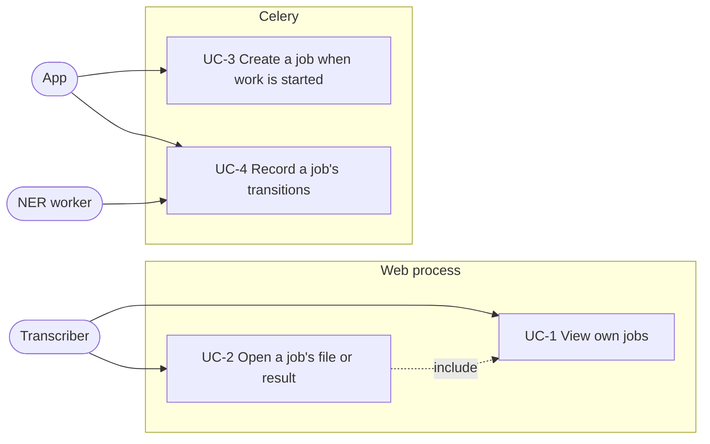
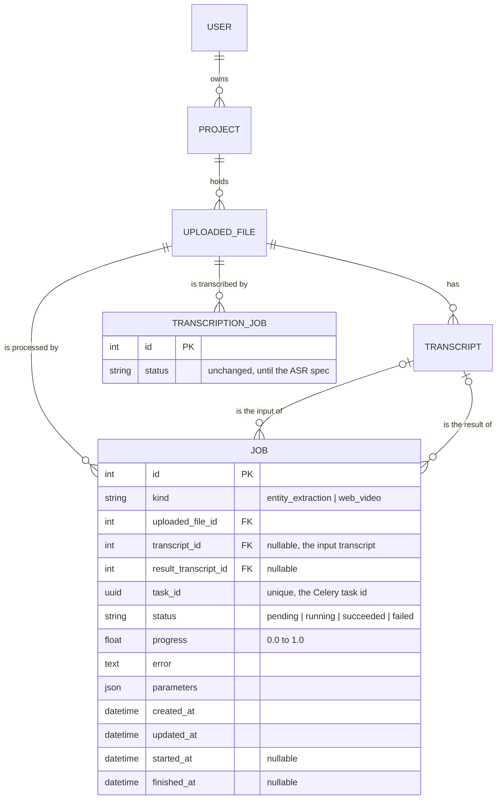

# Spec: jobs page and unified job model

Status: not started. Written on 2026-10-08.

This document is an **executable spec**: it is the prompt an implementing session works from and the authoritative record of every decision. Resolve ambiguity by reading this document, not by inventing; if a genuinely new decision comes up, write it into this document first. Check off tasks (`[x]`, with date) as they land.

The architecture note is a section of this document, because it concerns one app and one model.

## Motivation

A user learns the state of automatic work only in scattered places. Active transcription jobs appear on the project page (`project_detail` in [`projects/views.py`](../app/mmt/projects/views.py)) and on the uploaded file's page. Entity extraction (NER) jobs appear only in the admin. Web video generation has no record at all: `task_generate_web_video` in [`uploaded_files/tasks.py`](../app/mmt/uploaded_files/tasks.py) sets `has_web_video` on success and leaves no trace on failure.

Each job type also has, or would need, its own model. `TranscriptionJob` and `EntityExtractionJob` in [`transcripts/models.py`](../app/mmt/transcripts/models.py) repeat status, error and timestamps with different status vocabularies (`pending/submitted/running` against `queued`), so every listing has to adapt each model separately.

This feature adds:

1. A single `Job` model in a new app `mmt.jobs`, holding the lifecycle that all job types share, with type-specific inputs in a JSON `parameters` field.
2. A page `/jobs/` on which a transcriber sees their own jobs: running first, then pending, then finished.
3. NER and web video generation as the first two job types on `Job`. Transcription follows when ASR runs as a Celery worker (see non-goals).

## Non-goals

- **No ASR migration.** `TranscriptionJob` stays as it is, including `asr_job_id` and the HTTP polling by the sweep task. Moving ASR to a Celery worker and onto `Job` is a separate spec, after which `asr_job_id` is no longer needed. Until then, the jobs page reads both `Job` and `TranscriptionJob`.
- **No running state for NER.** The NER worker has no database access and reports only success or failure through the Celery callbacks, so an NER job goes from `pending` directly to `succeeded` or `failed`.
- **No progress reporting for web video.** `progress` stays 0 for web video jobs.
- **No new permissions.** The page is gated by the existing `transcripts.view_transcriptionjob`. Granting `jobs` permissions to a group is a later change.
- **No actions on the page.** No retry, cancel or delete.
- **No error text on the page.** The page shows the status; the error text is visible in the admin.
- **No live update.** The page shows the state at the time of the request; no polling and no server-sent events.
- **No deduplication of web video jobs.** `ensure_transcript_editing_media` keeps its existing guard (`has_web_video`) and nothing more.
- **No job records for waveform, duration or checksum tasks.**
- **No change to the job table on the project and file pages.**

## Actors

- **Transcriber**: a logged-in user with the permission `transcripts.view_transcriptionjob`, which the Transcribers group holds through `creategroups`. The actor of UC-1 and UC-2.
- **App**: the web process and the app's Celery worker. Creates jobs and records their transitions (UC-3, UC-4).
- **NER worker**: the separate Celery worker that runs `ner.extract`. It does not access the database; the app's callbacks record its outcome (UC-4).

## Use cases



### UC-1 View own jobs

Precondition: the transcriber is logged in.

1. The transcriber selects "Jobs" in the primary navigation. The link is shown only to users with `transcripts.view_transcriptionjob`.
2. The app lists the jobs of the transcriber's projects in three sections: Running, Pending, Finished. Each section shows its jobs in a table, or an empty-state line if it has none.

Alternative flows:

- 1a. The request is anonymous: the app redirects to the login page.
- 1b. The user lacks the permission: the app answers 403.

### UC-2 Open a job's file or result

1. On the jobs page, the transcriber selects a job's subject.
2. The app opens the result transcript's detail page if the job has a result transcript, otherwise the uploaded file's detail page.

### UC-3 Create a job when work is started

1. An NER extraction is requested (`enrich_transcript`), or the editing media of an uploaded file are ensured (`ensure_transcript_editing_media`) and the file needs a web video.
2. The app creates a `Job` with status `pending` and sends the Celery task with the job's id or `task_id`.

### UC-4 Record a job's transitions

1. A task that runs in the app's worker marks the job `running` when it starts.
2. On success, the app marks the job `succeeded` and sets `result_transcript` if the job produced one.
3. On failure, the app marks the job `failed` and stores the error as `<exception class name>: <message>`.

Alternative flow:

- 3a. The job is already `succeeded` (a late failure callback after a successful delivery): the app leaves it unchanged.

## Data model



## Architecture note

**A separate app.** Jobs span several apps (transcripts, uploaded files, later more), so `Job` lives in `mmt.jobs` and not in any of them. The apps that start work (`transcripts`, `uploaded_files`) import `Job` from `mmt.jobs`. Until the ASR spec lands, `mmt.jobs` also imports `TranscriptionJob` from `mmt.transcripts.models` for the jobs page; this two-way dependency is temporary and ends when `TranscriptionJob` is removed.

**One model, not one per type.** All job types share status, error, progress, timestamps and an owner. A single model lets the jobs page, the ownership filter and the admin work on one queryset. Type-specific inputs, such as a later ASR job's `language` and `diarize`, go into `parameters`; the database does not enforce them per type, and each enqueue function is responsible for writing them.

**The subject relation, designed twice.**

1. A generic foreign key (`content_type`, `object_id`) to any model. It is the most general, but the ownership filter cannot be expressed as one join path, and the database enforces no referential integrity.
2. A required `uploaded_file` foreign key and an optional input `transcript` foreign key. Every current and planned job type concerns an uploaded file: transcription and web video directly, NER through its transcript.

Option 2 is chosen. Ownership is one join path, `uploaded_file__project__user`, for every job type, and deleting an uploaded file deletes its jobs through `CASCADE`.

**Grouping across two models during the transition.** The page module `mmt/jobs/overview.py` converts `Job` and `TranscriptionJob` rows into one row type, `JobRow`, and groups them. `JobRow` exists only because there are two models; when the ASR spec removes `TranscriptionJob`, the template renders `Job` directly and `JobRow` is removed. The overview does not filter by user; the view passes querysets filtered with `owned_by(user)`, so the overview can serve other scopes (one project, all jobs) without change.

**Transitions are methods of `Job`.** `mark_running`, `mark_succeeded` and `mark_failed` set the status and the matching timestamp in one place, so the tasks of each job type do not repeat that logic. `mark_job_failed` in `mmt/jobs/tasks.py` is the shared Celery error callback for tasks that run outside the app's worker.

## Feature reference

### Job model (`mmt/jobs/models.py`)

`Job(TimestampedModel)`:

| Field | Definition |
| --- | --- |
| `kind` | `CharField(max_length=32, choices=KIND_CHOICES)`; values `entity_extraction` ("Entity extraction"), `web_video` ("Web video") |
| `uploaded_file` | `ForeignKey('uploaded_files.UploadedFile', on_delete=CASCADE, related_name='jobs')` |
| `transcript` | `ForeignKey('transcripts.Transcript', on_delete=CASCADE, null=True, blank=True, related_name='jobs')`, the input transcript |
| `result_transcript` | `ForeignKey('transcripts.Transcript', on_delete=SET_NULL, null=True, blank=True, related_name='+')` |
| `task_id` | `UUIDField(default=uuid.uuid4, unique=True, editable=False)` |
| `status` | `CharField(max_length=20, choices=STATUS_CHOICES, default=PENDING)`; values `pending`, `running`, `succeeded`, `failed` with the labels "Pending", "Running", "Succeeded", "Failed" |
| `progress` | `FloatField(default=0.0)` |
| `error` | `TextField(blank=True)` |
| `parameters` | `JSONField(default=dict, blank=True)` |
| `started_at`, `finished_at` | `DateTimeField(null=True, blank=True)` |

`Meta.ordering = ['-created_at']`.

Members:

- `PILL_MODIFIERS = {pending: 'quiet', running: 'info', succeeded: 'success', failed: 'danger'}` and the property `pill_modifier`.
- `mark_running()`: sets `running` and `started_at`, saves.
- `mark_succeeded(result_transcript=None)`: sets `succeeded`, `finished_at`, `progress = 1.0` and `result_transcript` if given, saves.
- `mark_failed(error: str)`: if the job is `succeeded`, returns without a change. Otherwise sets `failed`, `error` and `finished_at`, saves.
- `get_absolute_url()`: the result transcript's detail URL if `result_transcript` is set, else the uploaded file's detail URL.

`JobQuerySet` (`objects = JobQuerySet.as_manager()`):

- `owned_by(user)`: `filter(uploaded_file__project__user=user)`.

`TranscriptionJob` gets a queryset class with the same `owned_by(user)`, filtering on the same path.

### Error callback (`mmt/jobs/tasks.py`)

`mark_job_failed(job_id: int)`, a shared task used as an immutable `link_error` signature on the `celery` queue. It reads the exception from `AsyncResult(str(job.task_id)).result` and calls `job.mark_failed(f'{type(exc).__name__}: {exc}')`. It replaces `mark_extraction_failed`.

### NER on `Job`

- `enrich_transcript` creates `Job(kind=ENTITY_EXTRACTION, uploaded_file=transcript.uploaded_file, transcript=transcript)` and sends `ner.extract` as before, with `link_error=mark_job_failed.si(job.pk)`.
- `store_entities` locks the `Job` with `select_for_update()`, returns without a change if `result_transcript` is set, otherwise creates the NER transcript and calls `mark_succeeded(result_transcript=...)`. On a `ValidationError` it calls `mark_failed('ValidationError: <message>')` and raises again, as before.
- `EntityExtractionJob` and `EntityExtractionJobAdmin` are removed.

Migration:

1. `jobs/0001_initial` creates `Job`.
2. `jobs/0002_copy_entity_extraction_jobs` copies every `EntityExtractionJob` row into `Job` with the **same primary key**, `kind = entity_extraction`, `uploaded_file` from the transcript, `transcript`, `result_transcript`, `task_id`, `error`, `created_at`, `updated_at`, status `queued` mapped to `pending`, and `finished_at = updated_at` for `succeeded` and `failed`. Keeping the primary key means that callbacks already queued with an old job id find the job after the deploy. The reverse migration is `RunPython.noop`.
3. `transcripts/0009_delete_entity_extraction_job` deletes the model and depends on `jobs/0002`.

### Web video on `Job`

- `ensure_transcript_editing_media` creates `Job(kind=WEB_VIDEO, uploaded_file=uploaded_file)` and calls `generate_web_video.delay(job.pk)` where it called `task_generate_web_video.delay(uploaded_file.pk)`.
- New task `generate_web_video(job_id: int)` in `uploaded_files/tasks.py`, routed to the `media` queue: calls `mark_running()`; if the file is not a video, calls `mark_succeeded()` and returns; if `transcode_to_web_video` returns `True`, sets `has_web_video` and calls `mark_succeeded()`; if it returns `False`, calls `mark_failed('Transcoding failed.')`; if it raises, calls `mark_failed(f'{type(exc).__name__}: {exc}')` and raises again.
- `task_generate_web_video(uploaded_file_id)` stays registered, unchanged, for messages that are queued at the time of the deploy, and is removed one release later.

### Jobs page

Route: `GET /jobs/`, `path('jobs/', include('mmt.jobs.urls'))` in `mmt/urls.py`; `app_name = 'jobs'`, `path('', views.job_list, name='list')`.

View `job_list`: `@require_GET`, `@login_required`, `@permission_required('transcripts.view_transcriptionjob', raise_exception=True)`. It calls

```python
grouped_jobs(
    Job.objects.owned_by(request.user),
    TranscriptionJob.objects.owned_by(request.user),
)
```

and renders `jobs/job_list.html`.

Grouping (`mmt/jobs/overview.py`):

| Group | `Job` statuses | `TranscriptionJob` statuses | Order |
| --- | --- | --- | --- |
| Running | `running` | `submitted`, `running` | `created_at` ascending |
| Pending | `pending` | `pending` | `created_at` ascending |
| Finished | `succeeded`, `failed` | `succeeded`, `failed` | `finished_at` descending, `updated_at` where `finished_at` is null |

The Finished group holds at most `finished_limit` jobs (default 50), the most recent ones. Each queryset is limited to `finished_limit` before the merge, and the merged list is cut to `finished_limit`.

```python
@dataclass(frozen=True)
class JobRow:
    kind: str                 # the kind's label; "Transcription" for TranscriptionJob
    subject: str              # uploaded file display name, with " – <transcript label>" if the job has an input transcript
    url: str
    status_display: str
    pill_modifier: str
    progress_percent: int | None   # set only for a running job whose progress is above 0
    created_at: datetime

@dataclass(frozen=True)
class GroupedJobs:
    running: list[JobRow]
    pending: list[JobRow]
    finished: list[JobRow]

def grouped_jobs(
    jobs: QuerySet[Job],
    transcription_jobs: QuerySet[TranscriptionJob],
    finished_limit: int = 50,
) -> GroupedJobs: ...
```

`grouped_jobs` adds `select_related('uploaded_file', 'transcript')` with `defer('transcript__content')` to the `Job` queryset and `select_related('uploaded_file')` to the `TranscriptionJob` queryset. The URL of a `TranscriptionJob` row is its transcript's detail URL if it has one, else the uploaded file's detail URL.

Template `jobs/job_list.html` extends `base.html`. Title and heading "Jobs". Three sections with the headings "Running", "Pending", "Finished". Each section has a table with the columns "Type", "Subject" (a link to `url`), "Status" (pill), "Progress" (`progress_percent %` or empty) and "Created at" (`naturalday`, as in `_transcription_jobs_table.html`). An empty section shows "No running jobs.", "No pending jobs." or "No finished jobs."

Navigation: a "Jobs" item in `_nav.html` after "Projects", inside ``, with the active-state check of the other items.

### Admin

`JobAdmin` in `mmt/jobs/admin.py`, read-only like `TranscriptionJobAdmin`. The list shows `kind`, `uploaded_file`, `status` and `created_at`, filters by `kind`, `status` and `created_at`, and uses `list_select_related = ['uploaded_file']`. The detail page shows all fields.

## File layout

```
app/mmt/jobs/
  __init__.py
  apps.py               JobsConfig, name = 'mmt.jobs'
  models.py             Job, JobQuerySet
  admin.py              JobAdmin
  tasks.py              mark_job_failed(job_id)
  overview.py           JobRow, GroupedJobs, grouped_jobs(jobs, transcription_jobs, finished_limit=50)
  views.py              job_list(request)
  urls.py
  migrations/0001_initial.py, 0002_copy_entity_extraction_jobs.py
  templates/jobs/job_list.html
  tests/test_models.py, test_tasks.py, test_overview.py, test_views.py
app/mmt/transcripts/models.py      TranscriptionJobQuerySet.owned_by; EntityExtractionJob removed
app/mmt/transcripts/tasks.py       enrich_transcript, store_entities on Job; mark_extraction_failed removed
app/mmt/uploaded_files/tasks.py    generate_web_video(job_id)
app/mmt/core/templates/_nav.html   Jobs item
app/mmt/settings/base.py           'mmt.jobs' in INSTALLED_APPS; route for generate_web_video
```

## Slices

### Slice 1: `Job` model, NER on `Job`

- [ ] Add the `mmt.jobs` app with `Job`, `JobQuerySet.owned_by`, the transitions, `get_absolute_url`, `mark_job_failed` and `JobAdmin`.
  Done when: tests show that `mark_running`, `mark_succeeded` and `mark_failed` set status and timestamps; that `mark_failed` leaves a `succeeded` job unchanged; that `owned_by` excludes another user's jobs; that `get_absolute_url` returns the result transcript's URL when set and the file's URL otherwise; and that `mark_job_failed` stores the exception from the result backend.
- [ ] Move NER onto `Job`: change `enrich_transcript` and `store_entities`, remove `mark_extraction_failed`, add the copy migration and delete `EntityExtractionJob`. Adjust the existing NER tests in `transcripts/tests/test_tasks.py` instead of adding new ones.
  Done when: the adjusted tests show that `enrich_transcript` creates a `pending` `Job` of kind `entity_extraction` and sends the task with a `mark_job_failed` error link, that `store_entities` marks it `succeeded` with the result transcript, and that two calls create one transcript; and a migration test shows that an `EntityExtractionJob` is copied with its primary key and mapped status.

### Slice 2: jobs page

- [ ] Add `TranscriptionJobQuerySet.owned_by`, `overview.py`, the view, the URL, the template, the navigation item and the German translations.
  Done when: tests show that `grouped_jobs` puts each status of both models in the right group; that running and pending are ordered oldest first and finished newest first; that the finished group is cut to `finished_limit` and keeps the newest jobs; that an anonymous request is redirected to login; that a user without `view_transcriptionjob` receives 403; and that a transcriber sees an own `Job` and an own `TranscriptionJob` and neither of another user's two jobs.

### Slice 3: web video on `Job`

- [ ] Add `generate_web_video(job_id)` with its route and change `ensure_transcript_editing_media` to create the job. Adjust the existing `ensure_transcript_editing_media` tests.
  Done when: tests show that `ensure_transcript_editing_media` creates a `pending` `web_video` job for a video without a web video and sends `generate_web_video` with its id; and that `generate_web_video` marks the job `succeeded` and sets `has_web_video` when the transcode succeeds, marks it `failed` with "Transcoding failed." when it returns `False`, and marks it `failed` with the exception when it raises.
- [ ] One release after the slice above: remove `task_generate_web_video`.
  Done when: the task and its route are gone and the suite passes.
